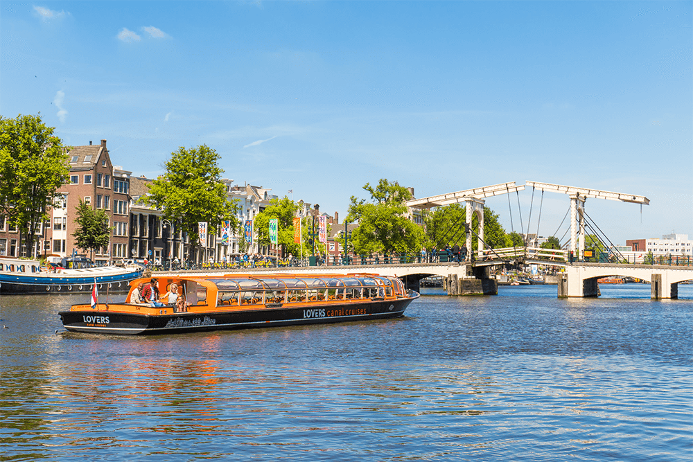
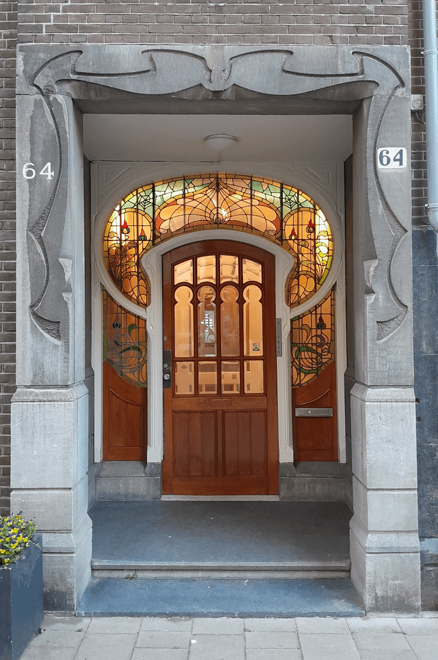
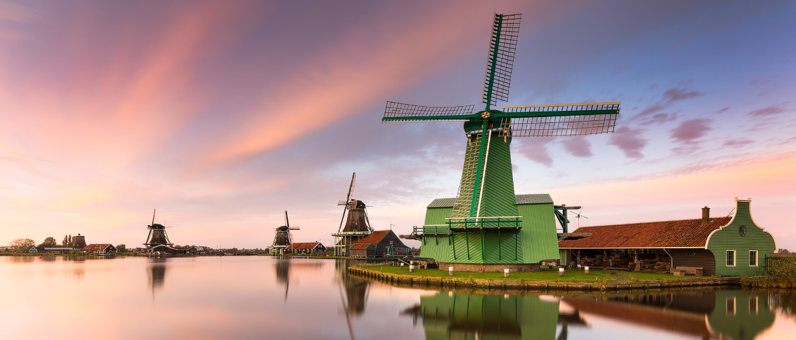

# Един вихрен уикенд в Амстердам: Канали, култура и кухня

Амстердам, очарователната столица на Нидерландия, е град, който съчетава историческо очарование с прогресивен и отворен дух. Известен със сложната си система от канали, богатото художествено наследство и оживената културна сцена, Амстердам е дестинация, която предлага по нещо за всеки пътешественик. В тази публикация в блога ще разгледаме как да прекарате незабравими два или три дни в този живописен град.

## Ден 1: Пристигане и разглеждане на сърцето на Амстердам

### Сутринта: Пристигане и настаняване

След като пристигнете на летище "Схипхол" в Амстердам, вземете удобния влак до Амстердам Сентрал - главната жп гара на града. Оттам можете лесно да стигнете до мястото за настаняване с трамвай, автобус или такси. След като се настаните и се освежите, е време да започнете приключението си.

### Следобед: Круиз по канала и Jordaan

Започнете проучването си с неангажиращ круиз по канала. Това е идеалното въведение в града, което предлага гледки към исторически мостове, къщи от 17-ти век и уникалния крайбрежен живот на Амстердам. 

След круиза се разходете из квартал Йордаан, един от най-очарователните квартали в Амстердам. Със своите тесни улички, причудливи бутици и уютни кафенета Йордаан прилича на село в града. Не пропускайте възможността да опитате холандско сирене в някой от местните магазини за сирене.

### Вечерта: Вечеря в De Pijp

За вечеря се отправете към De Pijp - модерен квартал, известен с разнообразната си кулинарна сцена. Изберете от разнообразни ресторанти, предлагащи всичко - от традиционни холандски ястия до международна кухня. След вечеря се насладете на разходка из района или посетете местен бар, за да вкусите от нощния живот на Амстердам.

## Ден 2: Изкуство, история и паркове

### Сутрин: Музейният квартал

Започнете деня си в Музейния квартал, където се намират музеите Rijksmuseum, Van Gogh Museum и Stedelijk Museum. Любителите на изкуството ще бъдат на седмото небе, докато се разхождат из колекциите от холандски майстори, импресионистични картини и модерно изкуство. 

### Следобед: Вонделпарк и пазаруване

След като се потопите в изкуството, отпуснете се в близкия Вонделпарк - най-големия и известен парк в Амстердам. Насладете се на пикник или просто наблюдавайте хората, докато местните жители и туристите минават оттам.

След това разгледайте луксозните търговски улици P.C. Hooftstraat и Van Baerlestraat, където ще намерите дизайнерски бутици и луксозни марки. За по-еклектично пазаруване се насочете към Деветте улици (De Negen Straatjes), където има много винтидж магазини и занаятчийски магазини.

### Вечерта: Кварталът на червените фенери и старият Амстердам

С настъпването на вечерта се впуснете в квартала на червените фенери - район, известен с развлеченията за възрастни, но и с богата история и култура. Участвайте в обиколка с екскурзовод, за да научите повече за миналото и настоящето на квартала, като в същото време си осигурите уважително и безопасно преживяване.

След това се разходете из старите улици на Амстердам и спрете в традиционно кафяво кафене за местна бира и bitterballen (холандска закуска), преди да приключите с вечерта.

## Ден 3: Еднодневна екскурзия или по-нататъшно проучване

### Вариант 1: Еднодневна екскурзия до Заансе Сханс

Ако разполагате с трети ден, помислете за еднодневна екскурзия до Заансе Сханс - историческо село в непосредствена близост до Амстердам. Тук можете да видите емблематични нидерландски вятърни мелници, дървени къщи и дори демонстрация на правене на дървени класове. 

### Вариант 2: Разглеждане на кварталите на Амстердам

Като алтернатива можете да прекарате последния си ден в опознаване на още от разнообразните квартали на Амстердам. Посетете хипстърския рай на Амстердам Ноорд, до който се стига с безплатен ферибот зад гара Centraal, или богатите на културни забележителности Източни докове.

### Вечерта: Вечеря край канала

За последната си вечер се насладете на вечеря в ресторант край канала, като се наслаждавате на гледката към водните пътища, докато светлините на града се отразяват от повърхността. Това е идеалният завършек на вашето приключение в Амстердам.

## Заключение

Амстердам е град с безкраен чар и изненади. Независимо дали сте там заради изкуството, историята или оживената атмосфера, ще си тръгнете със спомени, които ще ви останат за цял живот. Не забравяйте да уважавате културата и правилата на града и най-важното - насладете се на всеки миг от холандското си бягство.
