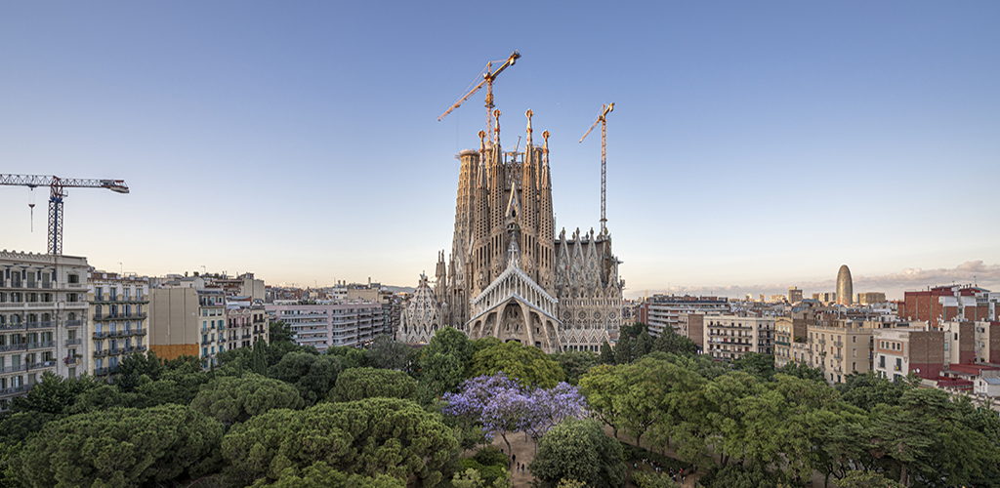
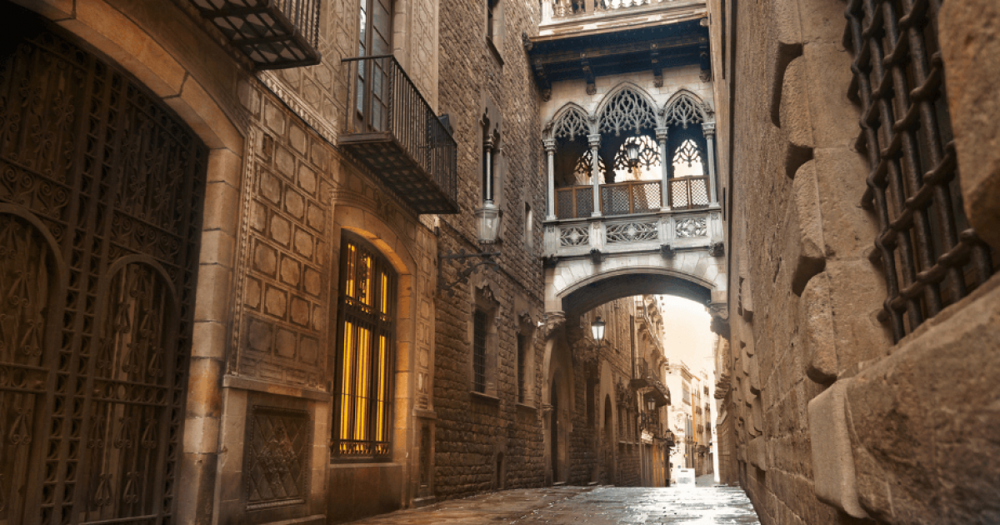
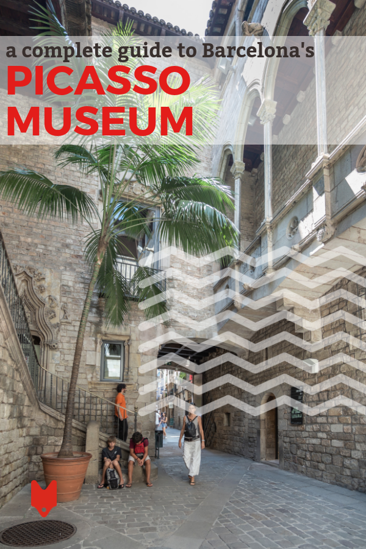
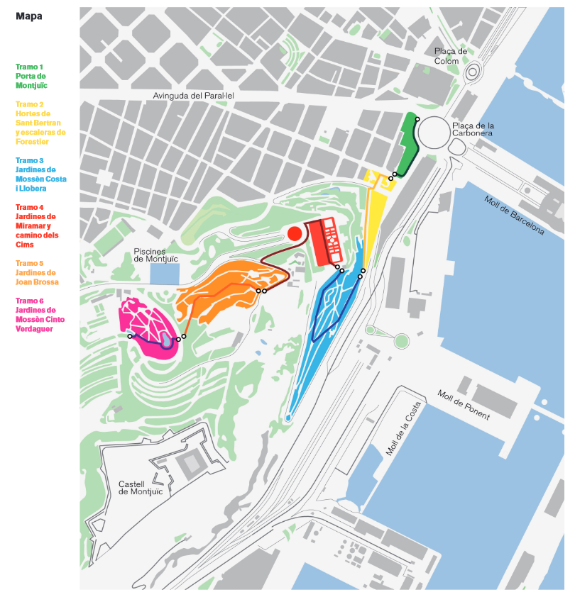
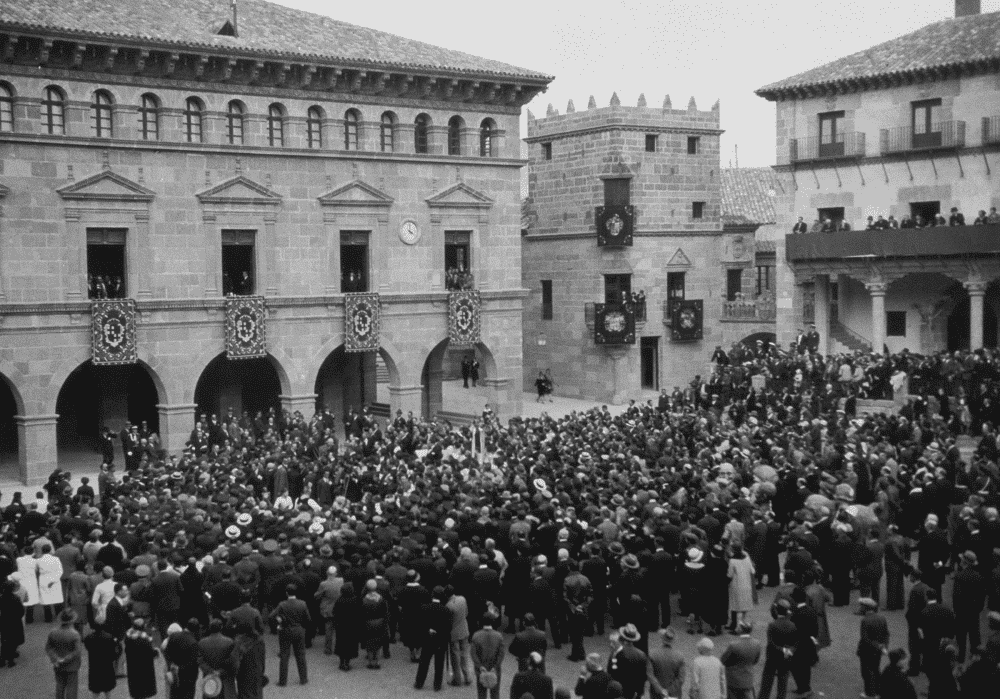
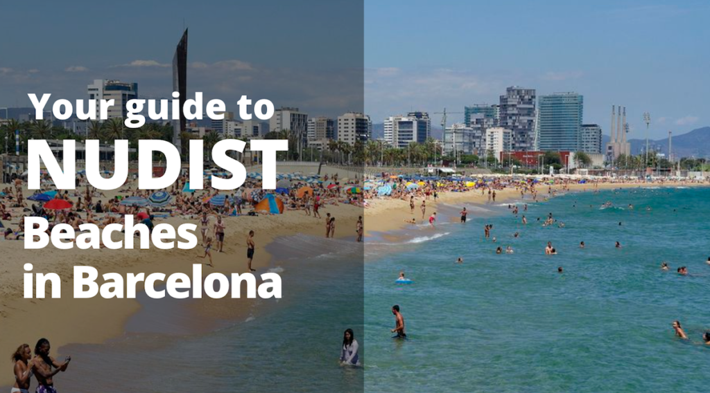
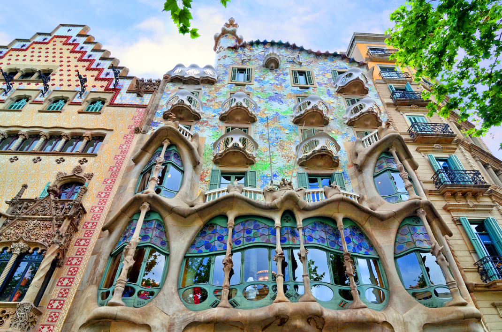
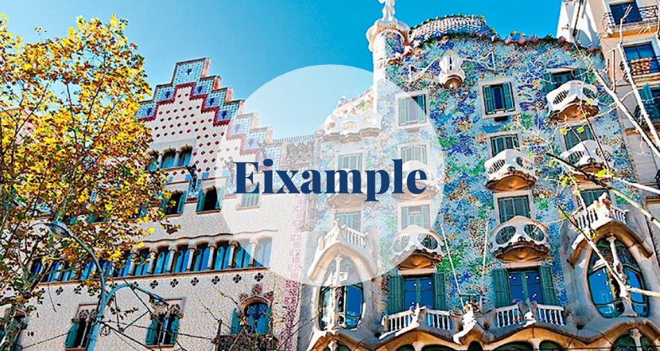

# Уикенд бягство в Барселона: Град на изкуството, културата и кухнята

Барселона, космополитната столица на испанския регион Каталуния, е известна със своето изкуство и архитектура. В града се намират фантастичната църква Саграда Фамилия и други модернистични забележителности, проектирани от Антонио Гауди. От целунатите от слънцето плажове до оживения уличен живот - Барселона е град, който не спира да очарова своите посетители. Ето как можете да прекарате незабравими два или три дни в това средиземноморско бижу.

## Ден 1: Откриване на Гауди и Готическия квартал

### Сутринта: La Sagrada Família

Започнете деня си с посещение на спиращата дъха Ла Саграда Фамилия - недовършения шедьовър на Гауди. Тази базилика се строи от 1882 г. и е включена в списъка на световното културно наследство на ЮНЕСКО. Нейните сложни фасади и зашеметяващият интериор, изпълнен с цветна светлина, струяща през витражите, са гледка, която трябва да се види.

### Следобед: Парк Гюел и обяд

След като се възхитите на Саграда Фамилия, се отправете към Парк Гюел - друго творение на Гауди. Този обществен парк е изпълнен с причудливи мотиви, включително известния фонтан с дракон на входа. Разходете се из градините и се насладете на панорамна гледка към града от терасовидната зона.

За обяд се отбийте в някой от местните ресторанти или тапас барове в близкия квартал Грасия. Опитайте някои каталунски специалитети като "pa amb tomàquet" (хляб с домати) и "escalivada" (зеленчуци на скара).

### Вечер: Готическият квартал

Със залеза на слънцето се насочете към Готическия квартал (Barri Gòtic). Този исторически център представлява лабиринт от тесни средновековни улички, пълни с модерни барове, клубове и каталунски ресторанти. Посетете зашеметяващата катедрала на Барселона и площад Пласа дел Рей - живописен площад, който ще ви върне назад във времето.

Вечеряйте в традиционен каталунски ресторант и се насладете на ястия като "fideuà" (ястие с юфка, подобно на паеля) или "suquet de peix" (рибена яхния).

## Ден 2: Изкуство, култура и магията на Монжуик

### Сутринта: Музеят на Пикасо и Ел Борн

Започнете втория си ден в Музея на Пикасо, в който се съхранява една от най-богатите колекции от творби на испанския художник от 20-ти век Пабло Пикасо. След това разгледайте квартал Ел Борн, известен с бохемската си атмосфера и занаятчийски магазини.

Вземете кафе и сладкиш от някое от местните кафенета, преди да се отправите към следващата си дестинация.

### Следобед: Хълмът Монжуик

Прекарайте следобеда си на хълма Монтжуик - забележителен хълм с изглед към пристанището. Посетете замъка Монтжуик за доза история и се насладете на пищните градини и спортните съоръжения от Олимпийските игри през 1992 г.

Не пропускайте вълшебния фонтан на Монжуик, който вечер предлага впечатляващи водни и светлинни представления.

### Вечерта: Poble Espanyol и вечеря

Завършете деня си в Poble Espanyol - архитектурен музей на открито, в който са представени пълномащабни реплики на сгради от различни части на Испания. С настъпването на нощта изберете един от многото ресторанти в музея за прекрасна вечеря.

## Ден 3: Плажове и модернистични чудеса (по желание)

### Сутрин: Плаж Барселонета

Ако разполагате с трети ден, започнете с релаксираща сутрин на плажа Барселонета. Насладете се на средиземноморското слънце, потопете се в морето или просто се разходете по крайбрежната алея.

За късна закуска опитайте пресни морски дарове в някой от chiringuitos (плажните барове) по крайбрежието.

### Следобед: Пасео де Грасия и Каса Батльо

Следобед се отправете към Пасео де Грасия, най-известната търговска улица в Барселона. Тук ще откриете два от шедьоврите на Гауди: Casa Batlló и La Pedrera (Casa Milà). Направете обиколка на тези емблематични сгради, за да оцените тяхната уникална архитектура и дизайн.

### Вечерта: Прощална вечеря в Ешампле

В последната си вечер се насладете на прощална вечеря в квартал Ейшампле, известен със своята мрежеста структура и модернистична архитектура. Изберете ресторант, който предлага дегустационно меню, за да се насладите на разнообразни каталунски вкусове.

Барселона е град, който завладява сърцето със смесицата от история, изкуство и жизнена култура. Независимо дали се възхищавате на архитектурните чудеса на Гауди, изследвате историческите улици или вкусвате местната кухня, този град със сигурност ще остави у вас спомени, които ще останат за цял живот. ¡Buen viaje!
