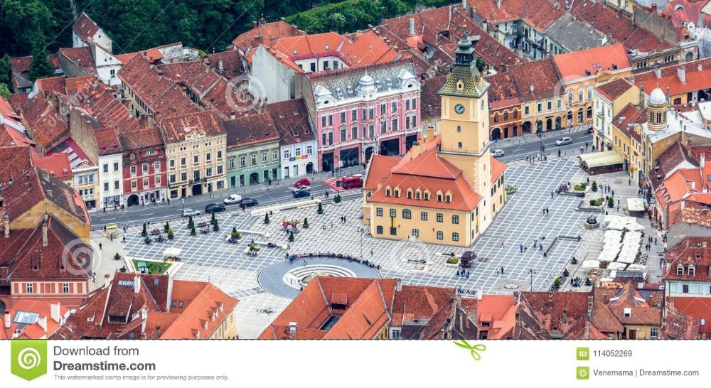
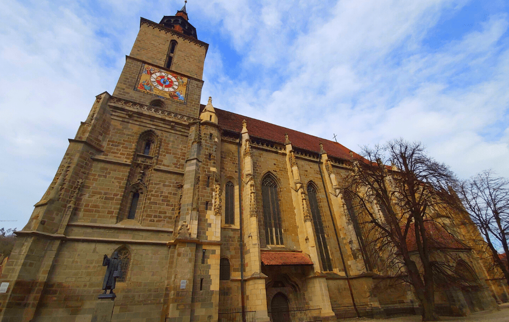
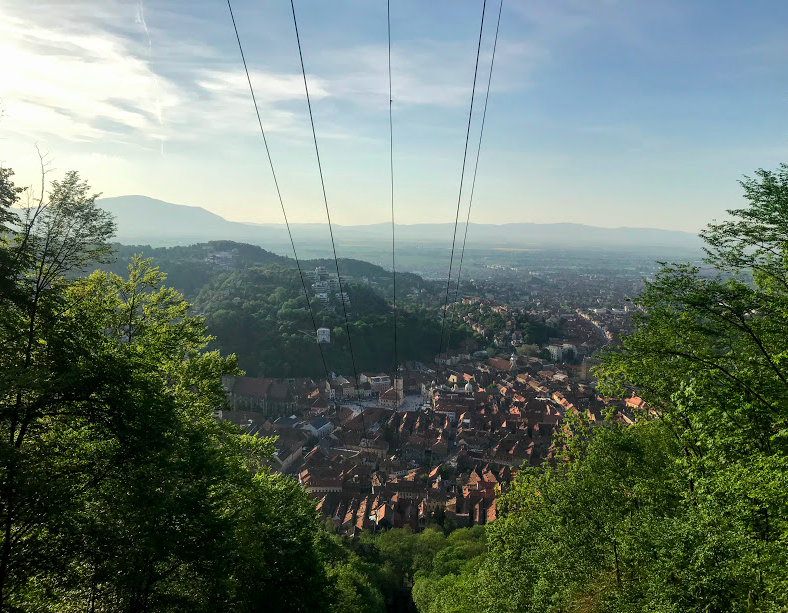
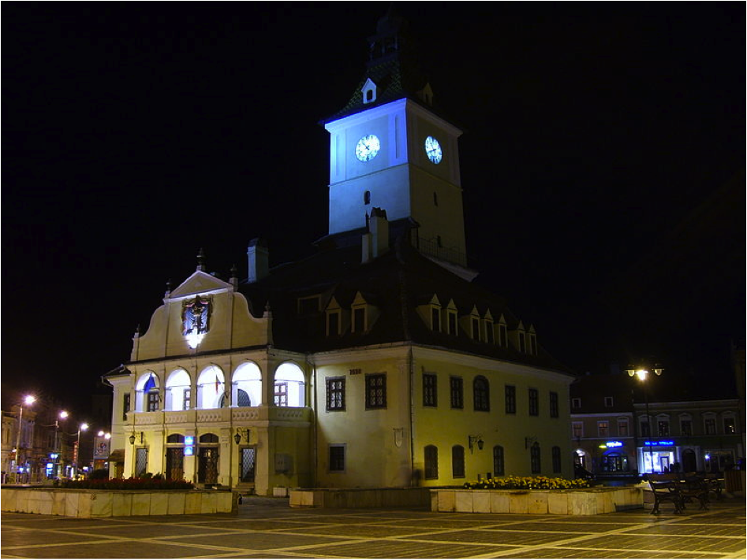
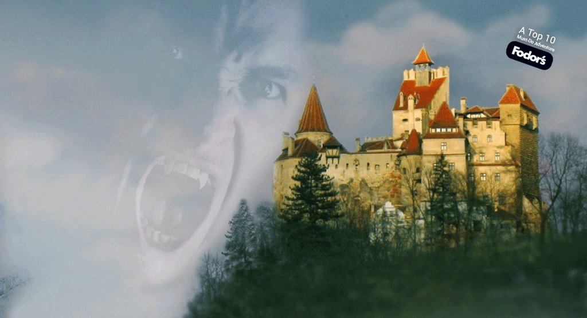
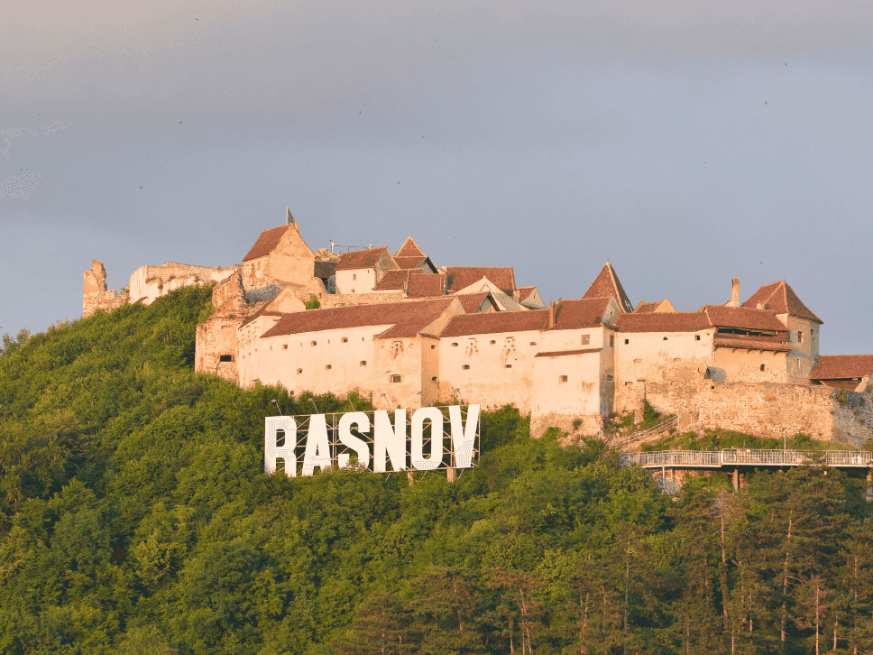

# Уикенд бягство в Брашов: Приказка за средновековен чар и природно великолепие

Сгушен в сърцето на Румъния, град Брашов привлича пътниците със средновековния си чар и спиращите дъха пейзажи на Трансилванските Алпи. Този пътеводител ще ви преведе през едно очарователно двудневно пътешествие в Брашов, където историята и природата се преплитат, за да създадат едно незабравимо преживяване.

## Ден 1: Разглеждане на Стария град

### Сутрин: Площадът на Съвета и Черната църква

Започнете приключението си на главния площад на града, Piața Sfatului, или Площада на Съвета. Докато слънцето хвърля златистите си оттенъци върху сградите в пастелни цветове, ще се почувствате сякаш сте се върнали назад във времето. Площадът е идеално място за неангажираща закуска в някое от многобройните кафенета, където можете да се насладите на традиционни румънски сладкиши и силно кафе.

След закуска се отправете към Черната църква - най-голямата готическа църква в Румъния. Името ѝ идва от потъмнелия цвят на стените ѝ, резултат от пожар през 17 век. Вътре ще откриете богата колекция от ориенталски килими и масивен тръбен орган, който все още звучи с музика по време на концерти.

### Следобед: Разходка по Strada Sforii и планината Тампа

След обяд направете кратка разходка до Strada Sforii - една от най-тесните улици в Европа. Тази причудлива уличка е остатък от средновековното минало на Брашов и предоставя уникална възможност за снимки.

След това се отправете на поход към планината Тампа. Пътеката започва близо до центъра на града и предлага няколко маршрута до върха. За тези, които търсят по-спокойно изкачване, кабинковият лифт на Тампа осигурява живописно пътуване с панорамна гледка към града. След като стигнете до върха, ви очаква надписът "Брашов" в холивудски стил, както и широки гледки към стария град и околните планини.

### Вечерта: Румънска кухня и въжената улица

С падането на здрача се върнете в стария град за обилна румънска вечеря. Опитайте традиционни ястия като сармале (зелеви рула, пълни с месо) или полента със сирене и сметана в местен ресторант като "Casa Românească".

След вечеря се разходете през нощта до Улицата на въжетата - най-тясната улица в Брашов, красиво осветена и създаваща романтична атмосфера. Това е идеалният завършек на първия ви ден в този средновековен град.

## Ден 2: Замъци и околна природа

### Сутринта: Замъкът Бран

През втория ден излезте извън града и отидете до легендарния замък Бран, който често се свързва с мита за Дракула. Кратко пътуване с кола или автобус ще ви отведе до тази емблематична крепост, кацнала на върха на скала. Разгледайте многобройните стаи на замъка и се запознайте с историята му, която е много по-завладяваща от измислените истории, които я засенчват.

### Следобед: Крепост Рашнов и резерват за мечки

След обяд продължете историческото си пътешествие към крепостта Рашнов. Тази впечатляваща цитадела е построена от тевтонските рицари през XIII в. и предлага поглед към бурното минало на региона. Гледките от стените на крепостта са не по-малко впечатляващи.

След това посетете близкия мечи резерват Либърти - убежище за мечки, спасени от плен. Наблюдението на тези величествени същества в естествена среда е трогателно преживяване и напомняне за важността на опазването на дивата природа.

### Вечерта: Свободно време и местен живот

Вечерта се върнете в Брашов и се насладете на малко време за почивка. Оживените улици на града оживяват през нощта, а местните жители и туристите се наслаждават на прохладния планински въздух. Разходете се спокойно, пазарувайте сувенири или просто се отпуснете в някое кафене и размишлявайте върху богатите преживявания от изминалите два дни.

## Заключение

Брашов е град, в който всеки калдъръм разказва история, а заобикалящият го карпатски пейзаж нашепва старите легенди. От средновековната му архитектура до природните му чудеса, Брашов предлага преживяване, което е едновременно обогатяващо и очарователно. Независимо дали сте любител на историята, на природата или просто търсите красиво бягство, Брашов е дестинация, която ще завладее сърцето и въображението ви.

Не забравяйте да проверите местните препоръки за пътуване и работното време на всички забележителности и най-важното - насладете се на всеки миг от вашето трансилванско приключение!
