  # Уикенд бягство в Брюксел: Сърцето на Европа

Брюксел, фактическата столица на Европейския съюз, е град, в който историческото очарование се съчетава с модерна динамика. Брюксел е дестинация, която обещава незабравим уикенд - от големите площади и средновековните улици до оживената културна сцена и световноизвестната гастрономия. Ето как да прекарате два или три дни в този очарователен град.

## Ден 1: Голямо начало и гастрономически удоволствия

### Сутрин: Гранд плас и шоколадово удоволствие

Започнете деня си с най-емблематичната забележителност на града - Гран Плас. Този обект на световното културно наследство на ЮНЕСКО е заобиколен от пищни гилдии и поразителното готическо кметство. Площадът е особено вълшебен в сутрешната светлина, което го прави идеално време за снимки. 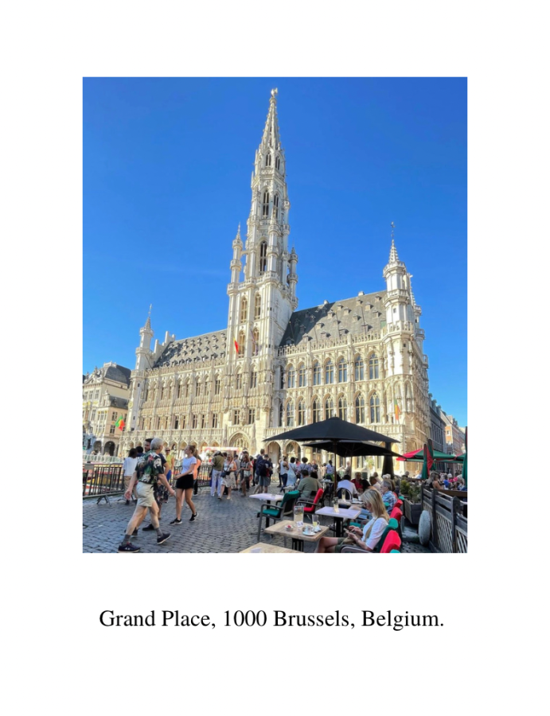

След като се потопите във величието, поглезете се с белгийски шоколад. Посетете един от многото занаятчийски магазини за шоколад около Гранд плас, като Neuhaus или Godiva, и се отдайте на дегустация на шоколад. 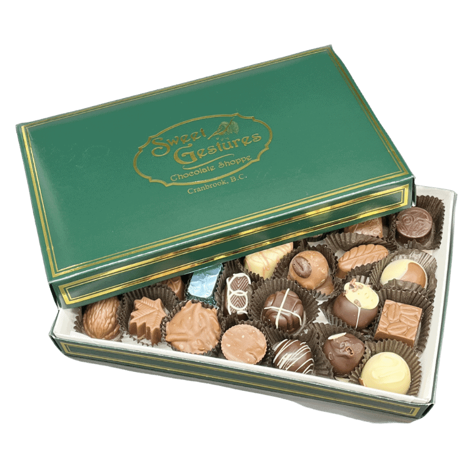

### Следобед: Музеи и вафли

След шоколада се отправете към Mont des Arts, където можете да прекарате следобеда в разглеждане на богатите културни предложения на Брюксел. Задължително трябва да посетите Кралските музеи на изящните изкуства на Белгия, в които се съхранява богата колекция от фламандско и белгийско изкуство. 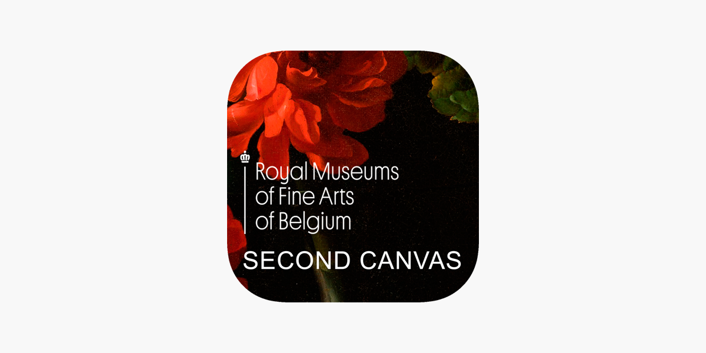

За обяд си вземете традиционна белгийска вафла от уличен търговец. Това не са обикновени гофрети, те са райско удоволствие, хрупкави отвън и пухкави отвътре, често гарнирани с бита сметана, ягоди или шоколадов сос. 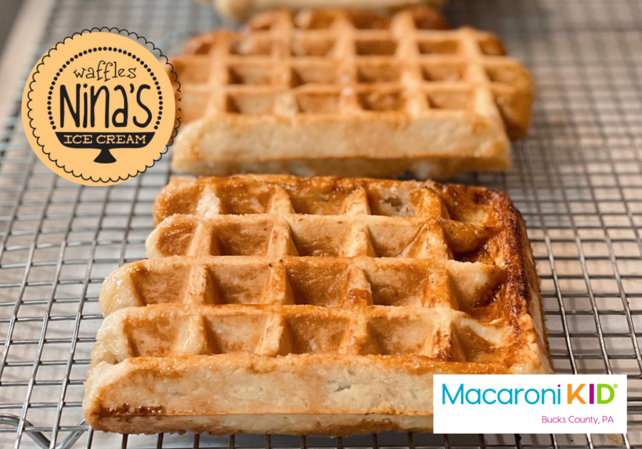

### Вечерта: Вкусът на Брюксел

Белгия е известна със своята кухня, така че за вечеря се насочете към района Сен Катрин, където можете да намерите множество ресторанти, предлагащи традиционни белгийски ястия. Опитайте moules-frites (миди с пържени картофи) или stoofvlees (фламандска говежда яхния). Съчетайте ястието си с белгийска бира от местна пивоварна. 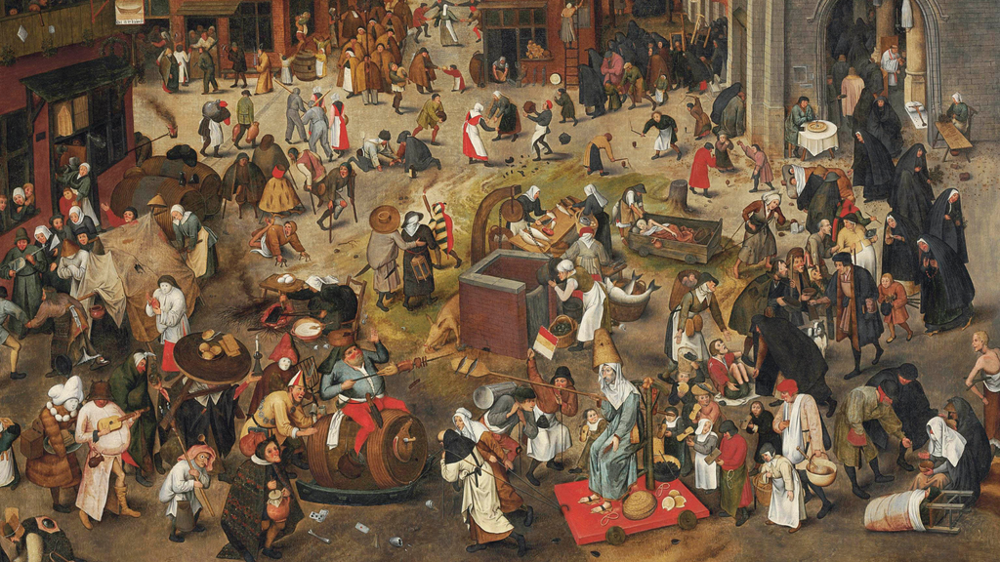

## Ден 2: Пикници в европейския квартал и парк

### Сутрин: Европейски квартал

Започнете втория си ден с посещение на Европейския квартал. Тук можете да видите Европейския парламент и парка Леополд. Вземете участие в обиколката с екскурзовод, за да научите повече за историята на ЕС и неговото влияние върху Европа и света. 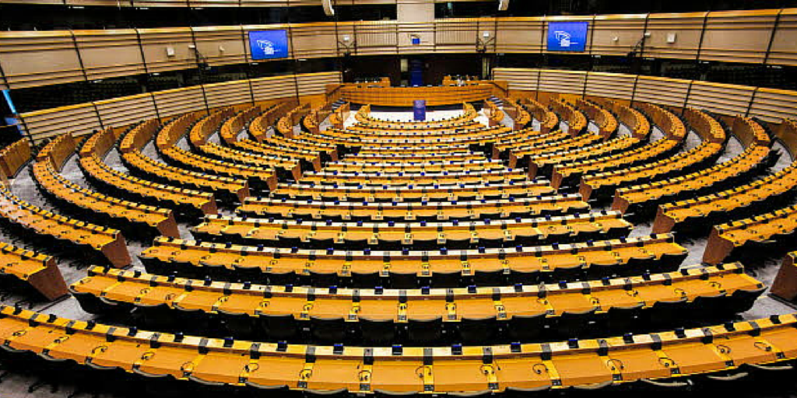

### Следобед: Отпуснете се в парка

След обиколката си се насладете на неангажиращ пикник в парка Cinquantenaire. Вземете пресен хляб, сирене и колбаси от местния пазар и се насладете на красотата на арките и поддържаните градини в парка. 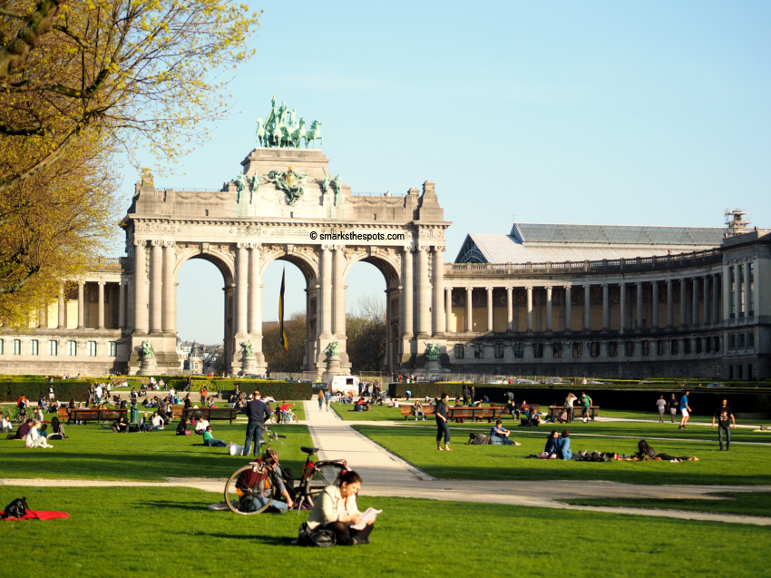

### Вечерта: Разглеждане на Атомиума и Мини-Европа

С настъпването на края на деня се отправете към Атомиума - емблематична сграда и музей с формата на гигантски атом. Вътре ще откриете изложби за науката, дизайна и обществото. Със залеза на слънцето Атомиумът се осветява, създавайки завладяваща гледка. 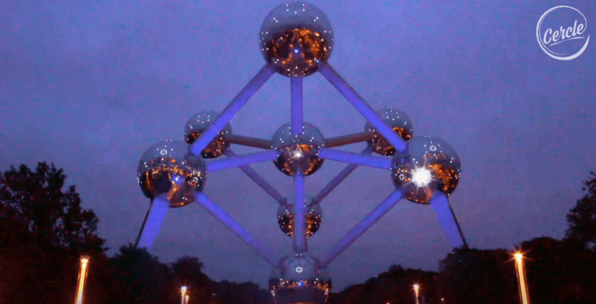

В непосредствена близост до Атомиума се намира Мини-Европа - парк, в който са представени миниатюрни копия на известни европейски забележителности. Това е забавен и образователен начин да завършите деня си, особено ако пътувате със семейството си. 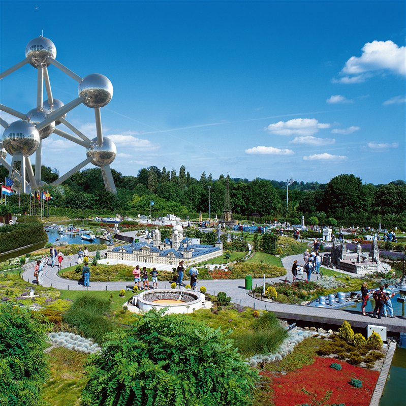

## Ден 3 (по избор): Art Nouveau и пазаруване

### Сутрин: Екскурзия в стил ар нуво

Ако разполагате с трети ден, потопете се в наследството на Брюксел в стил ар нуво. Направете обиколка с екскурзовод, за да видите някои от най-красивите сгради в стил ар нуво в града, включително произведения на известния архитект Виктор Хорта. 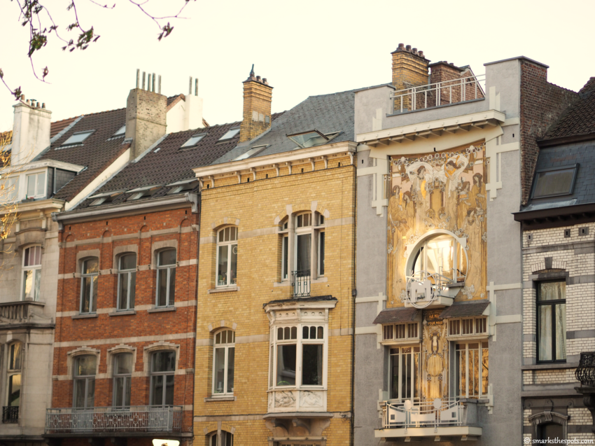

### Следобед: Пазаруване в Les Galeries Royales Saint-Hubert

Прекарайте следобеда си в Les Galeries Royales Saint-Hubert - една от най-старите търговски пасажи в Европа. Тук можете да намерите белгийски дантели, луксозни стоки и още магазини за шоколад. Това е идеалното място да вземете сувенири. 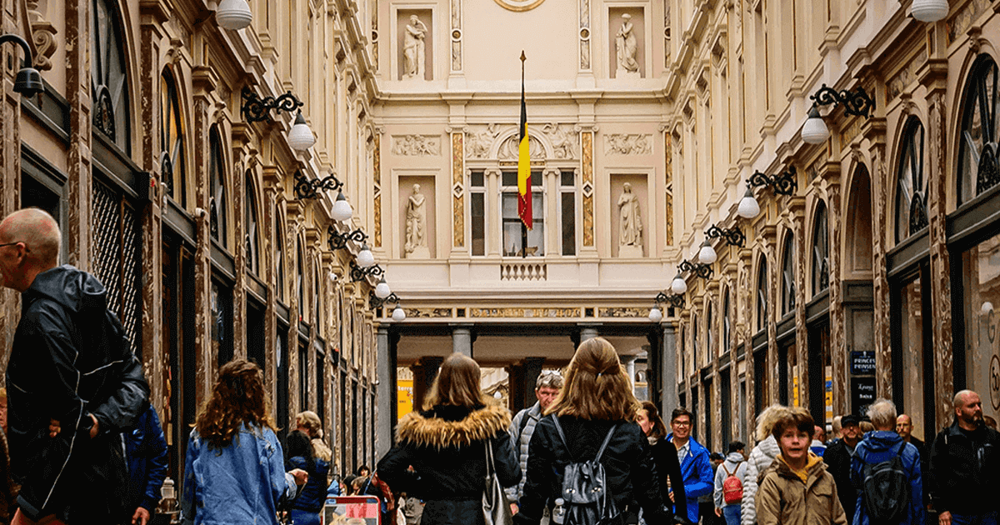

### Вечерта: Джаз и прощална вечеря

В Брюксел има оживена джаз сцена. Вечерта намерете местен джаз бар и се насладете на музика на живо. Музикалното село и L'Archiduc са популярни места. 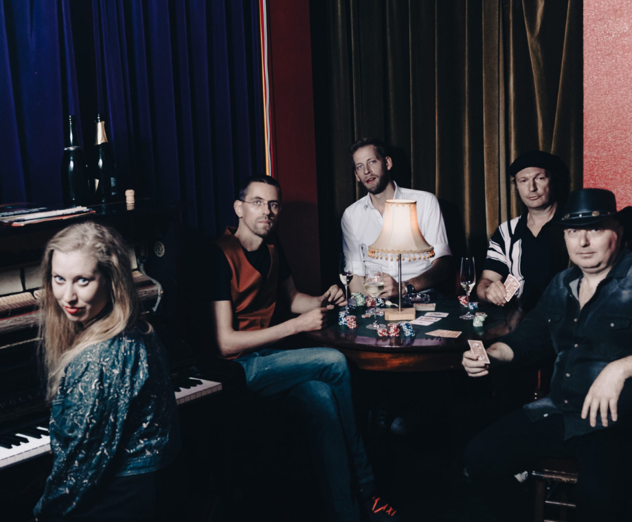

За последната си вечеря изберете един от брюкселските ресторанти със звезди "Мишлен" за незабравимо кулинарно преживяване. Резервирайте предварително, за да си осигурите маса.

## Заключение

Брюксел е град, който предлага богата палитра от преживявания - от историческите му корени до ролята му в центъра на европейската политика. Независимо дали сте там заради храната, културата или историята, един уикенд в Брюксел със сигурност ще ви остави трайни спомени и желание да се върнете отново. Бон воаяж!