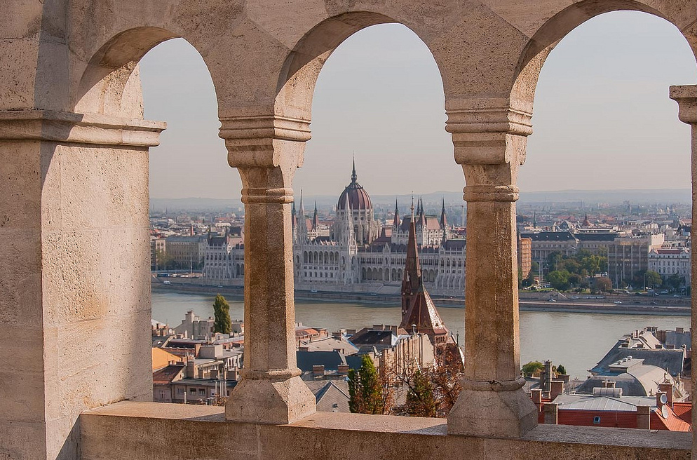
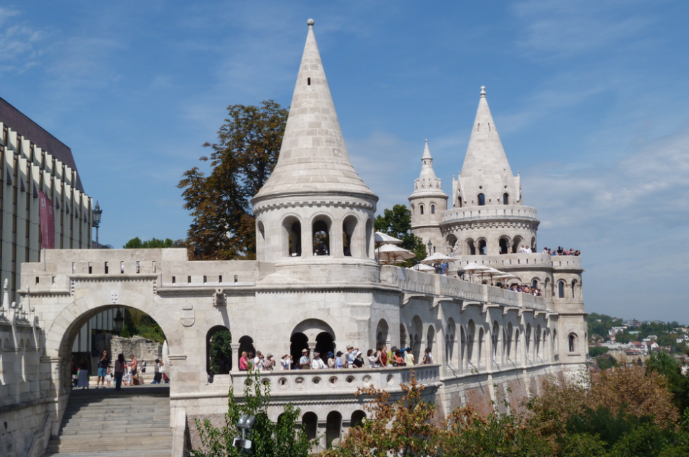
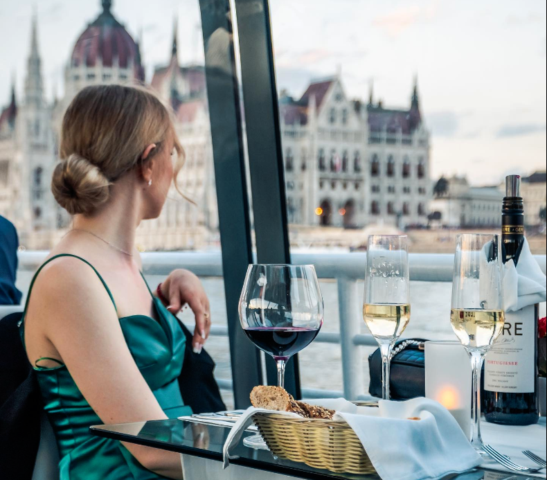
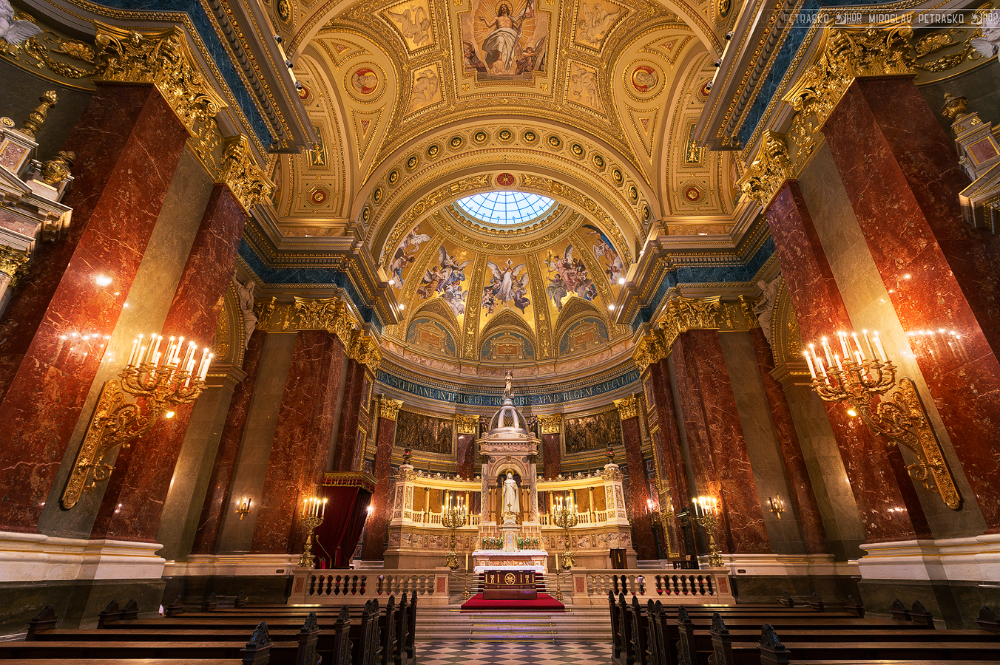
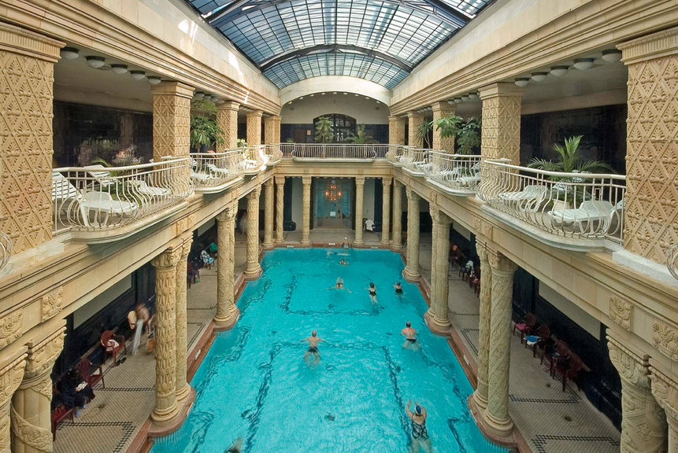
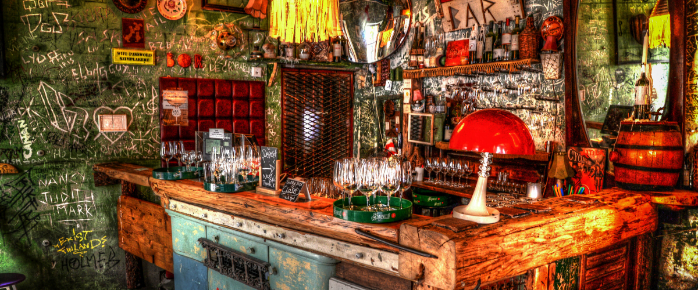
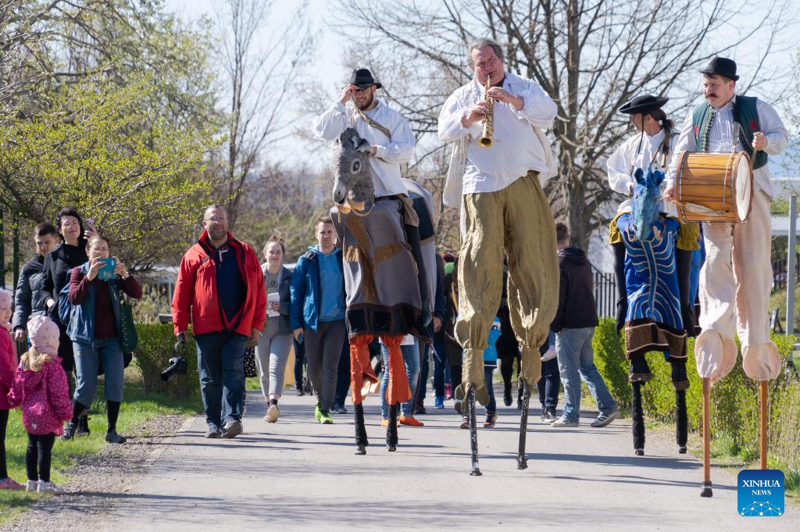
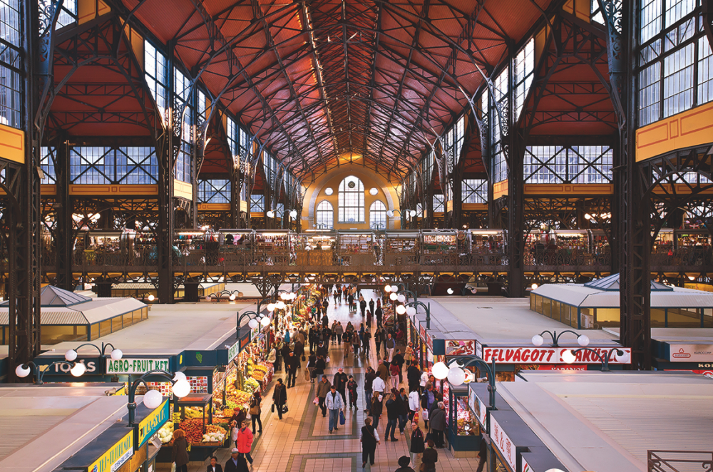
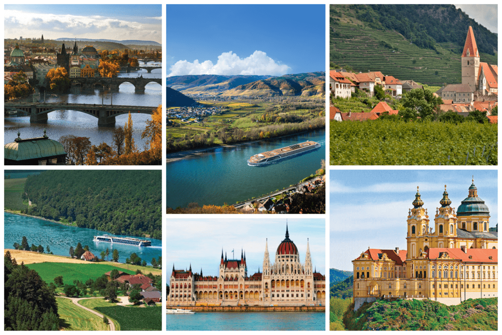

  # Уикенд бягство в Будапеща: Перлата на Дунава

Будапеща, столицата на Унгария, е град, в който богатата история се съчетава безпроблемно с динамична съвременна култура. Разположен на река Дунав, с Буда от едната страна и Пеща от другата, този град предлага уникално преживяване, което съчетава зашеметяваща архитектура, релаксиращи термални бани и нощен живот, който няма равен на себе си. Ето как да прекарате незабравими два или три дни в Будапеща.

## Ден 1: Разглеждане на Замъка и Буда

### Сутринта: Замъкът Буда и кварталът на замъка

Започнете деня си рано и се отправете към частта на града - Буда. Вземете фуникуляра или се изкачете пеша по хълма до замъка Буда - обект на световното наследство на ЮНЕСКО. В замъка, който датира от 13-ти век, сега се помещават Унгарската национална галерия и Историческият музей на Будапеща. Прекарайте няколко часа в разглеждане на замъка и се наслаждавайте на панорамната гледка към Пеща от другата страна на реката.

### Следобед: Рибарският бастион и църквата "Матиас

След традиционен унгарски обяд в един от уютните ресторанти в квартала на замъка се отправете към Рибарския бастион. От неговите приказни кули се откриват едни от най-добрите гледки към града, особено към сградата на унгарския парламент от другата страна на реката. Непосредствено до бастиона се намира църквата "Матиаш" с нейния цветен керемиден покрив и готическа архитектура. Направете обиколка с екскурзовод, за да оцените напълно нейната история и красота.

### Вечерта: Вечеря с гледка

Завършете деня си с вечеря в ресторант с изглед към Дунав. Изберете заведение с места на открито, за да се насладите на осветената гледка към Верижния мост и Парламента. Унгарската кухня е изобилна и ароматна, така че опитайте местни ястия като гулаш или пилешки паприкаш.

## Ден 2: Сърцето на Пеща и релаксиращи термални бани

### Сутрин: Базиликата "Свети Стефан" и булевард "Андраши

Преминете по Верижния мост към Пеща и посетете базиликата "Свети Стефан" - най-голямата църква в Будапеща. Изкачете се до купола, за да се насладите на 360-градусова гледка към града. След това се разходете по булевард Андраши - будапещенските Шанз-Елизе, осеян с бутици, кафенета и неоренесансови имения.

### Следобед: Термална баня Széchenyi

Никое пътуване до Будапеща не е пълно без посещение на някоя от известните термални бани. Отправете се към термалната баня Széchenyi - най-голямата лечебна баня в Европа. Откритите басейни са идеални за релаксиращо потапяне, а освен това има сауни, парни бани и масажни услуги.

### Вечерта: Барове с руини и унгарско вино

Насладете се на уникалния нощен живот на Будапеща, като посетите няколко от известните барове-руини в еврейския квартал на града. Тези причудливи, еклектични барове са разположени в порутени предвоенни сгради и са пълни с винтидж мебели и произведения на изкуството. Докато сте там, опитайте унгарско вино, което печели международно признание заради качеството си.

## Ден 3 (по желание): Завой на Дунав и унгарска кухня

### Сутрин: Екскурзия по Дунавския завой

Ако разполагате с допълнителен ден, помислете за еднодневна екскурзия до Дунавския завой - регион с върхове и живописни градчета северно от Будапеща. Посетете историческия град Сентендре, известен със своите художествени галерии и калдъръмени улички, или базиликата в Естергом - най-голямата църква в Унгария.

### Следобед: Централна пазарна зала

Отново в Будапеща разгледайте Централната пазарна зала - рай за гурманите. Първият етаж е идеален за опитване на традиционни унгарски храни като lángos и kolbász, а на горния етаж има магазини за сувенири, в които се продават унгарски червен пипер, вино Tokaji и народни занаяти.

### Вечерта: Круиз по река Дунав

Завършете приключението си в Будапеща с круиз по река Дунав. Много от круизите предлагат вечеря и музика на живо, което е романтичен и незабравим начин да видите забележителностите на града, осветени през нощта.

Будапеща е град, който ще завладее сърцето ви със старинния си чар и младежката си енергия. Независимо дали ще се потопите в термална баня, ще опитате унгарски деликатеси или ще се възхитите на архитектурните чудеса, уикендът ви в Будапеща със сигурност ще бъде изпълнен с очарование и открития.