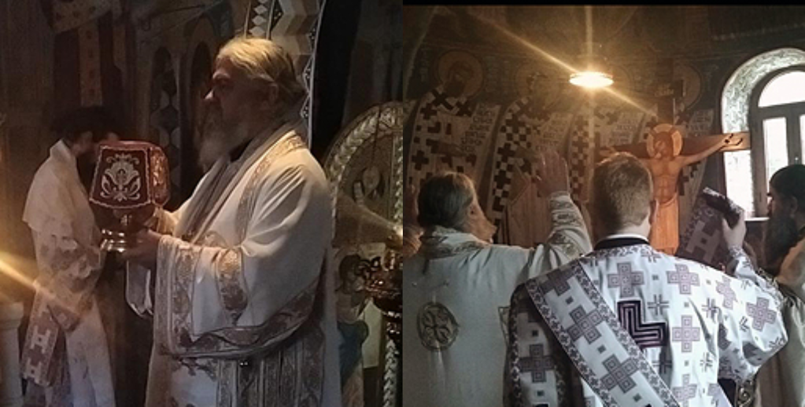

# Уикенд бягство в Будва: Крайбрежният скъпоценен камък на Черна гора

Сгушен по адриатическото крайбрежие, Будва е град в Черна гора, който се отличава с перфектна комбинация от исторически чар и съвременен лукс. Със своя средновековен стар град, зашеметяващи плажове и оживен нощен живот Будва е идеална дестинация за бягство през уикенда. Ето как можете да прекарате два или три дни, за да се потопите в най-доброто, което Будва може да предложи.

## Ден 1: Разглеждане на стария град и релаксация на плажа

### Сутрин: Разходка из Стария град на Будва

Започнете деня си със спокойна разходка из Стария град - укрепен средновековен град, разположен на малък полуостров. Докато се разхождате по тесните калдъръмени улички, ще се пренесете назад във времето. Не пропускайте да посетите Цитаделата - крепост от XV в., от която се открива панорамна гледка към града и морето.

### Следобед: Време за плаж на плажа Могрен

След като разгледате Стария град, се отправете към плажа Могрен, който се намира само на кратка разходка. Този плаж се състои от два пясъчни залива, свързани с тунел, и е известен с чистите си води и живописна обстановка. Прекарайте следобеда в слънчеви бани, плуване и наслаждаване на черногорското слънце.

### Вечерта: Вечеря с гледка

Завършете деня си с вечеря на брега на морето в един от многото ресторанти в Будва. Изберете заведение с открита тераса, за да се насладите на залеза над Адриатическо море. Местната кухня е възхитителна смесица от средиземноморски вкусове, така че не забравяйте да опитате някои ястия с морски дарове като октопод на скара или прочутото черно ризото.

## Ден 2: Обиколка на острови и исторически паметници

### Сутринта: Екскурзия с лодка до остров Свети Никола

През втория ден направете разходка с лодка до остров Свети Никола, известен още като Хаваите. Островът се намира само на кратко разстояние от Будва и предлага уединени плажове и кристално чисти води. Прекарайте сутринта си в гмуркане с шнорхел и изследване на естествената красота на острова.

### Следобед: Посетете манастира Подмане

В следобедните часове си починете от плажа и посетете манастира Подмайн. Това мирно убежище се намира на хълмовете край Будва и датира от XV век. Манастирът е отличен пример за черногорската религиозна архитектура и предлага спокойна атмосфера за размисъл.

### Вечерта: Изживейте нощния живот на Будва

Будва е известна с оживения си нощен живот и няма по-добър начин да го изживеете от това да посетите някои от популярните барове и клубове в града. Независимо дали предпочитате уютен бар с музика на живо или оживен нощен клуб, в Будва има за всекиго по нещо. Не пропускайте възможността да танцувате цяла нощ под звездите.

## Ден 3: Свободно време и лукс (по желание)

Ако разполагате с допълнителен ден в Будва, отдайте се на малко свободно време и лукс.

### Сутрин: Спа ден в луксозен курорт

Подарете си спа ден в един от луксозните курорти на Будва. Насладете се на масаж, отпуснете се в сауната или се потопете в басейн с изглед към морето. Това е идеалният начин да се отпуснете и да се подмладите, преди да се върнете към реалността.

### Следобед: Пазаруване и култура на кафенетата

Прекарайте следобеда си в разходка из бутиците и магазините на Будва, където можете да намерите всичко - от дизайнерски дрехи до местни занаяти. След пазаруването се отпуснете в някое кафене и се насладете на чаша кафе или на чаша черногорско вино, докато наблюдавате хората.

### Вечерта: Круиз по залез слънце

Завършете пътуването си с круиз по залез слънце по Будванската ривиера. Докато плавате покрай брега, ще станете свидетели на зашеметяващите цветове на залеза, отразяващи се в Адриатическо море - идеален завършек на вашето приключение в Будва.

Будва е град, който предлага по малко от всичко: история, култура, природна красота и съвременни удобства. Независимо дали търсите релаксираща почивка на плажа, културна екскурзия или парти уикенд, Будва със сигурност ще остави у вас незабравими спомени. Така че опаковайте багажа си и се пригответе да изпитате магията на крайбрежното бижу на Черна гора.
