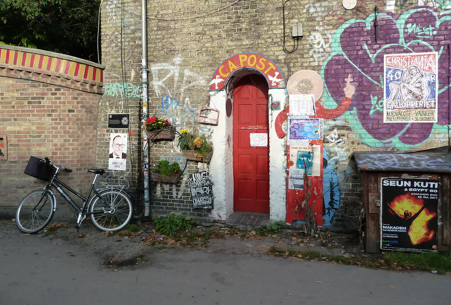
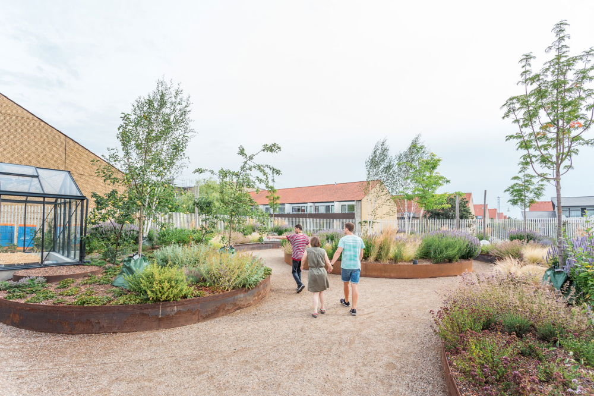

  # Уикенд бягство в Копенхаген: Смесица от хигиена и градско изследване

Копенхаген, столицата на Дания, е оживена и живописна дестинация, която предлага уникална смесица от исторически чар и модерен скандинавски дизайн. Известен с приятелски настроените си местни жители, удобните за велосипедисти улици и концепцията за уют, известна като "hygge", Копенхаген е град, който приканва посетителите да се отдадат на отдих и почивка сред оживената си градска среда. В тази публикация в блога ще ви запознаем с идеалния маршрут за два до три дни в този очарователен град.

## Ден 1: Пристигане и разглеждане на сърцето на Копенхаген

### Сутрин: Пристигане и разходка из Нихавн

Започнете приключението си в Копенхаген, като се настаните във вашия хотел или Airbnb. След като се настаните, се отправете към емблематичното пристанище Nyhavn. Със своите колоритни градски къщи от 17-ти век и исторически дървени кораби, Nyhavn е перфектното въведение в морското наследство на града.

Насладете се на спокойна закуска в някое от кафенетата край канала, където можете да се насладите на датски сладкиши и чаша силно кафе, докато се наслаждавате на гледките.

### Следобед: Кралското преживяване

След закуска направете кратка разходка до двореца Амалиенборг - зимния дом на датското кралско семейство. Насрочете посещението си така, че да станете свидетели на церемонията по смяна на караула, която се провежда всеки ден по обяд.

След това посетете близкия замък Розенборг - дворец от ренесансовата епоха, в който се съхраняват датските короновани скъпоценности. Замъкът е разположен в Кралската градина - идеално място за обедна почивка.

### Вечерта: Кулинарни изкушения и градините Тиволи

Копенхаген е известен със своята кулинарна сцена, така че си подарете вечеря в някой от многото ресторанти в града, удостоени със звезди "Мишлен", или в уютни бистра. Опитайте традиционни датски ястия като smørrebrød (сандвичи с отворено лице) или frikadeller (кюфтета).

След вечеря се отправете към градините Тиволи - един от най-старите увеселителни паркове в света. Паркът е красиво осветен през нощта и предлага вълшебна атмосфера със своите старинни атракциони и пищни градини.

## Ден 2: Изкуство, култура и пазаруване

### Сутринта: Артистични вдъхновения

Започнете деня си в Музея за модерно изкуство в Луизиана, който се намира недалеч от Копенхаген. Музеят е дом на впечатляваща колекция от модерно и съвременно изкуство, както и на зашеметяваща архитектура и живописна гледка към протока Øresund.

### Следобед: Пазаруване и дизайн

Върнете се в центъра на града и се насочете към Стрьогет - една от най-дългите пешеходни улици в Европа. Тук ще откриете смесица от марки от високите етажи на магазините, луксозни бутици и датски дизайнерски магазини. Не пропускайте възможността да посетите водещия магазин на Royal Copenhagen, известен с изящния си порцелан.

### Вечерта: Разгледайте квартала Meatpacking

За вечеря се отправете към квартала Meatpacking District (Kødbyen) - модерен район с разнообразие от ресторанти и барове. Този квартал е средище на гурмани и нощни птици, като предлага всичко - от гурме бургери до експериментална кухня.

## Ден 3: Извън утъпкания път

### Сутринта: Алтернативната страна на Копенхаген

Прекарайте последния си ден в проучване на Свободния квартал Кристиания - самопровъзгласил се за автономен квартал, известен с алтернативния си начин на живот и яркото улично изкуство. Макар че снимането често е забранено, районът е наслада за очите и свидетелство за разнообразната културна структура на Копенхаген.

### Следобед: Отпуснете се в парковете

Отпуснете се в някоя от многото зелени площи в Копенхаген, като например градините Фредериксберг или Ботаническата градина. Тези паркове предлагат спокойно убежище от градската суета, с красиви пейзажи и много места за пикник.

### Вечерта: Отпътуване или обиколка по канала

Ако тръгвате на третия ден, не забравяйте да оставите време за пазаруване в последния момент или за бързо хапване на Torvehallerne - пазар, предлагащ пресни продукти и гурме лакомства.

Ако графикът ви позволява, завършете пътуването си с релаксираща обиколка по каналите, за да видите Копенхаген от друга перспектива. Обиколката ще ви отведе покрай много от забележителностите на града и ще бъде подходящ завършек на вашето датско приключение.

Копенхаген е град, който с лекота съчетава история, култура и модерен живот. Независимо дали сте там заради храната, дизайна или просто за да се запознаете с датския начин на живот, този град със сигурност ще остави трайни впечатления. С този маршрут сте добре подготвени, за да се насладите на незабравими два-три дни в сърцето на Дания. God rejse! (Приятно пътуване!)