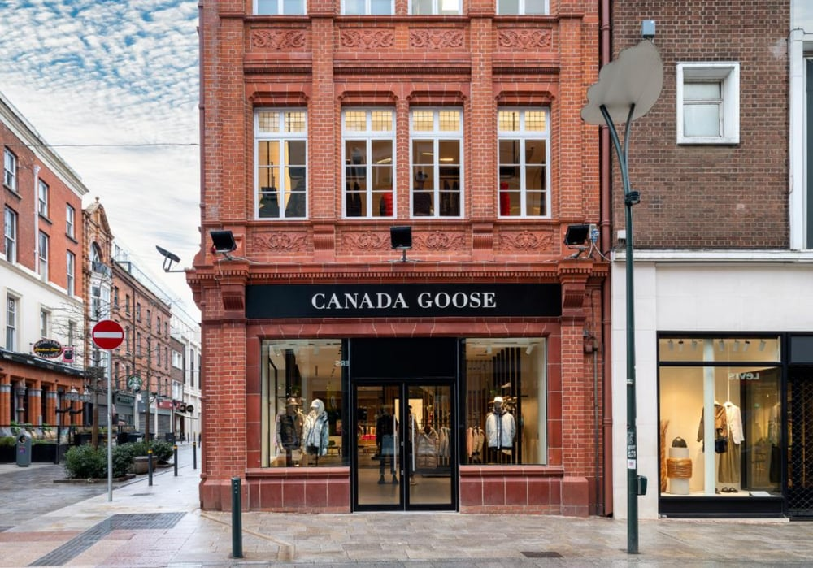
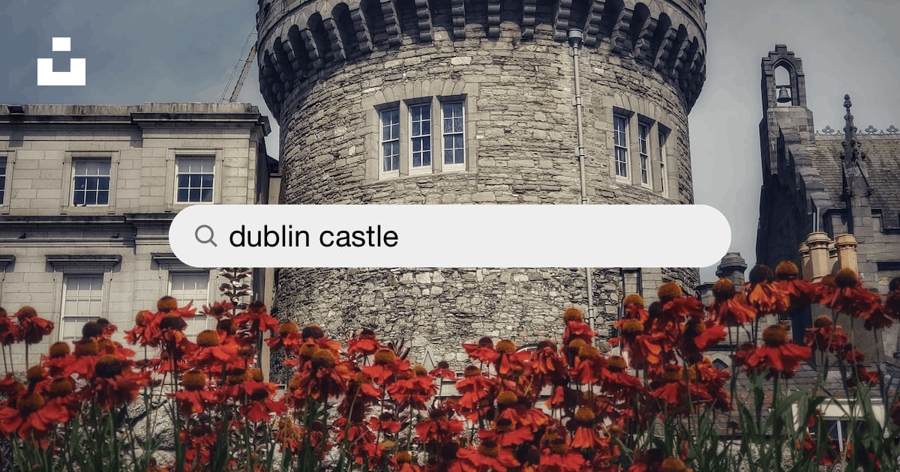
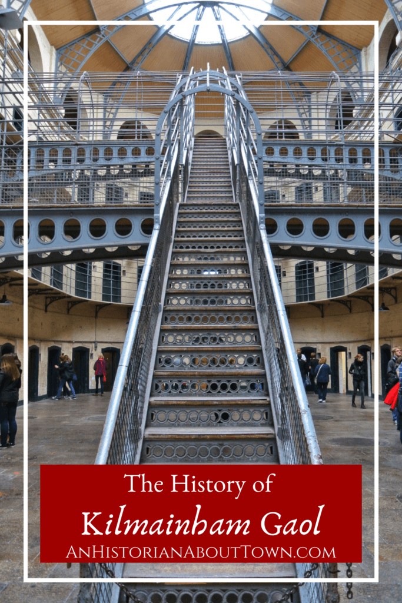
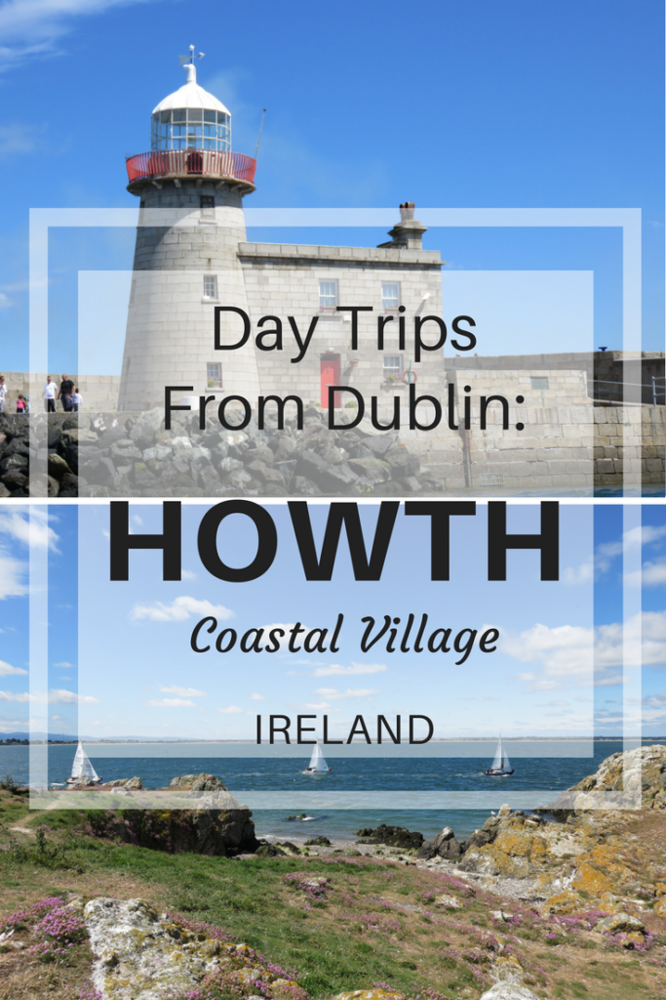
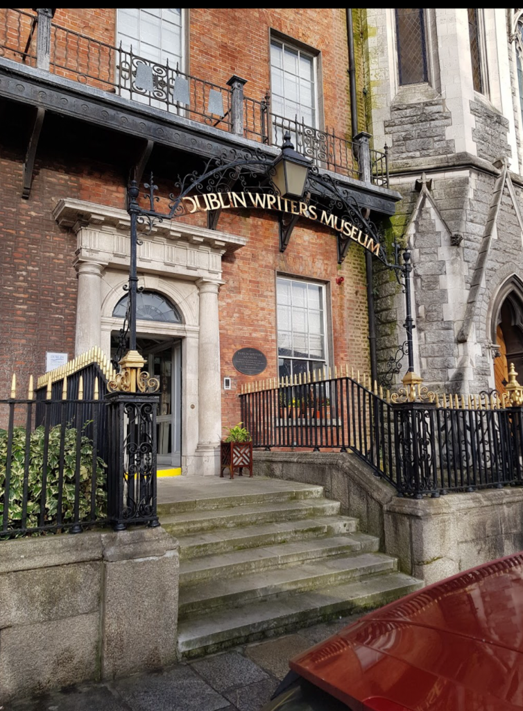
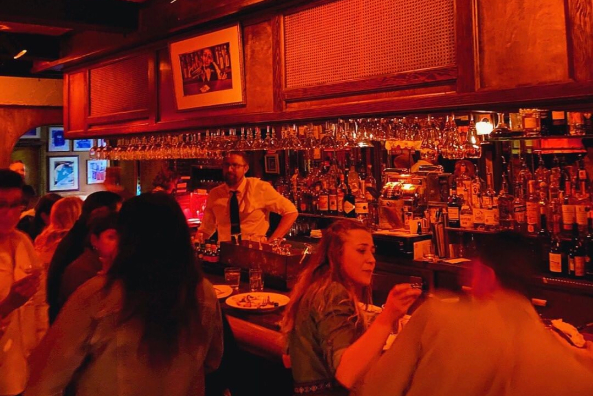

  # Един уикенд в Дъблин: Пътуване през историята, културата и пивото

Дъблин, столицата на Ирландия, е град с богата история и култура, с калдъръмени улици, исторически сгради и винаги присъстващ ирландски чар. Един уикенд в Дъблин е възможност да се потопите в живата атмосфера на града, да опознаете богатото му наследство и да се насладите на прочутото му гостоприемство. Ето как можете да прекарате незабравими два или три дни в сърцето на Ирландия.

## Ден 1: Историческо начало и културни познания

### Сутрин: Разходка във времето в колежа "Тринити

Започнете приключението си в Дъблин в престижния Тринити Колидж - най-старият университет в Ирландия, основан през 1592 г. Докато се разхождате из свещените арки, ще усетите тежестта на историята и шепота на учените от миналото. Основната забележителност тук е Старата библиотека, където се намира Книгата от Келс - зашеметяващо илюстрован ръкопис, създаден от келтски монаси около 800 г.

След като се възхитите на древните текстове, отделете малко време, за да се разходите из Дългата зала - една от най-красивите библиотеки в света. С високите си рафтове със стари книги и емблематичния сводест таван, тя е мечта за библиофилите.

### Следобед: Графтън Стрийт и къщата Пауърскорт

След обяда се насочете към улица Графтън, оживения търговски булевард на Дъблин. Тук ще намерите всичко - от модни магазини до занаятчийски бутици. Улицата често е осеяна с улични изпълнители, които допълват шопинг преживяването ви.

В непосредствена близост до улица Графтън се намира Powerscourt Townhouse - зашеметяващо имение от 18-ти век, превърнато в търговски център. Това е идеалното място да намерите уникални ирландски подаръци и да се насладите на кафе в някое от шикозните кафенета.

### Вечерта: Култура и кухня на Темпъл Бар

С наближаването на вечерта се отправете към района Темпъл Бар - културното сърце на Дъблин. Този квартал е известен с оживения си нощен живот, калдъръмените улици и колоритните кръчми. Преди да се потопите в кръчмарския живот, се насладете на храна в някой от многобройните ресторанти, предлагащи всичко - от традиционни ирландски ястия до международна кухня.

След вечеря се отбийте в някой пъб за бира Гинес и ирландска музика на живо. Атмосферата е заразителна и скоро ще можете да потропвате с крака или дори да се включите в пеенето.

## Ден 2: Историческото сърце на Дъблин

### Сутрин: Дъблинският замък и библиотеката "Честър Бийти

Започнете втория си ден с посещение на Дъблинския замък, който е в центъра на ирландската история от повече от 800 години. Направете обиколка с екскурзовод, за да научите повече за миналото на замъка - от средновековния му произход до ролята му на седалище на английската администрация в Ирландия.

В съседство със замъка се намира библиотеката "Честър Бийти", едно от скритите съкровища на Дъблин. В този музей се съхранява невероятна колекция от ръкописи, редки книги и артефакти от цял свят. Той е задължителен за посещение от всеки, който се интересува от история и изкуство.

### Следобед: Килмейнъм Гаол и Ирландския музей за модерно изкуство

След обяд се отправете към Kilmainham Gaol - бивш затвор, изиграл важна роля в ирландската история, особено по време на борбата за независимост. Обиколката с екскурзовод е едновременно поучителна и трогателна, тъй като научавате за живота на тези, които са били затворени тук.

Наблизо се намира Ирландският музей на модерното изкуство (IMMA), който се помещава в кралската болница Килмейнъм от 17-ти век. Експозициите на музея представят смесица от съвременно и модерно изкуство, предлагайки различна гледна точка към творческия дух на Ирландия.

### Вечерта: Вкус от хранителната сцена на Дъблин

През последните години хранителната сцена в Дъблин преживя ренесанс, като се набляга на местните сезонни съставки. Прекарайте вечерта си в опознаване на кулинарните изкушения на града. Помислете за резервация на маса в ресторант, който акцентира върху модерната ирландска кухня, или се присъединете към кулинарна обиколка, за да опитате различни ястия от най-добрите заведения за хранене.

## Ден 3 (по желание): Крайбрежен чар и литературни легенди

### Сутрин: Морско спокойствие в Хаут

Ако разполагате с допълнителен ден, вземете кратко пътуване с влак до живописното рибарско селище Хаут. Разходете се по кея, наблюдавайте лодките, които пристигат с улова си, и се насладете на свежия морски въздух. Изкачете се на Howth Head, за да се насладите на зашеметяваща гледка към Дъблинския залив и Ирландско море.

### Следобед: Музеят на писателите в Дъблин и Центърът "Джеймс Джойс

Отново в Дъблин, любителите на литературата не бива да пропускат Музея на дъблинските писатели, който прославя литературните знаменитости на града, сред които Джеймс Джойс, У. Б. Йетс и Самюел Бекет. Музеят се помещава в имение от XVIII в. и предоставя завладяващ поглед върху литературното наследство на Дъблин.

Наблизо се намира Центърът "Джеймс Джойс", посветен на един от най-известните синове на Дъблин. Тук можете да се потопите по-дълбоко в живота и творчеството на автора на "Одисей" - роман, който е неразривно свързан с града.

### Вечерта: Прощална вечеря в историческа кръчма

В последната си вечер защо да не вечеряте в някой от историческите пъбове на Дъблин? The Brazen Head, датиращ от 1198 г., претендира, че е най-старият пъб в Ирландия и предлага уютна атмосфера с традиционна ирландска музика и обилна храна.

Докато вдигате чаша за приключението си в Дъблин, несъмнено ще планирате следващото си посещение в този очарователен град, където всеки ъгъл разказва история, а всяка бира се лее с усмивка.

---

Дъблин е град, който завладява въображението и сърцето. Независимо дали ще тръгнете по стъпките на литературни гиганти, ще изследвате древната история или просто ще се насладите на веселието в оживен пъб, Дъблин предлага незабравимо преживяване за всеки пътешественик. Sláinte!