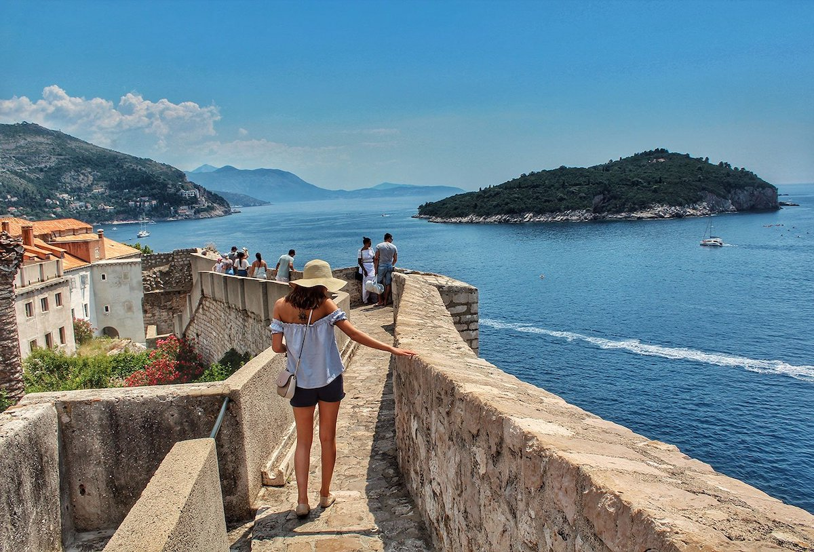
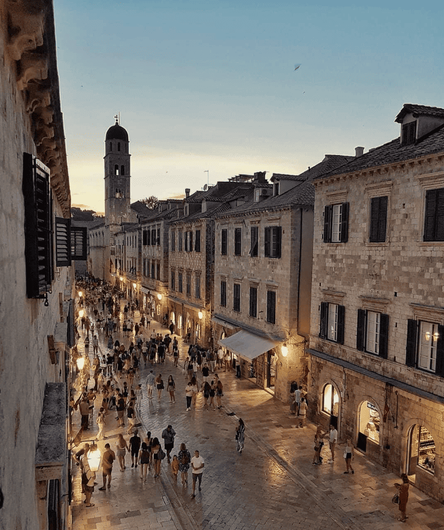
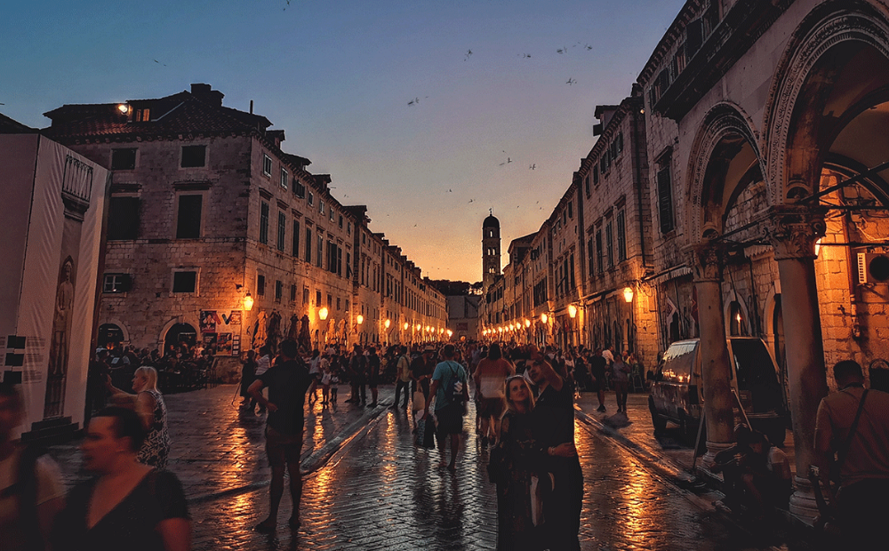
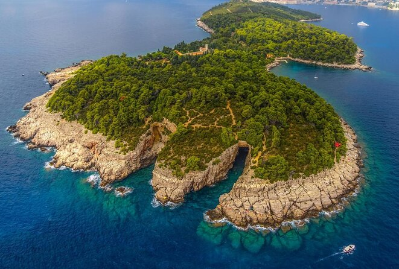
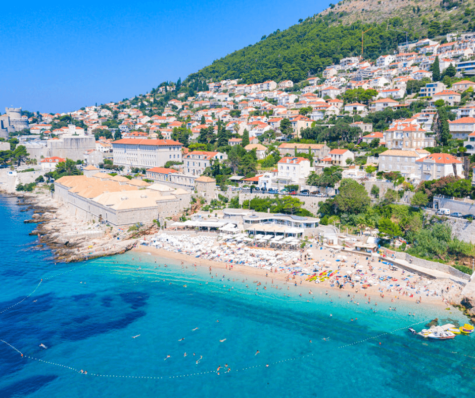
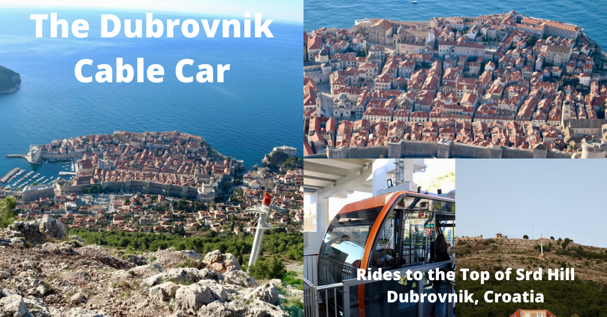
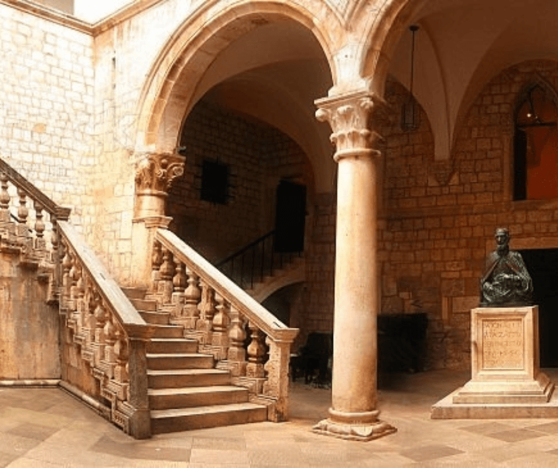
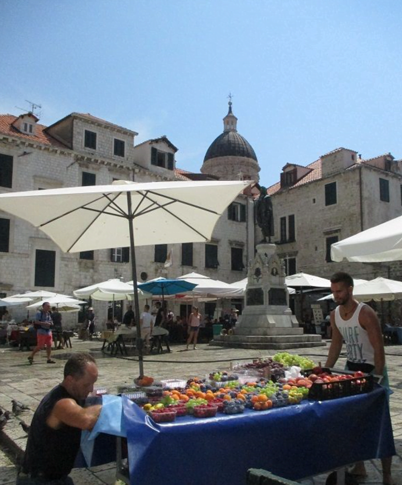
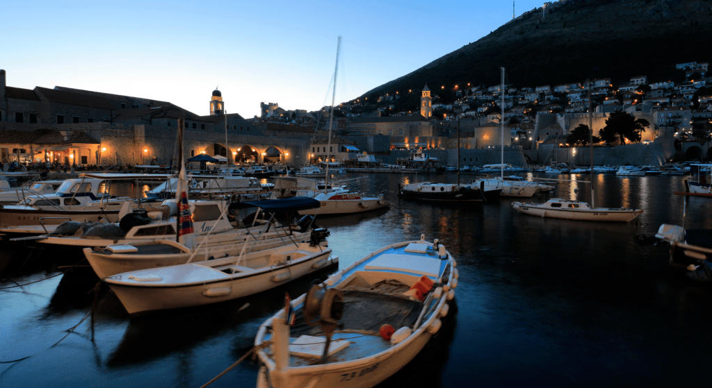

# Откриване на перлата на Адриатика: Един уикенд в Дубровник.

Сгушен на южния бряг на Хърватия, Дубровник е град, който сякаш е изскочил от страниците на книга с приказки в Адриатическо море. Със своята зашеметяваща архитектура, кристално чисти води и богата история Дубровник е дестинация, която обещава незабравим уикенд. Ето как да прекарате два или три дни в този омагьосващ град.

## Ден 1: Разглеждане на Стария град

### Сутринта: Разходка из градските стени

Започнете деня си рано, за да избегнете тълпите и жегата. Древните градски стени на Дубровник трябва да се видят, тъй като предлагат панорамна гледка към града и морето. Докато се разхождате по тези исторически крепостни стени, ще се насладите на гледки, които са останали почти непроменени през вековете.

### Следобед: Разходка из Страдун

След като слезете от стените, се насочете към Страдун - главната улица на Стария град. Осеяна с магазини и кафенета, тази павирана с варовик улица е идеална за спокойна разходка. Не забравяйте да посетите фонтана Онофрио и Францисканския манастир, в който се намира една от най-старите аптеки в Европа.

### Вечерта: Вечеря с гледка

Със залеза на слънцето изберете един от многото ресторанти с тераси с изглед към Стария град. Насладете се на ястия с пресни морски дарове или традиционни хърватски ястия, докато се наслаждавате на гледката към теракотените покриви на града и Адриатическо море.

## Ден 2: Обиколка на острови и релаксация на плажа

### Сутрин: Остров Локрум

Вземете кратко пътуване с ферибот до остров Локрум - природен резерват, който се намира само на един хвърлей от Дубровник. Разгледайте ботаническите градини, посетете руините на бенедиктински манастир и се потопете в малкото солено езеро, известно като Мъртво море.

### Следобед: Слънчеви бани на плажа Banje

Върнете се на сушата и се отправете към плажа Банье, най-известния чакълест плаж в Дубровник. Прекарайте следобеда в слънчеви бани, плуване в чистите води или изпробване на водни спортове.

### Вечерта: Кабинков лифт до планината Srđ

За да видите впечатляващ залез, изкачете се с кабинковия лифт до планината Srđ. Панорамната гледка към Дубровник и околните острови е спираща дъха. На върха има и ресторант, където можете да се насладите на вечеря с гледка.

## Ден 3: Културно потапяне и релаксация

### Сутрин: Посещение на Ректорския дворец

Посветете последната си сутрин на Двореца на ректора - готическо-ренесансова постройка, която някога е служила за седалище на ректора на Република Рагуза. Днес той е музей, в който са изложени мебели от епохата, произведения на изкуството и артефакти, разказващи за миналото на Дубровник.

### Следобед: Пийте кафе на площада

Прекарайте последния си следобед като местен жител, като се насладите на неангажиращо кафе на някой от площадите. Площад Гундулич е чудесен избор, особено ако сте там, когато сутрешният пазар е в разгара си.

### Вечерта: Прощална вечеря

За последната си вечер се отдайте на прощална вечеря в някое от изисканите заведения в Дубровник. Изберете място покрай пристанището за пресни морски дарове и тост за спомените, създадени в този великолепен град.

Дубровник е град, който завладява сърцето със своята красота, история и очарование. Независимо дали се разхождате по стените с история, излежавате се на плажа или се наслаждавате на местната кухня, уикендът в Дубровник със сигурност ще бъде връхна точка в пътешествието на всеки пътешественик.
