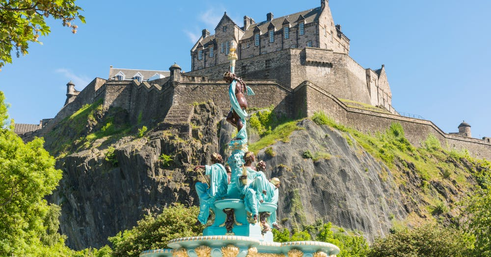
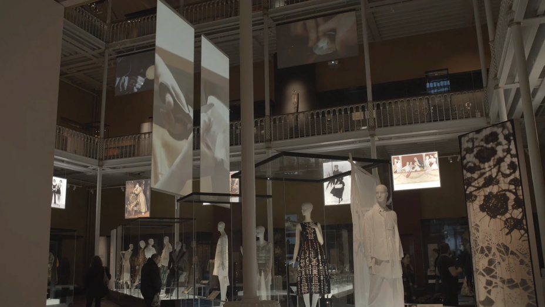
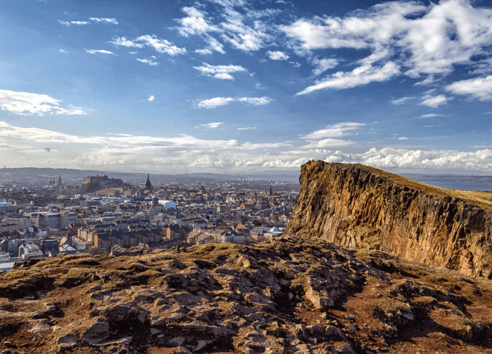
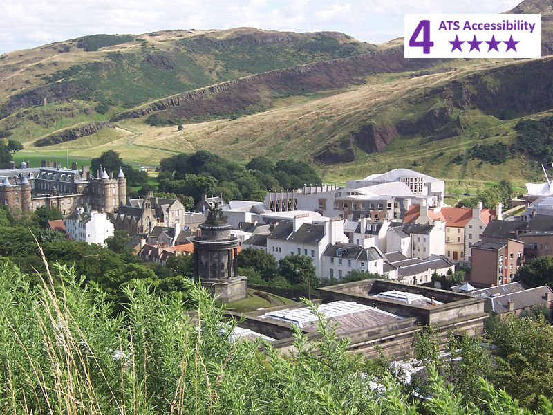

  # Един вихрен уикенд в Единбург: Приказка за замъци, култура и калдъръм

Единбург, столицата на Шотландия, е място, където история и съвременност се срещат на фона на зашеметяваща архитектура и природна красота. От емблематичния Единбургски замък до очарователните калдъръмени улички на Стария град - на всяка крачка ви очаква приключение. Присъединете се към мен, за да се впуснем в двудневно пътешествие из този очарователен град.

---

## Ден 1: Разглеждане на сърцето на Единбург

### Сутринта: Кралската миля и Единбургският замък

Започнете деня си с обилна шотландска закуска в някое от местните кафенета, преди да се отправите към Кралската миля. Тази историческа улица свързва две важни места в Единбург: Дворецът Холируд и Единбургският замък.

**Замъкът на Единбург**

Кацнал на върха на Касъл Рок, Единбургският замък е не само емблематична част от силуета на града, но и символ на легендарното минало на Шотландия. Докато разглеждате територията на замъка, не забравяйте да посетите скъпоценностите на короната и Камъка на съдбата - ключови елементи от шотландската история. Гледката към града от бойните стени е спираща дъха и предлага идеална възможност за снимки.

### Следобед: Обяд и Националния музей на Шотландия

След като слезете от замъка, насладете се на обяд в близката кръчма, където можете да опитате традиционни ястия като хагис, непс и тати.

**Национален музей на Шотландия**

След обяда се разходете спокойно до Националния музей на Шотландия. Разнообразните колекции на музея ще ви отведат на пътешествие от епохата на динозаврите до технологиите на бъдещето. Не пропускайте Голямата галерия и Шотландските галерии, където можете да навлезете по-дълбоко в богатото наследство на страната.

### Вечерта: Обиколка на призраци и вечеря

С падането на здрача се присъединете към една от известните обиколки на призраци в Единбург. Тези обиколки ще ви запознаят с тъмната история на града и ще ви преведат през призрачни алеи и гробища.

Завършете деня си с вечеря в ресторант в Стария град, където можете да се насладите на шотландска кухня със съвременен привкус.

---

## Ден 2: Седалката на Артур и културната сцена на града

### Сутринта: Разходка до Arthur's Seat

Започнете втория си ден с ободряващ поход до Arthur's Seat, главния връх в групата хълмове в Единбург. Изкачването е сравнително лесно и е подходящо за повечето нива на физическа подготовка.

**Изглед към Артур'с Сиат**

След като стигнете до върха, ще бъдете възнаградени с панорамна гледка към града и извън него. Това е идеалното място за запомняща се снимка и момент на размисъл.

### Следобед: Шотландският парламент и дворецът Холируд

Спуснете се от Arthur's Seat към сградата на шотландския парламент. Независимо дали се интересувате от политика или архитектура, уникалният дизайн на сградата си заслужава да бъде разгледан.

**Дворецът Холируд**

На кратка разходка от парламента се намира дворецът Холирууд - официалната резиденция на британския монарх в Шотландия. Разгледайте държавните апартаменти и историческите палати и се разходете из красивите градини.

### Вечерта: Дегустация на уиски и музика на живо

Никое посещение на Единбург не би било пълно без дегустация на шотландско уиски. Посетете местен уиски бар за дегустация, където ще научите повече за различните региони и вкусове.

След това се отправете към кръчма с шотландска музика на живо, за да се насладите на оживения нощен живот в града. Насладете се на звуците на цигулки и гайди, докато размишлявате върху вихрения си уикенд в Единбург.

---

Единбург е град, който завладява сърцата на всички, които се разхождат по историческите му улички и се вглеждат в живописните му гледки. От височините на Arthur's Seat до дълбините на призрачното му минало, Единбург предлага уникална смесица от приключения и култура. Независимо дали сте любител на историята, на природата или на изкуствата, тази шотландска столица със сигурност ще остави у вас спомени, които ще останат за цял живот.