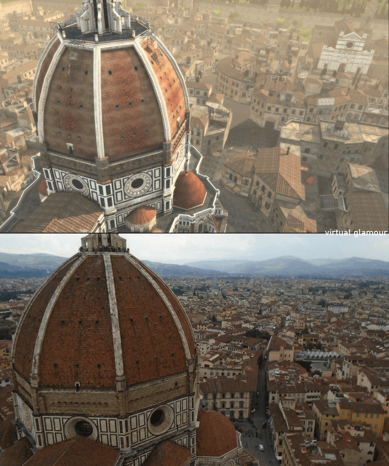
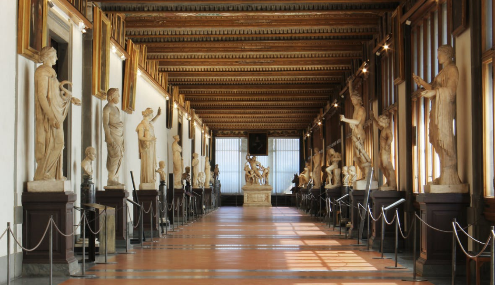
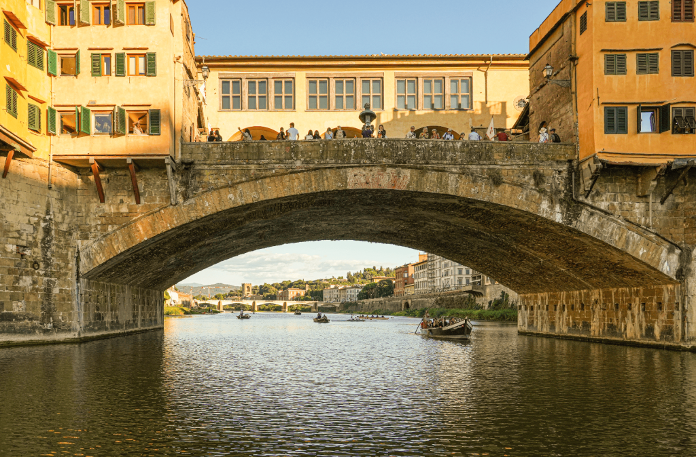
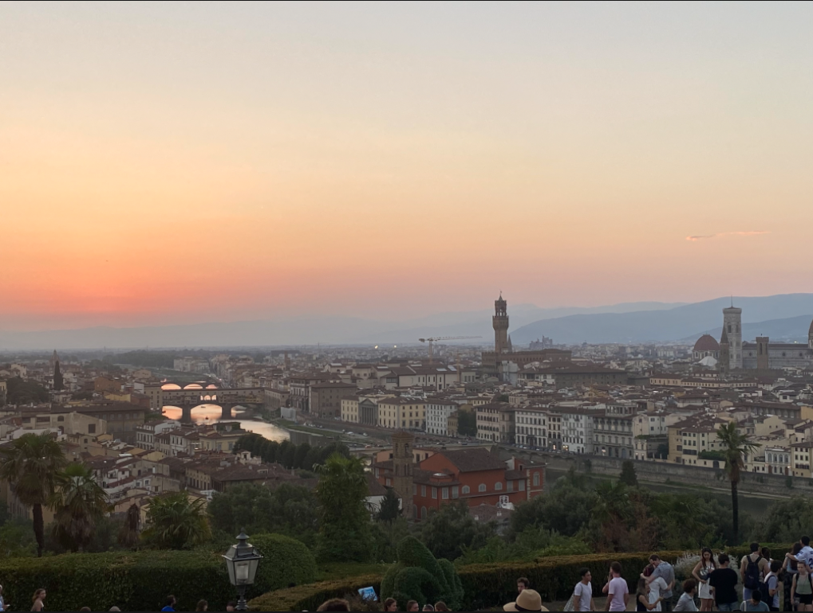
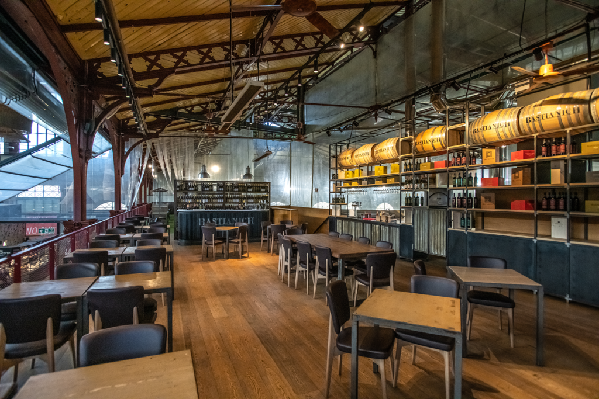

# Един уикенд във Флоренция: Люлката на Ренесанса

Флоренция, или Фиренце, както е известен в Италия, е град, който пленява сърцето с историческия си чар, художественото богатство и кулинарните си изкушения. Сгушен в хълмовете на Тоскана, Флоренция е компактен град, идеален за двудневно или тридневно посещение. Ето как да се възползвате максимално от уикенда във Флоренция.

## Ден 1: Сърцето на Флоренция

### Сутринта: Комплексът Дуомо

Започнете деня си рано на Пиаца дел Дуомо, религиозния център на Флоренция. Гледката на катедралата "Санта Мария дел Фиоре" с емблематичния й купол от червени плочки, проектиран от Филипо Брунелески, предизвиква възхищение. Изкачете 463-те стъпала до върха на купола, за да се насладите на панорамна гледка към града. 

В съседство с катедралата се намира Кампаниле на Джото - красива готическа камбанария, която също може да изкачите. Не е за изпускане и баптистерият "Свети Йоан" с прочутите бронзови врати на Лоренцо Гиберти, наречени "Райските порти".

### Следобед: Обяд и галерия Уфици

За обяд се отправете към местна тратория, за да вкусите от тосканската кухня. Опитайте риболита - обилна супа от зеленчуци и хляб, или класическа флорентинска пържола.

След обяда се отправете към галерия Уфици - един от най-известните музеи на изкуството в света. Дом на огромна колекция от ренесансово изкуство, Уфици е мястото, където ще откриете "Раждането на Венера" и "Примавера" на Ботичели, както и творби на Леонардо да Винчи, Микеланджело и Рафаел. 

### Вечерта: Пиаца делла Синьория и вечеря

Когато слънцето започне да залязва, се разходете до близкия площад Пиаца дела Синьория, главния площад на Флоренция, и разгледайте изложбата на скулптури на открито в Лоджия дей Ланци. За вечеря се насладете на традиционно тосканско ястие в ристорант с изглед към площада, като се отдадете на местните вина и може би на чиния папардели ал цингиале (паста от диво прасе).

## Ден 2: Занаятчии и градини

### Сутрин: Занаятчийски работилници в Олтрарно

Преминете по Понте Векио, най-стария мост във Флоренция, за да разгледате квартал Олтрарно. Този район е известен със своите занаятчийски работилници, където можете да наблюдавате как занаятчиите работят, създавайки бижута, кожени изделия и други традиционни флорентински занаяти. 

### Следобед: Градините Боболи и дворецът Питти

След лек обяд в кафене, посетете градините Боболи зад двореца Питти. Тези обширни ренесансови градини са идеални за неангажираща разходка сред фонтани, гротове и скулптури. В самия дворец Питти се помещават няколко музея, включително Галерия Палатина с колекция от ренесансови картини.

### Вечерта: Пиацале Микеланджело Залез

Нито едно посещение на Флоренция не е пълно, ако не станете свидетели на залеза от площад Микеланджело. От този площад на върха на хълма се открива спираща дъха гледка към Флоренция и река Арно. 

За вечеря вечеряйте в местна енотека, където можете да опитате различни тоскански вина, съчетани със селекция от сирена и сушени меса.

## Ден 3: Вкусът на Тоскана

### Сутрин: Пазар Сан Лоренцо

През последния ден се потопете в местния живот на пазара Mercato Centrale в квартал Сан Лоренцо. На приземния етаж се намира традиционен пазар за хранителни продукти, а на горното ниво - модерна зала за хранене, където можете да опитате флорентинска улична храна и италиански деликатеси. 

### Следобед: Галерия "Академия" и разходка в свободното време

След обяд посетете галерия "Академия", където се намира "Давид" на Микеланджело - истински шедьовър на ренесансовата скулптура. Прекарайте остатъка от следобеда в скитане по калдъръмените улици на Флоренция, откриване на скрити площади и наслаждаване на сладолед.

### Вечерта: Прощална вечеря

За последната си вечеря изберете ресторант с изглед към река Арно и размишлявайте за вашето флорентинско приключение. Опитайте zuppa di fagioli (бобена супа) или bistecca alla fiorentina, ако все още не сте опитали.

Флоренция е град, който продължава да очарова посетителите с непреходната си красота и културно наследство. Независимо дали сте любител на изкуството, кулинар или просто търсите la dolce vita, Флоренция предлага парче италиански рай, което ще остане в паметта ви дълго след като сте напуснали нейните легендарни улици.
