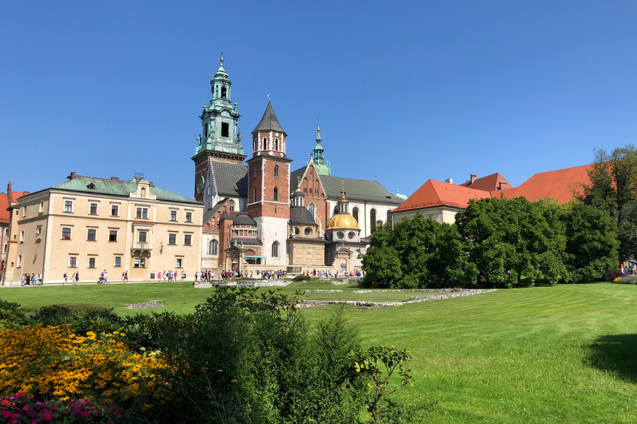
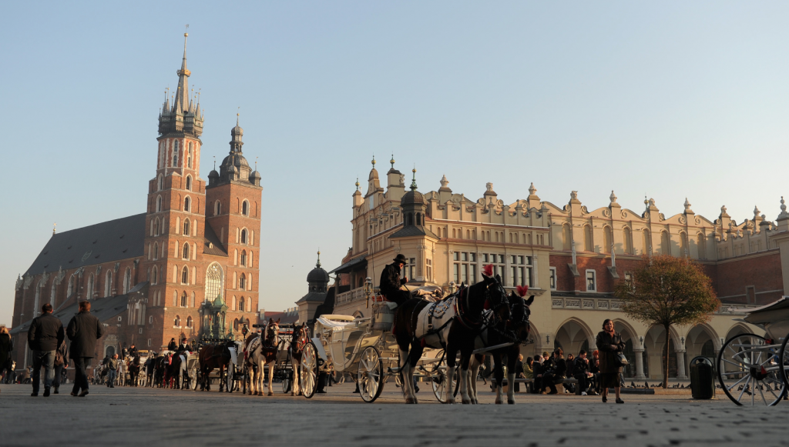
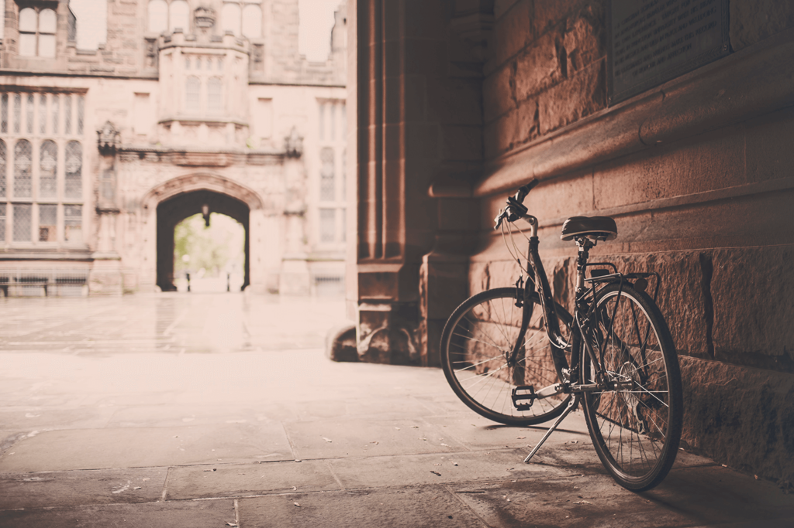
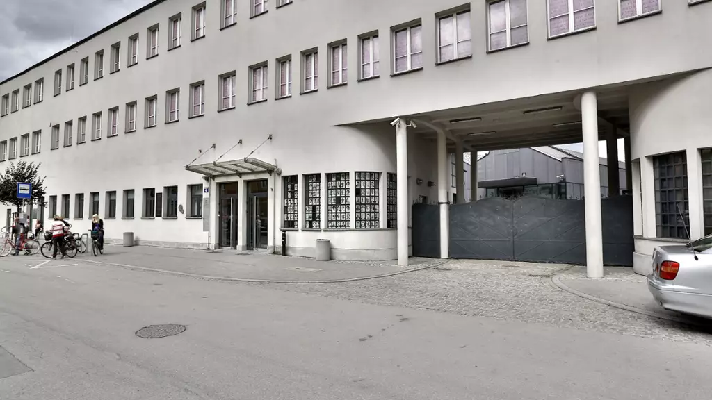

  # Пътуване през уикенда в Краков: Смесица от история и жизнена култура

Сгушен в сърцето на Европа, Краков е град, който пленява душата със своята средновековна архитектура, богата история и оживена културна сцена. Като бивша кралска столица на Полша, той е запазил очарованието си през вековете и сега е свидетелство за устойчивостта и красотата на Източна Европа. Присъединете се към мен на двудневно пътешествие из Краков, където всеки калдъръм нашепва истории от миналото и всеки ъгъл на улицата предлага ново откритие.

## Ден 1: Разглеждане на историческото ядро

### Сутрин: Кралският замък Вавел

Започнете приключението си в Краков от емблематичния кралски замък Вавел - перлата в короната на историческия район на града. Кацнал на хълм с изглед към река Висла, замъчният комплекс е обект на световното наследство на ЮНЕСКО и символ на полската национална идентичност.

Докато се разхождате из пищните държавни зали, частните кралски апартаменти и впечатляващата оръжейна, ще се пренесете във времената, когато крале и кралици са се разхождали из тези зали. Не пропускайте възможността да видите легендарната скулптура на Вавелския дракон близо до входа - митично същество, за което се твърди, че е тероризирало първите жители на града.

### Следобед: Разходка из Стария град

След като се потопите в кралската история, се спуснете в сърцето на Стария град на Краков. Започнете от Главния пазарен площад - един от най-големите средновековни градски площади в Европа. Тук ще откриете Залата на платовете (Sukiennice), която някога е била основен център на международната търговия. Днес в нея се помещава оживен пазар, където можете да намерите традиционни полски занаяти и сувенири.

След това посетете базиликата "Света Богородица" с нейния зашеметяващ дървен олтар, изваян от Вейт Щос, и с ежечасовия тръбен звън от високата й кула - традиция, която датира от 13 век. Зовът се прекъсва по средата на мелодията в чест на тръбач, който бил прострелян в гърлото, докато предупреждавал града за монголско нашествие.

### Вечер: Район Казимеж

Със залеза на слънцето се отправете към квартал Казимеж - историческият център на еврейския живот в Краков. Този квартал, който някога е бил отделен град, сега е оживен район, изпълнен с модерни кафенета, художествени галерии и уникални магазини.

Вечеряйте в някой от многото ресторанти, предлагащи традиционна еврейска или полска кухня. След това се насладете на неангажираща разходка и попийте трогателната история на района, като се спрете на забележителности като Старата синагога и гробището Ремух.

## Ден 2: Пътешествие през времето и изкуството

### Сутрин: Фабрика на Оскар Шиндлер

През втория ден ще се потопите в по-новата история на Краков, като посетите фабриката на Оскар Шиндлер, която сега е музей, посветен на историята на Краков по време на Втората световна война. Изложбата "Краков под нацистка окупация 1939-1945 г." е поглъщащо преживяване, което ще ви запознае с влиянието на войната върху града и с живота, спасен от действията на Шиндлер.

### Следобед: Съвременно изкуство и релаксация

След сутринта, изпълнена с тежка история, подобрете настроението си с посещение на MOCAK - Музея на съвременното изкуство в Краков. Разположен в близост до фабриката на Шиндлер, MOCAK представя широк спектър от съвременно изкуство от полски и международни художници, предлагайки поглед към настоящата художествена сцена.

По-късно си вземете почивка в някоя от зелените площи на Краков, като например парк Planty, който обгражда Стария град. Този пищен парк е идеален за спокойна разходка или пикник, като ви позволява да се заредите с енергия преди вечерните занимания.

### Вечерта: Кулинарни изкушения и нощен живот

Кулинарната сцена на Краков е смесица от традиционни вкусове и модерни обрати. За вечеря изберете ресторант, който предлага съвременен поглед към полската кухня, като съчетаете ястието си с местна крафт бира или шот традиционна полска водка.

С настъпването на нощта се насладете на оживения нощен живот на Краков. Независимо дали предпочитате тих винен бар, оживена кръчма или динамичен клуб, градът предлага по нещо за всеки. Старият град и Кажимеж са особено известни с развлеченията си след залез слънце, като има заведения за всеки вкус.

## Заключение

Краков е град, който с лекота съчетава историческото си наследство с младежка енергия. От царствената атмосфера на замъка Вавел до трогателните спомени за фабриката на Шиндлер и от оживените пазари до авангардните художествени галерии, Краков предлага богат гоблен от преживявания. Независимо дали сте любители на историята, на културата или просто търсите красива дестинация, Краков ще ви остави спомени за цял живот.