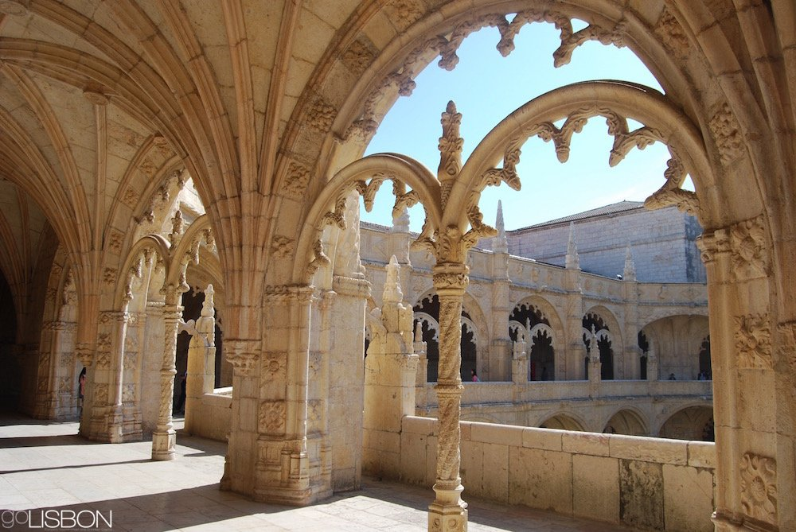

  # Откриване на очарованието на Лисабон: Двудневен маршрут

Лисабон, целунатата от слънцето столица на Португалия, е град, който без усилие съчетава традиционно наследство с поразителен модернизъм и прогресивно мислене. Този очарователен град край река Тежу е място, където можете да се разходите по тесни калдъръмени улички, да се насладите на панорамни гледки и да се отдадете на култура, която е едновременно жизнена и непринудена. Ето как да се възползвате максимално от два незабравими дни в Лисабон.

## Ден 1: Разглеждане на сърцето на Лисабон

### Сутринта: Разходка в Алфама
Започнете приключението си в Лисабон в историческия квартал Алфама - най-старият квартал в града, оцелял след голямото земетресение от 1755 г. С изгрева на слънцето улиците тук са тихи и това е идеалното време за разглеждане. Започнете от **Се де Лисбоа** (Лисабонската катедрала) - романска структура, наподобяваща крепост, която е издържала изпитанието на времето.

Оттам по лабиринтните улички стигнете до **Кастело де Сао Жорж**. Този мавритански замък предлага едни от най-завладяващите гледки към града и река Тежу. Прекарайте известно време в разходка по крепостните стени и надникнете през перископа в Кулата на Улисес.

### Следобед: Байша и Чиадо
Спуснете се от замъка към централната част на града, известна като Байша. Възстановен след земетресението, Байша се характеризира с големи площади, широки булеварди и неокласически сгради. Отправете се към **Праса до Комерсио**, величествен площад край реката, и се полюбувайте на статуята на крал Жозе I и триумфалната арка.

За обяд се отправете към оживената **Руа Аугуста** - пешеходна улица, осеяна с кафенета и магазини. Опитайте традиционно португалско ястие като бакалхау (риба треска) или се насладете на петискос (португалски тапас).

Следобед направете кратка разходка до шикозния квартал Чиадо. Тук можете да посетите емблематичното кафене **A Brasileira**, известно с връзката си с поета Фернандо Песоа. Не забравяйте да се снимате с бронзовата му статуя, която седи на маса отвън.

### Вечерта: Време за фадо
С наближаването на вечерта се върнете в Алфама или разгледайте квартала Байру Алто, където можете да вечеряте в някой от многото ресторанти, предлагащи изпълнения на фадо на живо. Този традиционен португалски музикален жанр е дълбоко емоционален и често меланхоличен, като разказва истории за живота, съдбата и копнежа.

## Ден 2: Белем и нататък

### Сутринта: Паметници и сладкиши в Белем
През втория ден вземете трамвай или автобус до квартал Белем, разположен на запад от центъра на града. Започнете от манастира **Jerónimos** - обект на световното наследство на ЮНЕСКО и шедьовър на мануелинската архитектура. Задължително трябва да се видят манастирските манастири със сложните си дърворезби и спокойна атмосфера.

На кратко разстояние пеша от манастира се намира емблематичната кула **Белем** - друг обект на ЮНЕСКО. Построена в началото на XVI в., кулата е символ на епохата на откритията и предлага друга гледна точка към историята на Лисабон и връзката му с морето.

Нито едно посещение на Белем не би било пълно, ако не опитате прочутите **Pastéis de Belém** - оригиналните португалски тарталети с крем. Спрете в историческата пекарна и се насладете на тези сладки изкушения, току-що извадени от фурната.

### Следобед: Музеи и градини
Прекарайте следобеда си в разглеждане на някои от културните забележителности на Белем. В **Музея на колекцията "Берардо "** е представено модерно и съвременно изкуство, а **Музеят на мореплаването "** се занимава с морското минало на Португалия.

Ако предпочитате разходките на открито, **Jardim Botânico Tropical** е пищен оазис, в който се намират различни екзотични растения и исторически паметници.

### Вечерта: Залезът на слънцето във фабриката LX
За последната си вечер посетете **LX Factory** - модерен индустриален комплекс, превърнат в творчески център с ресторанти, барове, магазини и арт пространства. Това е идеалното място да се отпуснете и да осмислите преживяването си в Лисабон.

Със залеза на слънцето намерете бар на покрива или уютно местенце край реката, за да наблюдавате как небето се оцветява в розови и оранжеви нюанси над моста 25 де Абрил - подходящ завършек на престоя ви в Лисабон.

## Заключение
Два дни в Лисабон ще ви очароват с историята, културата и топлотата на хората. Независимо дали слушате задушевните напъни на фадо, опитвате пастел де ната или гледате града от гледната точка на замък, Лисабон е град, който пленява сърцето. Когато си тръгвате, вече ще планирате следващото си посещение на това пленително португалско бижу.