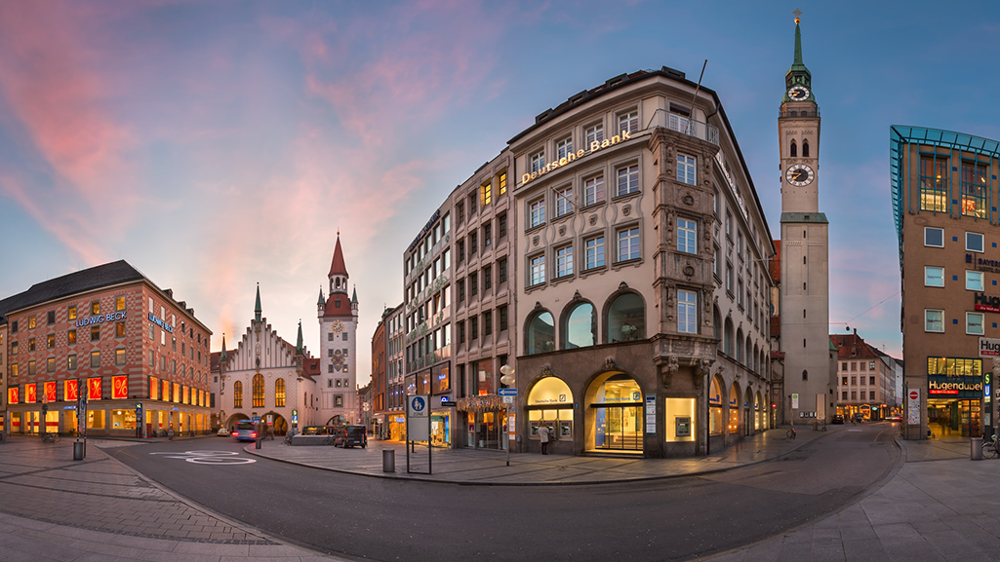
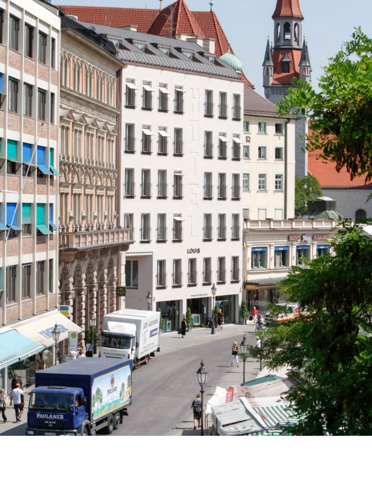
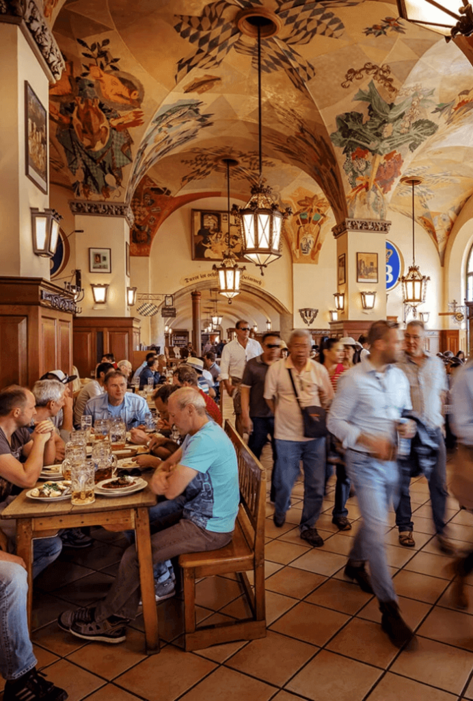
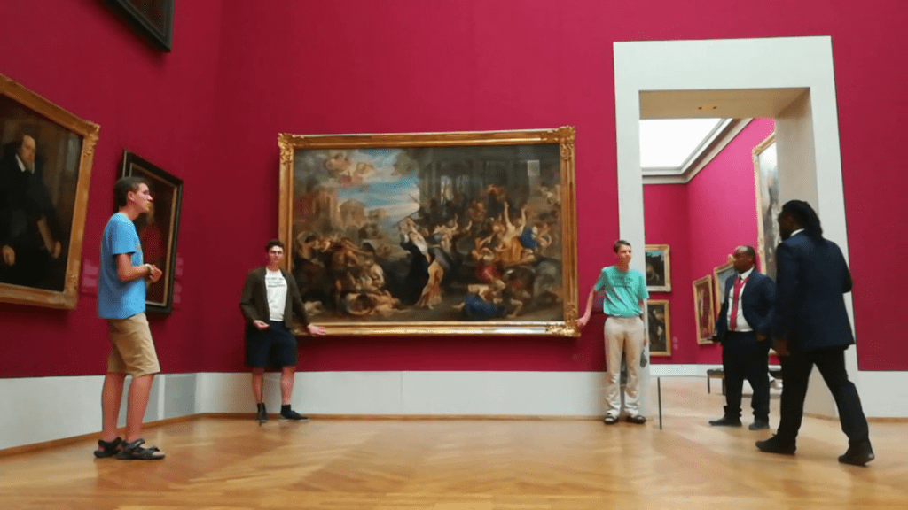
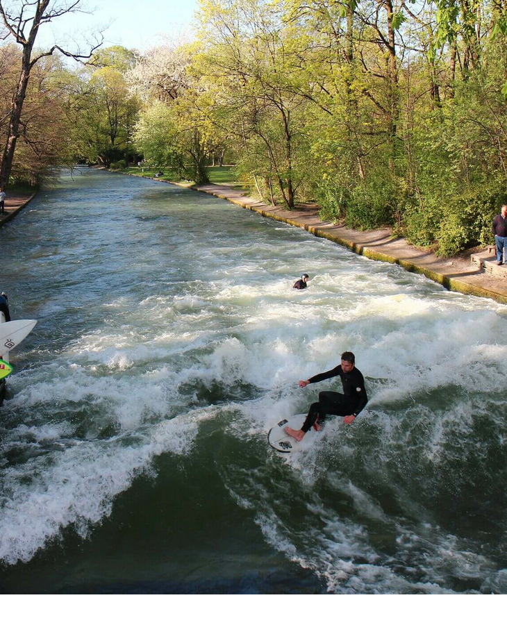
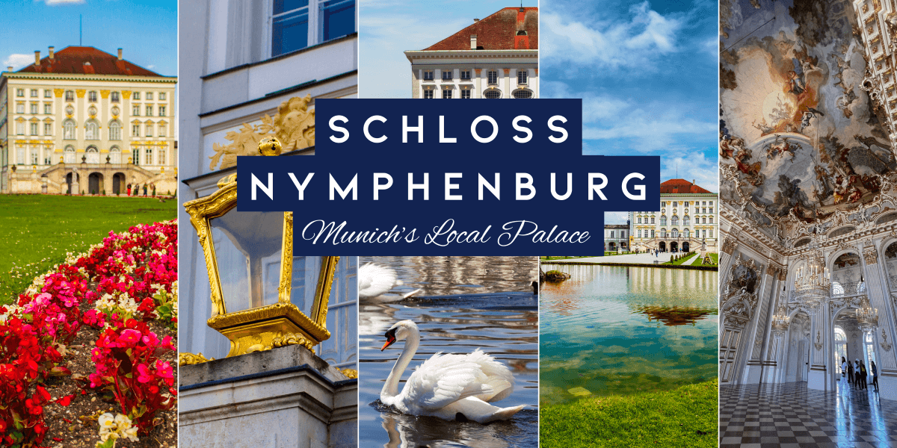
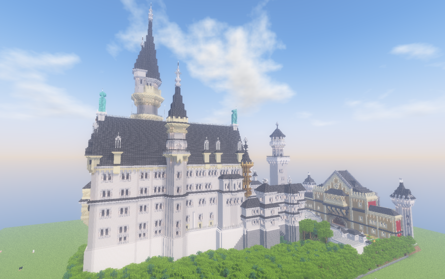

  # Уикенд бягство в Мюнхен: Културният скъпоценен камък на Бавария

Мюнхен, столицата на Бавария, е град, в който модерната изтънченост се съчетава с богатото културно наследство. Известен с ежегодния си празник Октоберфест, Мюнхен е и целогодишна дестинация с изобилие от атракции. Независимо дали сте любители на историята, на изкуството или на бирата, Мюнхен има какво да ви предложи. Ето как можете да прекарате незабравими два или три дни в този оживен германски град.

## Ден 1: Разглеждане на сърцето на Мюнхен

### Сутрин: Мариенплац и Новото кметство

Започнете приключението си в Мюнхен от централния площад на града - Мариенплац. На този оживен площад се намира Новото кметство (Neues Rathaus) - шедьовър на готическото възраждане. Уверете се, че сте там в 11:00 или 12:00 ч., за да станете свидетели на прочутия звън на Глокеншпил и да наблюдавате как 32 фигури в естествен размер пресъздават исторически баварски събития.

След представлението помислете дали да не се изкачите на кулата на църквата "Свети Петър", която се намира само на кратка разходка от Мариенплац, за да се насладите на панорамна гледка към града.

### Следобед: Viktualienmarkt и традиционен баварски обяд

На кратка разходка от Мариенплац се намира Виктуалиенмаркт - ежедневният открит фермерски пазар в Мюнхен. Тук можете да опитате местни деликатеси, да си вземете пресни продукти или да хапнете на някоя от многобройните сергии за храна. За обяд опитайте някои традиционни баварски ястия като Weisswurst (бяла наденица), Pretzel и освежаваща бира Maß в една от бирените градини на пазара.

### Вечерта: Хофбройхаус и баварската бирена култура

Нито едно посещение на Мюнхен не е пълно, без да се запознаете със световноизвестната бирена култура. Отправете се към Hofbräuhaus, една от най-старите бирарии в Мюнхен, за вечер на обилна храна, традиционна музика на живо и литри бира. Оживената атмосфера и общите места за сядане улесняват общуването с местните жители и с други пътници.

## Ден 2: Изкуство, паркове и дворци

### Сутринта: Музеи на изкуството в Кунстареал

Музейният квартал на Мюнхен, известен като Кунстареал, е задължително място за посещение от любителите на изкуството. Започнете с Alte Pinakothek, където се помещава впечатляваща колекция от европейски шедьоври от Средновековието до XVIII век. След това, в зависимост от интереса ви, посетете Новата пинакотека за изкуство от XIX в. или Пинакотеката на модерното изкуство за модерни и съвременни произведения.

### Следобед: Отдих в английската градина

След сутринта, посветена на изкуството, се отпуснете в Английската градина - един от най-големите градски паркове в света. Разходете се спокойно по нейните алеи, наблюдавайте как сърфистите се справят с изкуствената вълна на река Айзбах или намерете тихо местенце за отдих край езерото Клайнхеселохер.

### Вечерта: Дворецът Нимфенбург

Завършете деня си с посещение на бароковия дворец Нимфенбург, бивша лятна резиденция на баварските монарси. Разгледайте пищния интериор, разходете се из обширните градини и се възхищавайте на сложните детайли от архитектурата на двореца, докато слънцето залязва.

## Ден 3: Еднодневна екскурзия до замъка Нойшванщайн (по желание)

Ако разполагате с допълнителен ден, помислете за еднодневна екскурзия до приказния замък Нойшванщайн, който се намира на около 2 часа от Мюнхен. Този дворец от 19-ти век, кацнал на пресечен хълм над село Хоеншвангау, е вдъхновение за замъка на Дисни "Спящата красавица".

### Сутрин до следобед: Обиколка на замъка и пешеходен туризъм

Поръчайте обиколка с екскурзовод, за да научите повече за историята на замъка и за крал Лудвиг II, който го е поръчал. След обиколката се изкачете до Мариенбрюке, за да се насладите на спираща дъха гледка към замъка и околните пейзажи.

### Вечерта: Завръщане в Мюнхен

Вечерта се върнете в Мюнхен, като по пътя може да спрете за вечеря в уютна къща, за да се насладите на баварското гостоприемство преди края на пътуването си.

---

Мюнхен е град, който завладява със своята смесица от история, култура и съвременност. Независимо дали сте там заради бирата, изкуството или архитектурата, ще си тръгнете със спомени от място, където традициите се ценят и празнуват. Просто в Мюнхен - град, който наистина има всичко!