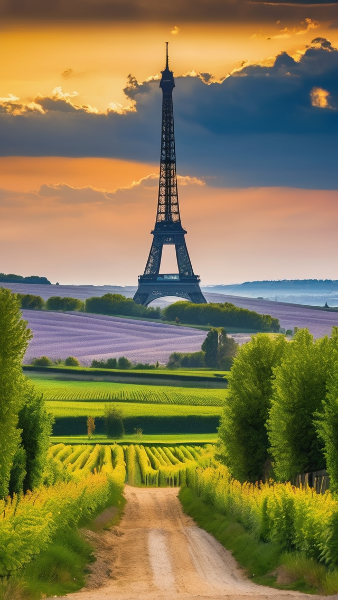
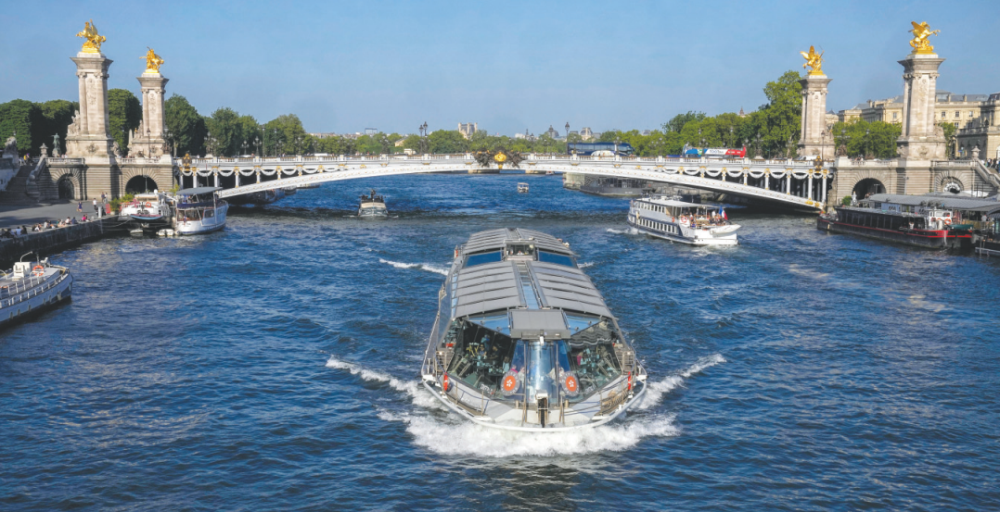
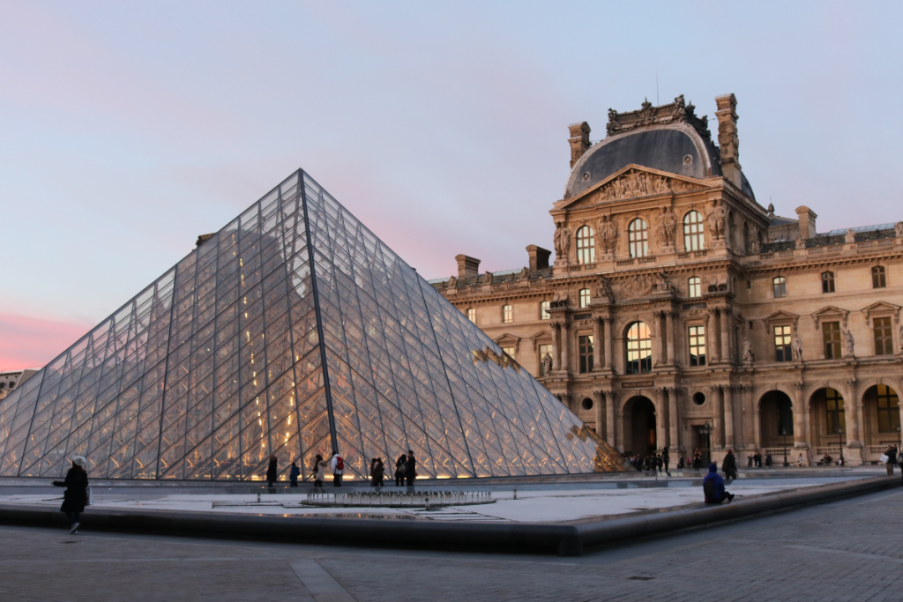
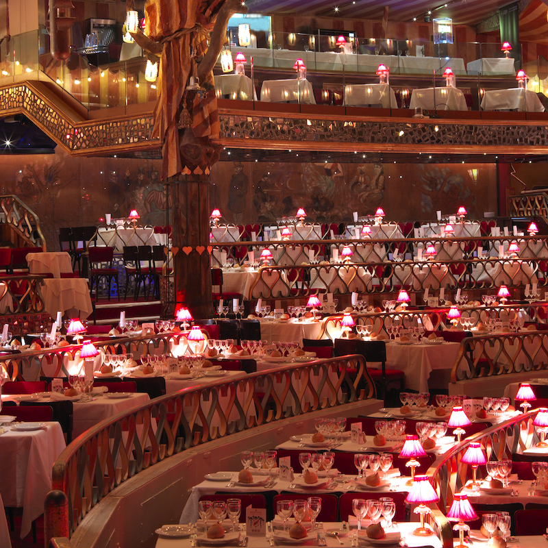
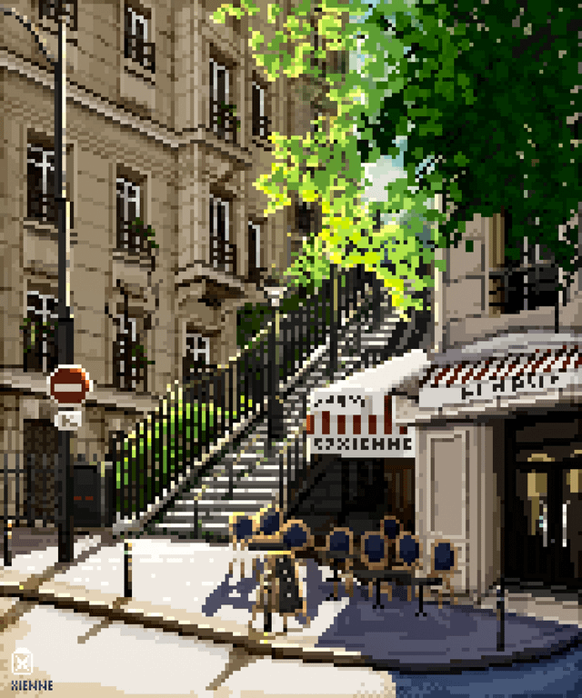
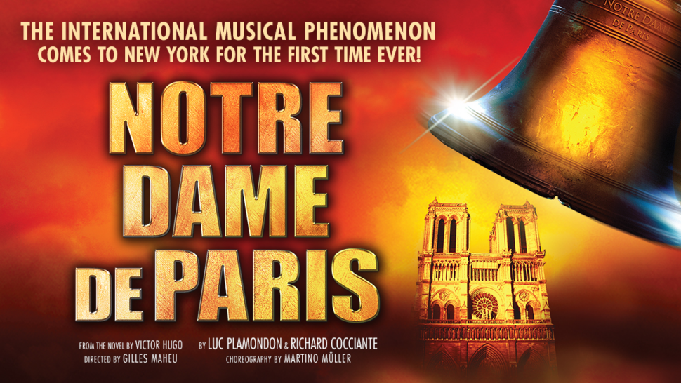
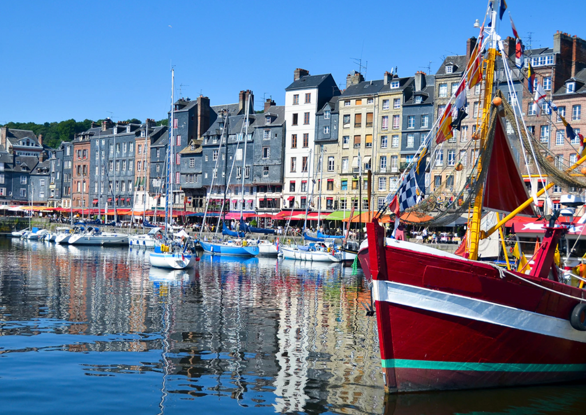
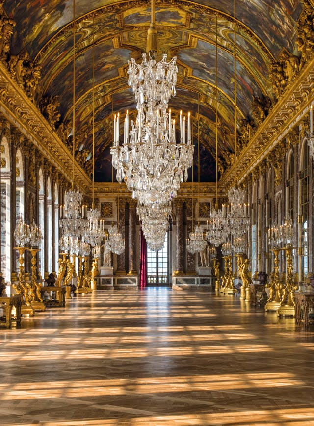
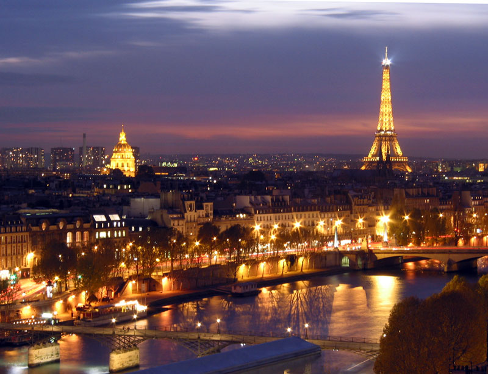

  # Един уикенд в Париж: Градът на светлината очаква

Париж, столицата на Франция, е град, който не се нуждае от представяне. Известен като "Градът на светлината" и често смятан за най-романтичния град в света, Париж е дестинация, която пленява сърцето на всеки пътешественик. От емблематичните си забележителности до очарователните си улички, Париж е град, който обещава незабравимо преживяване. В тази публикация в блога ще разгледаме как да прекарате очарователни два или три дни в този вълшебен град.

## Ден 1: Иконични забележителности и художествени съкровища

### Сутринта: Изгрев с Желязната лейди

Започнете парижкото си приключение с посещение на Айфеловата кула рано сутринта. Гледането на изгрева от градините Трокадеро предлага спираща дъха гледка към кулата, когато тя започва да блести в утринната светлина. 

### Закуска: Френски деликатес

След изгрева на слънцето се отправете към близкото кафене за класическа френска закуска. Насладете се на топъл кроасан или на pain au chocolat в комбинация с café au lait. Причудливите сладкарници по улиците са идеални за бързо хапване.

### В средата на сутринта: Разходка покрай Сена

Разходете се спокойно покрай река Сена. По бреговете на реката, която е част от световното наследство на ЮНЕСКО, са разположени книжарници и художници, които предлагат поглед към оживената култура на града. 

### Обяд: Пикник в парка

Вземете пресни багети, сирене и вино от местния пазар и се отправете към Марсово поле за пикник с гледка към Айфеловата кула. Това е типично парижко преживяване, което не бива да пропускате.

### Следобед: Чудеса на изкуството в Лувъра

Прекарайте следобеда си в музея Лувър, където се намират хиляди произведения на изкуството, включително Мона Лиза и Венера дьо Мило. Огромната колекция на музея обхваща векове и е свидетелство за човешкото творчество. 

### Вечерта: Вечеря и шоу

За вечеря се отдайте на френска кухня в традиционна бирария. Опитайте ескарго, coq au vin или boeuf bourguignon. След това посетете кабаретно шоу в известния Moulin Rouge, за да прекарате една нощ в блясък и разкош. 

## Ден 2: Бохемска рапсодия и готическо великолепие

### Сутрин: Художниците на Монмартър

Започнете деня си в бохемския квартал Монмартър. Посетете белоснежната базилика Сакре Кьор и се насладете на панорамна гледка към града. Разходете се по калдъръмените улички и открийте пазара на местните художници на площад дю Тертр. 

### Обяд: Вкусът на Монмартър

Насладете се на обяд в уютно бистро в Монмартър. Опитайте традиционни ястия като рататуй или патешко конфи, докато се наслаждавате на артистичната атмосфера на квартала.

### Следобед: Нотр Дам и островите

Отправете се към Île de la Cité, за да посетите емблематичната катедрала Нотр-Дам. Въпреки че претърпя опустошителен пожар през 2019 г., катедралата остава символ на Париж. Разходете се до близкия остров Île Saint-Louis - спокоен остров, идеален за наслада на сладолед Berthillon. 

### Вечерта: Круиз по река Сена

Със залеза на слънцето се отправете на круиз по река Сена. Плъзнете се покрай осветени забележителности като Лувъра, музея Орсе и Айфеловата кула, докато се наслаждавате на гурме вечеря на вода. 

## Ден 3 (по желание): Версай и сбогуване

### Сутрин: Дворецът Версай

Ако разполагате с трети ден, направете кратка екскурзия до двореца Версай. Разгледайте пищните зали, Огледалната зала и обширните градини. Великолепието на двореца е свидетелство за разточителния начин на живот на френските кралски особи. 

### Обяд: Кралски удоволствия

Вечеряйте в някой от ресторантите във Версай или си пригответе пикник, на който да се насладите в градините. Местните пазари предлагат разнообразни гурме варианти за кралска вечеря на открито.

### Следобед: Завръщане в Париж

Прекарайте последния си следобед обратно в Париж, като може би разгледате квартал Маре или посетите модерното изкуство в Центъра Помпиду. Използвайте това време, за да се разхождате и да откриете собствените си скрити съкровища в града.

### Вечерта: Заключителен тост

За последната си вечер вдигнете тост за парижкото си приключение в бар на покрива с панорамна гледка към града. Помислете за създадените спомени и красотата на Париж, докато светлините на града блещукат долу. 

Париж е град, който винаги ви кара да копнеете за още. Независимо дали стоите под Айфеловата кула, или отпивате вино покрай Сена, магията на Париж е неоспорима. Приятен път и нека дните ви в Париж бъдат толкова очарователни, колкото и самият град.