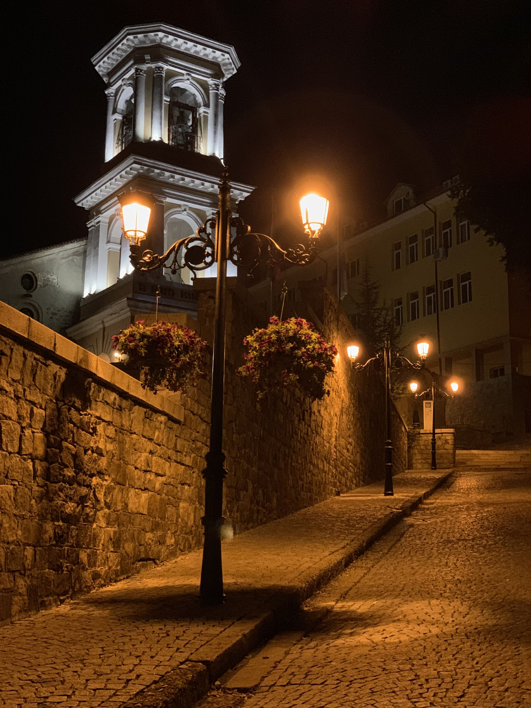

# Откриване на древния чар в Пловдив: Двудневен маршрут

Сгушен в сърцето на България, Пловдив е град, който с лекота съчетава древните си корени с динамична съвременна култура. Като един от най-старите непрекъснато обитавани градове в Европа, Пловдив е съкровищница от история, изкуство и живописна красота. Присъединете се към нас, за да изследваме това скрито бижу в рамките на два незабравими дни.

---

## Ден 1: Пътуване във времето в Стария град

### Сутрин: Стъпка назад във времето

Започнете деня си със спокойна разходка по калдъръмените улички на Стария град в Пловдив. Този архитектурен и исторически резерват е разположен на трите хълма Небет тепе, Джамбаз тепе и Таксим тепе. Това е място, където всяко кътче шепне приказки от миналото, с красиво реставрирани къщи от периода на Българското национално възраждане.

Станете рано, за да уловите златната утринна светлина, която облива в топло сияние пъстрите къщи. Посетете **Етнографския музей**, който се помещава в Куюмджиевата къща - зашеметяващ пример за възрожденска архитектура, за да разберете начина на живот на българите през XVIII и XIX век.

### Следобед: Римско наследство

След традиционен български обяд в местна механа се отправете към **Древния римски театър на Филипопол** - един от най-добре запазените древни театри в света. Седнете в древната зрителна зала и си представете представленията, които са се провеждали тук под зоркия поглед на римските зрители.

Следващата ви спирка е Римският стадион, разположен в близост до Джумая джамия. Въпреки че голяма част от него е скрита под града, части от него са разкопани, разкривайки величието, което някога е побирало 30 000 зрители. Римското наследство на Пловдив не свършва дотук; разгледайте останките от Римския форум и Одеона, които предлагат представа за някогашното значение на града.

### Вечерта: Изкуство и кухня

Пловдив е известен и с оживената си арт сцена. Разходете се по главната пешеходна улица и скоро ще се озовете сред множество художествени галерии и занаятчийски магазини. Квартал **Капана** - означаващ "капан" - е творческото сърце на града, а криволичещите му улички са платно за градските художници.

Вечеряйте в някой от модерните ресторанти в Капана, където традиционните български ястия се срещат с модерни кулинарни техники. Завършете вечерта с питие в местен бар, за да се потопите в младежката енергия, която градът излъчва.

---

## Ден 2: Смесица от култура и природа

### Сутрин: Културно познание

Започнете втория си ден в **Регионалния археологически музей в Пловдив**. Обширната колекция включва тракийски съкровища и римски мозайки, което задълбочава разбирането ви за многопластовата история на района.

Ако посетите града през уикенда, можете да посетите **Фермерския пазар в Пловдив**, където местните производители се събират, за да продават пресни продукти, домашно приготвени деликатеси и уникални български занаяти.

### Следобед: Релаксиращо бягство

След обяда е време да се запознаете с естествената страна на Пловдив. Паметникът на Альоша\*\* е масивна статуя, разположена на върха на хълма Бунарджик, откъдето се открива панорамна гледка към града. Изкачването до върха е умерено, но си заслужава заради спиращите дъха гледки.

След като се спуснете, отпочинете краката си в **Цар Симеоновата градина**. В този красиво озеленен парк се намират живописните Пеещи фонтани, които вечер оживяват със синхронизирана музика и светлинни ефекти.

### Вечерта: Жива прощална вечер

Прекарайте последната си вечер в Пловдив на **Канала за гребане**. Този спокоен район става оживен, тъй като местните жители излизат за вечерни разходки, колоездене и гребане. Това е идеалният фон за размисъл за приключенията ви в Пловдив.

Вечеряйте в ресторант на брега на реката, като се насладите на прясна риба или други местни специалитети. С падането на нощта се разходете за последен път из града, който сега е осветен и излъчва друг вид красота. Нощният Пловдив не е за изпускане с неговите исторически сгради и паметници, осветени драматично на фона на тъмното небе.

Пловдив е град, в който старото играе хармонично с новото, като въвлича посетителя в един очарователен танц през времето. Двудневното посещение дава възможност само да се надникне в душата на този пленителен град. Но бъдете предупредени, че Пловдив умее да краде сърца; не се изненадвайте, ако откриете, че копнеете да се върнете към неговите очарователни улици и сърдечни хора.
