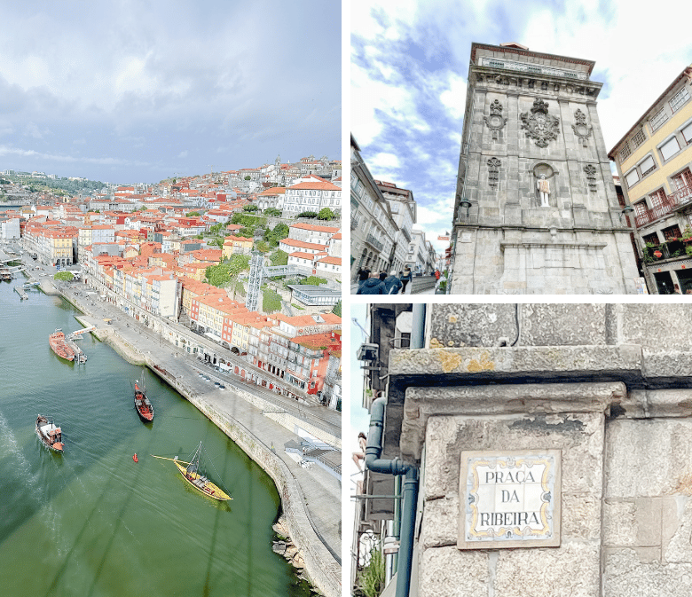

  # Откриване на очарованието на Порто: Двудневен маршрут

Разположен покрай река Дору в Северна Португалия, Порто е град с богата история и култура, в който се съчетават старинно очарование и съвременен дух. Порто предлага наслада за сетивата - от лабиринтните улички на квартал Рибейра до извисяващите се камбанарии на многобройните църкви. Присъединете се към мен, за да предприемем двудневно пътешествие из този очарователен град.

## Ден 1: Разглеждане на сърцето на Порто

### Сутрин: Железопътна гара Сао Бенто и катедралата на Порто

Започнете приключението си в Порто на една от най-красивите гари в света - жп гара Сао Бенто. Входното фоайе е украсено с около 20 000 азулежу - традиционните португалски сини и бели плочки, на които са изобразени сцени от историята на Португалия. 

На кратко разстояние пеша от Сао Бенто се намира Се до Порто или Катедралата на Порто. Тази романска и готическа структура е свидетелство за религиозното наследство на Порто. Изкачете стъпалата до терасата, за да се насладите на панорамна гледка към града и реката под него. 

### Следобед: Район Рибейра и мостът Дом Луиш I

Разходете се до квартал Рибейра - историческото сърце на града. Цветните къщи, тесните калдъръмени улички и местните таверни създават атмосфера, която прилича на стъпка назад във времето. Насладете се на традиционен португалски обяд в един от многото ресторанти на брега на реката. 

След обяда се разходете по емблематичния мост Дом Луиш I, проектиран от ученик на Густав Айфел. От моста се открива зашеметяваща гледка към града и реката, особено от горния етаж. 

### Вечерта: Вечеря и фадо

За вечеря се отдайте на местната кухня в традиционен португалски ресторант. Опитайте Francesinha - специален сандвич от Порто, сложен от месо и покрит с разтопено сирене и гъст сос от домати и бира.

След вечеря се насладете на задушевните звуци на фадо, най-известната музикална традиция в Португалия, в местна къща за фадо. Меланхоличните мелодии са идеалният завършек на първия ви ден в Порто. 

## Ден 2: Вино, изкуство и градини

### Сутрин: Вила Нова де Гая и дегустация на портвайн

Направете кратко пътуване през реката до Вила Нова де Гая, където се намират известните изби за портвайн в Порто. Присъединете се към обиколка с екскурзовод на една от избите и научете повече за историята и производството на портвайн, последвана от дегустация. 

### Следобед: Музей и градини Сералвес

След като се насладите на сладкия вкус на портвайна, се отправете към Музея на съвременното изкуство в Сералвес. Самият музей е произведение на изкуството със своя елегантен, модерен дизайн. Разгледайте изложбите, които представят както португалски, така и международни художници. 

Около музея се намират градините Сералвеш - пищен оазис, идеален за спокойна разходка. Градините съчетават съвременен ландшафтен дизайн с естествената красота на региона. 

### Вечерта: Вечеря в Матосинхос и залез на плажа

За последната си вечер се отправете към крайбрежния квартал Матосинхос, за да опитате едни от най-пресните морски дарове в Порто. Рибата на скара и ракообразните са звездите на шоуто тук.

След вечерята се разходете по плажа и наблюдавайте залеза над Атлантическия океан - един спокоен завършек на вашето пътуване в Порто. 

## Заключение

Порто е град, който улавя същността на Португалия: богат на традиции, но жизнен и постоянно развиващ се. Само за два дни можете да се запознаете с най-интересните забележителности на този завладяващ град, но очарованието на Порто може да ви примами да останете малко по-дълго. Независимо дали пиете портвайн или слушате завладяващите мелодии на фадо, магията на Порто със сигурност ще остави трайни впечатления.