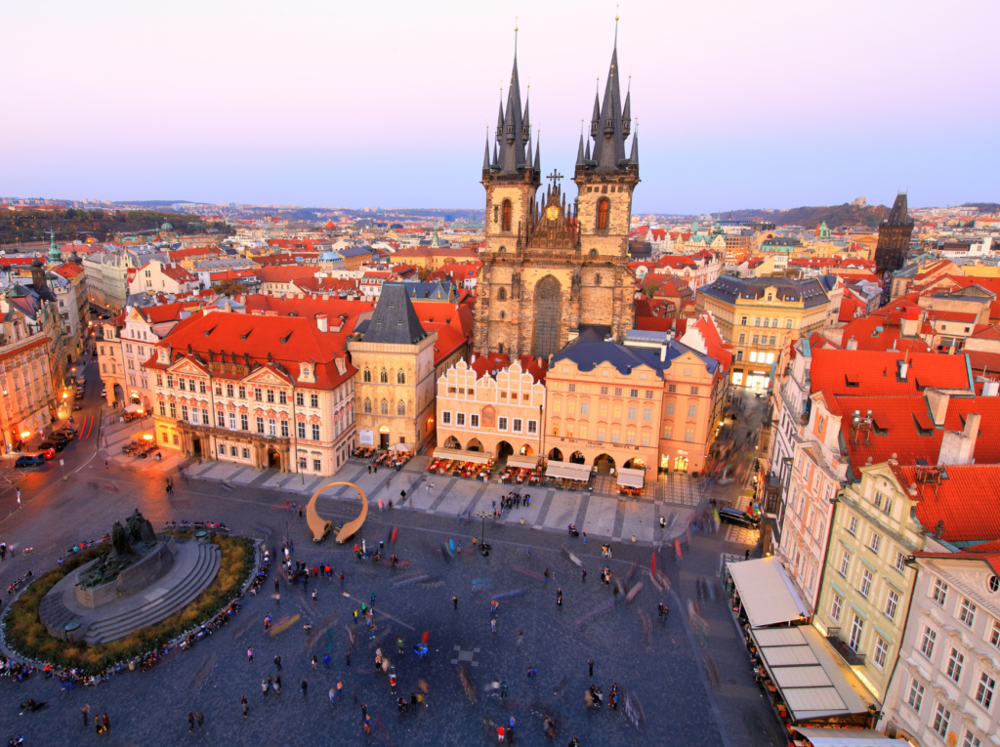
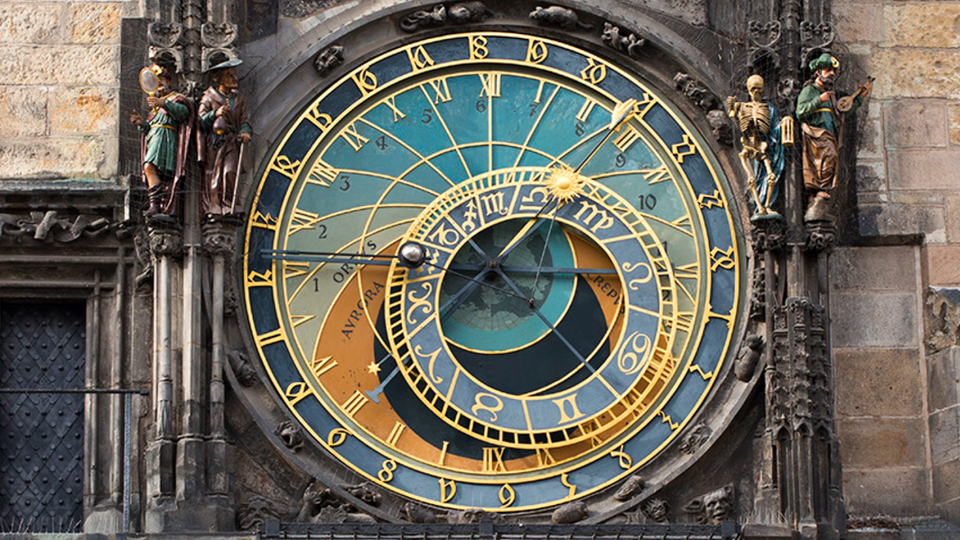
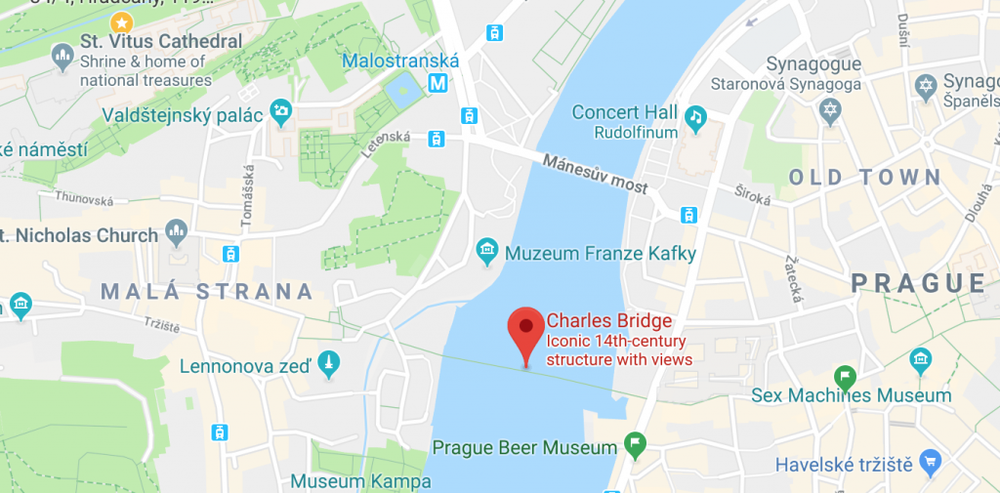
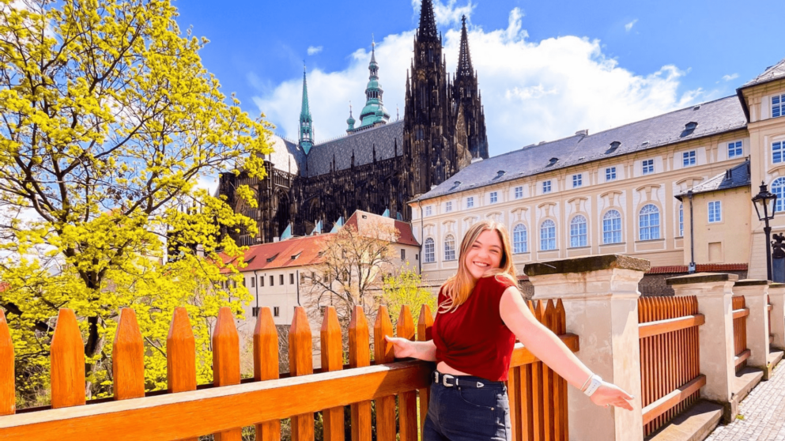
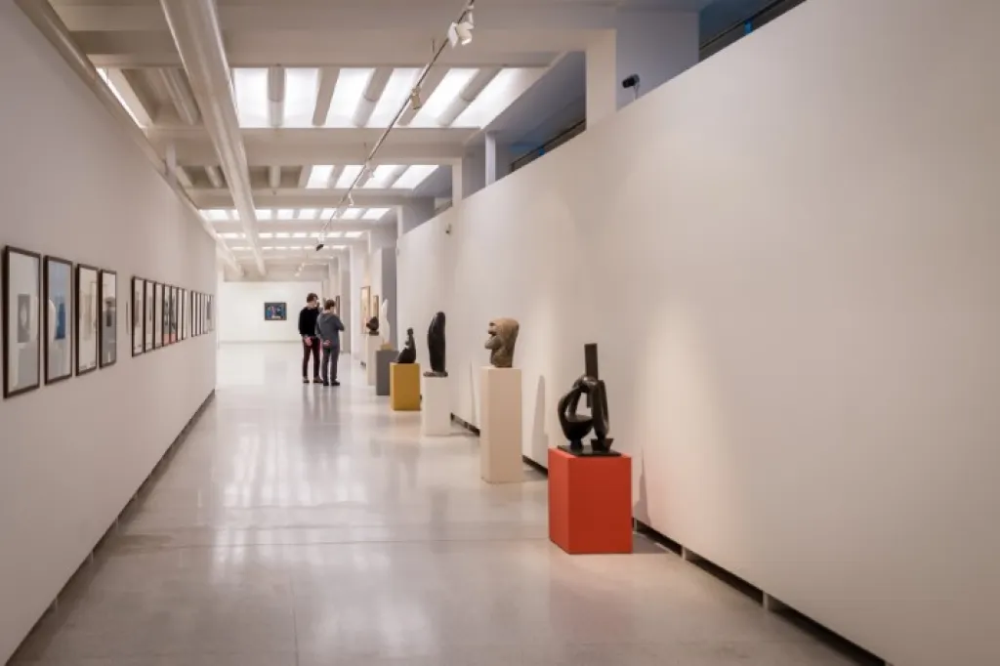
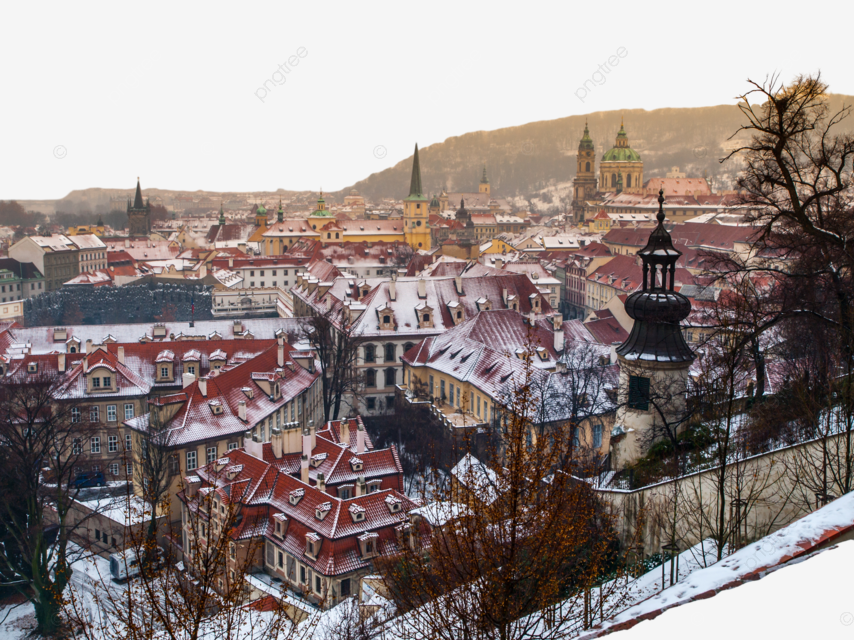
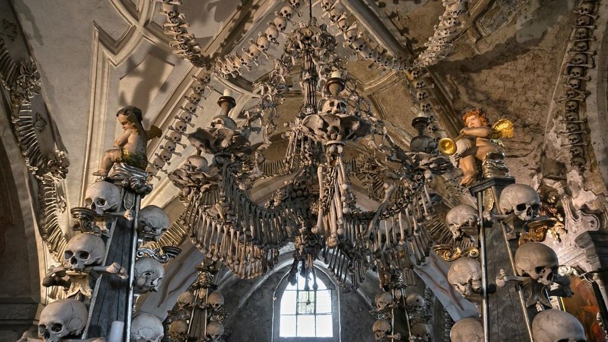
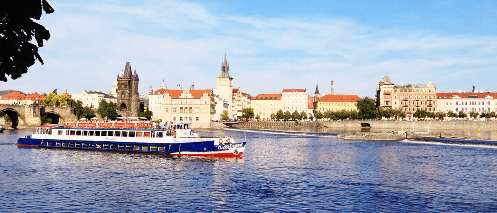

# Един вихрен уикенд в Прага: Градът на стоте кули

Прага, столицата на Чешката република, е град с богата история и култура. Със своята добре запазена средновековна архитектура, оживена художествена сцена и множество исторически забележителности Прага е дестинация, която обещава незабравимо бягство. В тази публикация в блога ще разгледаме как да прекарате очарователни два или три дни в този вълшебен град.

## Ден 1: Разглеждане на сърцето на Прага

### Сутринта: Староместкият площад и Астрономическият часовник

Започнете приключението си в Прага на Староместкия площад - историческия център на града. Когато стъпите на калдъръмените улици, ще се пренесете назад във времето. Площадът е заобиколен от цветни барокови сгради, готически църкви и известния Астрономически часовник.

В началото на часа се присъединете към тълпата пред Старото кметство, за да станете свидетели на процесията на Дванадесетте апостоли - очарователно механично представление, което радва посетителите от векове.

### Следобед: Карлов мост и обяд

Разходете се до емблематичния Карлов мост - каменен готически мост, който свързва Стария град с Мала страна. Украсен с 30 статуи и скулптури, мостът предлага живописна гледка към река Вълтава и Пражкия замък.

За обяд намерете уютен ресторант на брега на реката, за да опитате традиционна чешка кухня. Опитайте класическата "svíčková na smetaně" (мариновано говеждо филе в сметанов сос) или "гулаш" с кнедли.

### Вечерта: Пражки замък

С настъпването на следобеда се отправете към Пражкия замък - най-големият старинен замък в света. Комплексът на замъка включва дворци, църкви и градини и предлага много неща за разглеждане.

Не пропускайте зашеметяващата катедрала "Свети Вит", седалище на архиепископа на Прага. С настъпването на нощта се насладете на спиращата дъха гледка към светлините на града от територията на замъка.

## Ден 2: Изкуство, култура и кухня

### Сутрин: Художествени галерии и музеи

Посветете втория си ден на богатото изкуство и култура на Прага. Посетете Националната галерия, в която се съхранява впечатляваща колекция от чешко и международно изкуство. Алтернативно, разгледайте Музея Муха, посветен на творбите в стил ар нуво на Алфонс Муха.

### Следобед: Мала страна и остров Кампа

След изпълнената с изкуство сутрин се разходете из очарователните улички на Мала страна. Открийте скрити градини, причудливи магазинчета и красивата барокова църква "Свети Николай".

След това преминете по малък мост до остров Кампа - спокоен оазис с парк и инсталации на модерното изкуство. Насладете се на неангажиращ обяд в едно от бистрата на острова.

### Вечерта: Вечеря и шоу

За вечеря се насладете на съвременната кулинарна сцена на Прага. Изберете ресторант, който предлага модерен обрат на чешките ястия.

След това се насладете на оживения нощен живот на Прага с представление в Националния театър или джаз концерт в някой от известните клубове в града.

## Ден 3 (по желание): Еднодневни екскурзии и релаксация

### Сутрин: Еднодневна екскурзия до Кутна Хора

Ако разполагате с допълнителен ден, помислете за еднодневна екскурзия до Кутна Хора - обект на световното наследство на ЮНЕСКО, намиращ се на около час път от Прага. Забележителността на града е костницата в Седлец - малък римокатолически параклис, украсен с костите на над 40 000 скелета.

### Следобед: Виногради и релаксация

След като се върнете в Прага, прекарайте един релаксиращ следобед в квартал Винохради. Този жилищен район е известен със своите сгради в стил ар нуво, спокойни паркове и модерни кафенета.

### Вечерта: Круиз по река Вълтава

Завършете пътуването си до Прага с круиз по река Вълтава. Със залеза на слънцето се плъзнете покрай осветените забележителности на града, докато се наслаждавате на вечеря на шведска маса.

## Заключение

Прага е град, който завладява сърцето със своя старовремски чар и оживен културен гоблен. Независимо дали изследвате историческите улици, наслаждавате се на местната кухня или се потапяте в изкуството, Прага обещава незабравимо преживяване, което ще ви накара да копнеете да се върнете.

Не забравяйте да проверите работното време и наличността на атракциите, тъй като те могат да варират през годината. С внимателно планиране и авантюристичен дух уикендът ви в Прага ще бъде пътуване през времето, красотата и културата. Безопасни пътувания!
