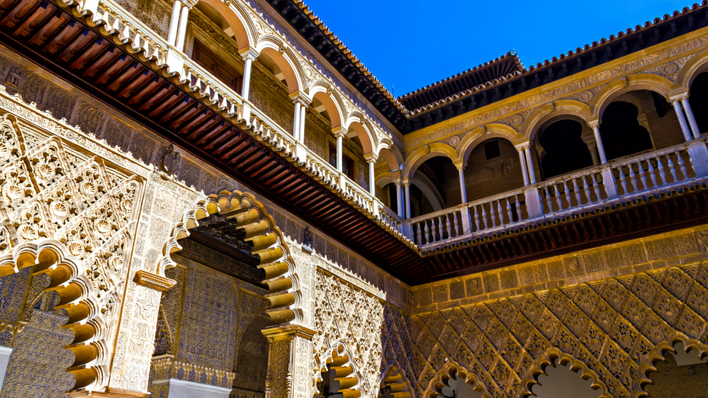
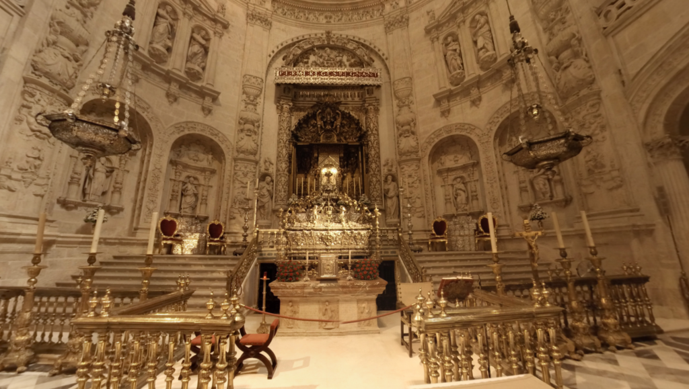
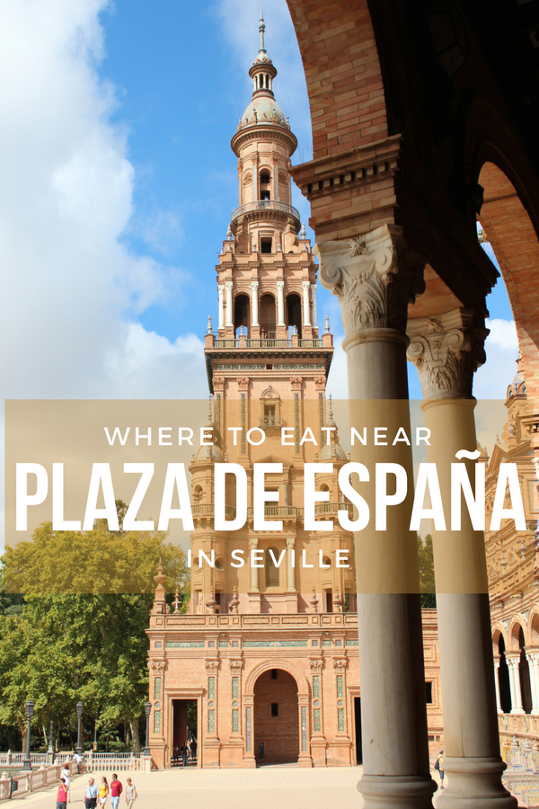
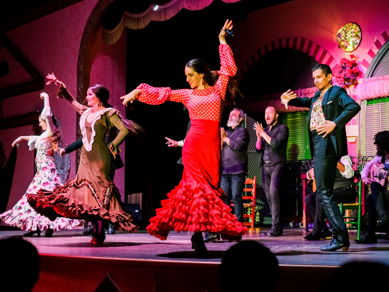
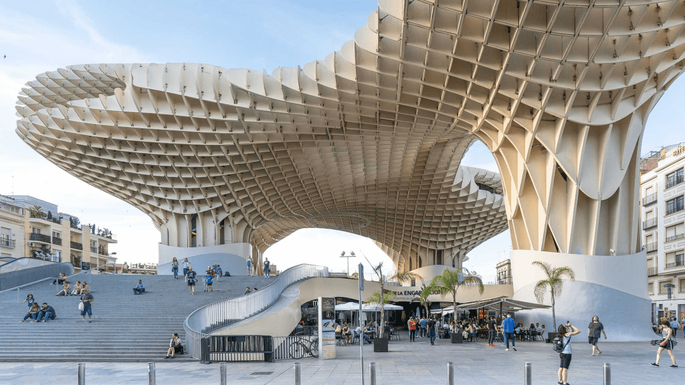
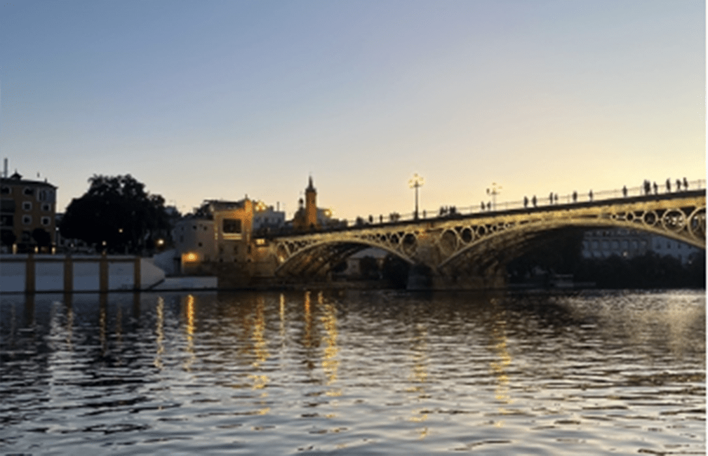
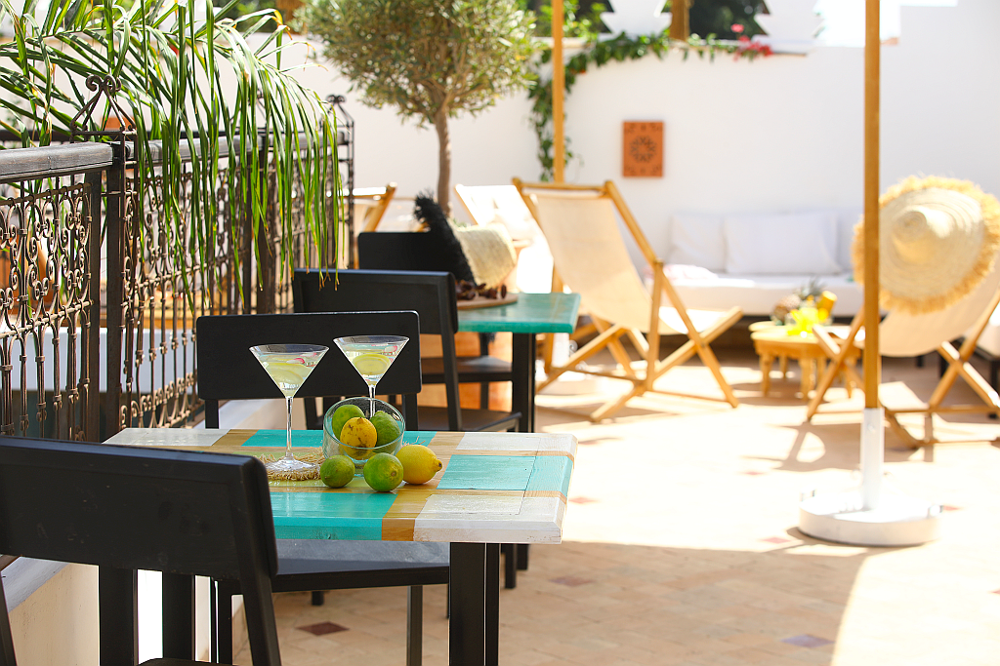
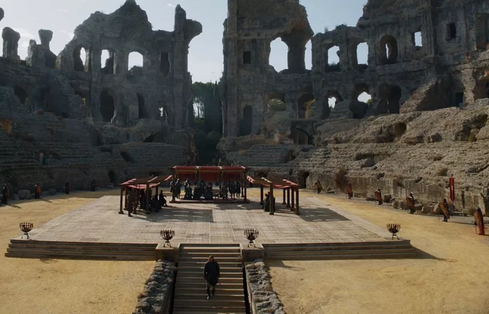
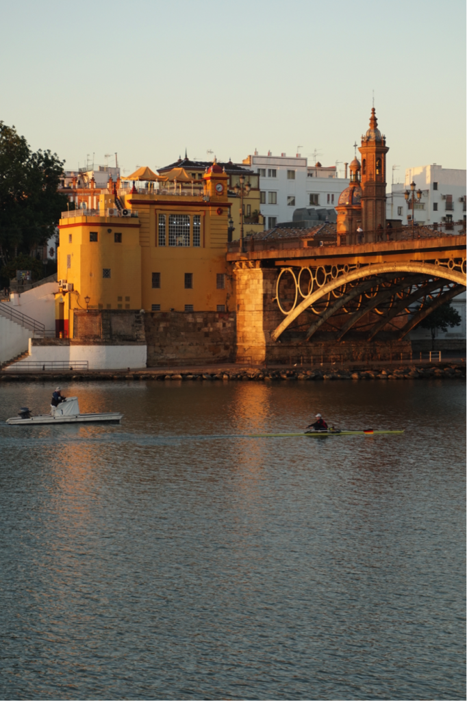

  # Откриване на сърцето на Андалусия: Уикенд в Севиля.

Севиля, очарователната столица на Андалусия, е град, в който страстта на фламенкото, ароматът на портокалови цветчета и наследството на вековната архитектура се сливат в незабравимо културно преживяване. Присъединете се към мен, за да прекараме идилични два или три дни в изследване на най-доброто, което Севиля може да предложи.

## Ден 1: Исторически забележителности и очарователни градини

### Сутрин: Кралският Алкасар и Севилската катедрала

Започнете севилското си приключение в **Кралския Алказар на Севиля**. Този обект на световното културно наследство на ЮНЕСКО е зашеметяващ пример за мудехарска архитектура със сложните си плочки и пищни градини. Докато се разхождате из двореца, ще се почувствате така, сякаш сте се върнали назад във времето. Не пропускайте възможността да посетите Залата на посланиците и спокойните бани на лейди Мария де Падиля.

Само на кратка разходка от Алказар се намира **Севилската катедрала** - друг обект на ЮНЕСКО и една от най-големите готически катедрали в света. Изкачете се на кулата Хиралда, за да се насладите на панорамна гледка към града. Вътре се възхищавайте на величието на главния олтар и на гроба на Христофор Колумб.

### Следобед: Обяд в Барио Санта Круз и Парк Мария Луиза

За обяд се отправете към очарователния **Барио Санта Круз** - стария еврейски квартал. Тук можете да се насладите на традиционни андалуски тапас в някой от многото китни ресторанти или тапас барове. Опитайте местни специалитети като espinacas con garbanzos (спанак с нахут) или salmorejo (студена доматена супа).

След обяд се разходете спокойно до **Parque de María Luisa**, най-известния парк в Севиля. Неговите романтични алеи, фонтани и павилиони са идеални за следобедна почивка. Не пропускайте и площад Испания - полукръгъл комплекс, известен с плочките си, изобразяващи различни провинции на Испания.

### Вечерта: Фламенко шоу

Никое посещение на Севиля не би било пълно, ако не се запознаете със страстта на фламенкото. Резервирайте маса в някой от автентичните "таблао" в града за вечеря и шоу. Докато танцьорите тропат, а китаристите подрънкват, ще бъдете завладени от интензивността на тази традиционна андалуска форма на изкуство.

## Ден 2: Разглеждане на местната култура и кухня

### Сутрин: Metropol Parasol и Mercado de la Encarnación

Започнете втория си ден в **Metropol Parasol**, известен на местно ниво като Las Setas (Гъбите) поради уникалния си дизайн. Тази модерна структура в стария квартал предлага пешеходна алея на покрива с невероятна гледка към града. Под нея разгледайте **Меркадо де ла Енкарнасион**, където можете да опитате пресни местни продукти и други кулинарни изкушения.

### Следобед: Музей на красивото изкуство и Триана

След лек обяд посетете **Museo de Bellas Artes**, в който се съхранява прекрасна колекция от испанско изкуство, особено от Севилската школа. Прекарайте няколко часа, възхищавайки се на творби на Мурильо, Зурбаран и други майстори.

След това прекосете река Гуадалкивир и отидете в оживения квартал **Триана**. Известен със своята керамика и фламенко, Триана има специфичен характер. Посетете работилница за керамика, за да видите работата на занаятчиите и може би да си купите уникален сувенир.

### Вечерта: Обиколка на тапас и Аламеда де Еркулес

С настъпването на вечерта се присъединете към обиколка с тапас, за да откриете някои от най-добрите барове и скрити гастрономически съкровища в Севиля. Местен екскурзовод ще ви преведе през кулинарните забележителности, като ви даде възможност да опитате различни ястия и да научите за техния произход.

Завършете вечерта си на **Alameda de Hércules** - оживен площад, заобиколен от барове и кафенета. Това е идеалното място да се насладите на питие и да се потопите в местната атмосфера.

## Ден 3 (по желание): Еднодневна екскурзия до Италика или почивка в Севиля

### Вариант 1: Древните руини на Италика

Ако сте готови за кратка екскурзия извън града, посетете древния римски град **Италика**, разположен само на 9 км от Севиля. Италика е известен с добре запазения си амфитеатър и красивите си мозаечни подове. Разхождайки се из руините, ще добиете представа за живота на римляните, които някога са обитавали този регион.

### Вариант 2: Ден за отдих в Севиля

Алтернативно, прекарайте третия си ден, наслаждавайки се на Севиля със собствено темпо. Посетете отново любимите си места, разгледайте местните магазини или просто се отпуснете в някое кафене с книга и кафе кон лече.

Преди да си тръгнете, не забравяйте да се насладите на последния залез по бреговете на река Гуадалкивир. Докато небето се оцветява в розови и оранжеви нюанси, ще разберете защо Севиля е завладявала сърцата на пътешествениците в продължение на векове.

Севиля е град, който танцува в ритъма на собственото си сърце, изпълнен с история, култура и кулинарни изкушения. Независимо дали сте тук за един уикенд или за по-дълго, спомените от престоя ви в това андалуско бижу ще останат с вас завинаги. ¡Hasta luego, Seville!