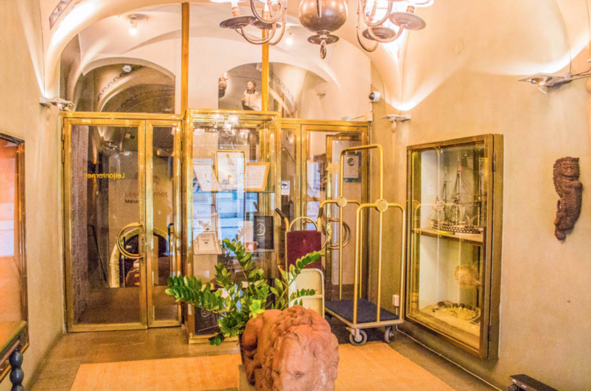
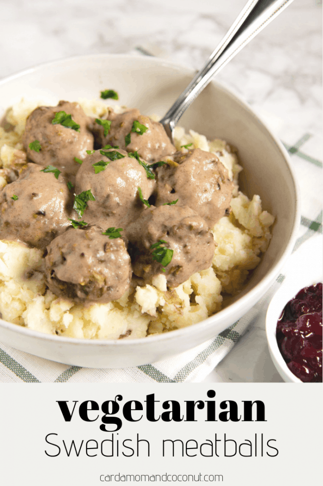
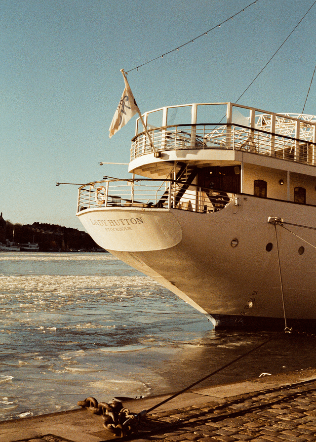
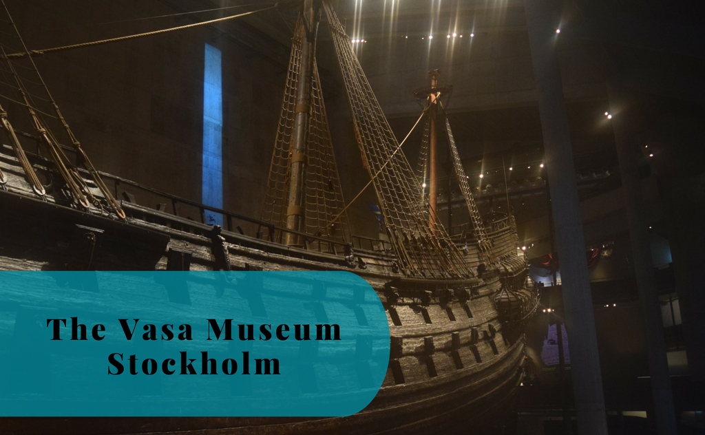
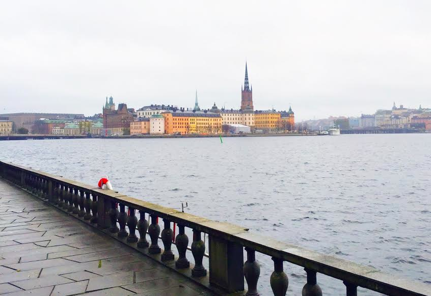
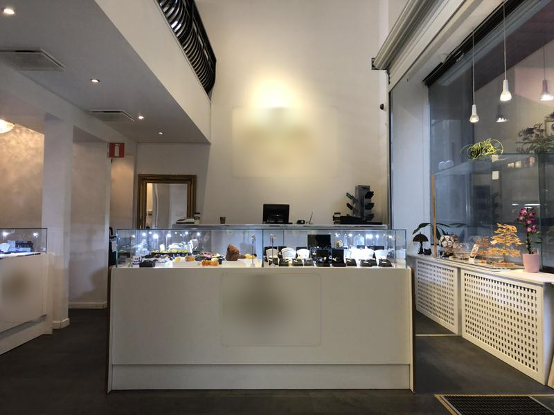
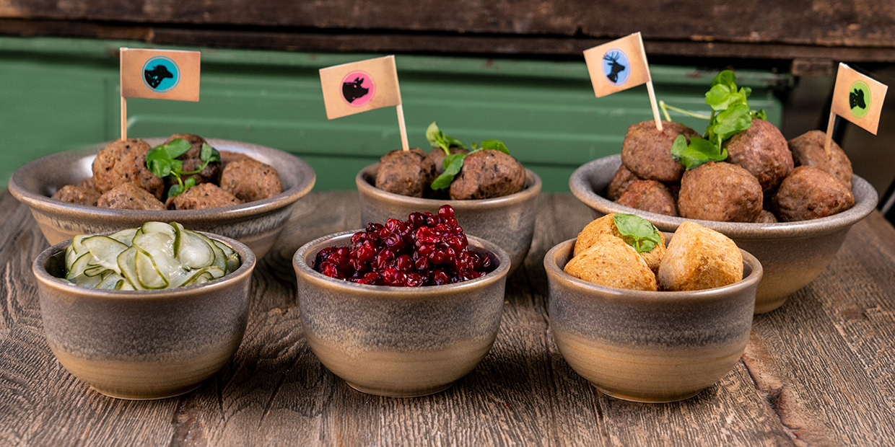

  # Уикенд в Стокхолм: Венеция на Севера

Стокхолм, столицата на Швеция, е град, в който модерното се съчетава с традициите. Известен като "Северната Венеция" заради красивия си архипелаг и водни пътища, Стокхолм е град, който е толкова богат на история и култура, колкото и на зашеметяваща природна красота. В тази публикация в блога ще разгледаме как да прекарате незабравими два или три дни в това скандинавско бижу.

## Ден 1: Разглеждане на Гамла Стан и кралското великолепие

### Сутринта: Разходка из Гамла Стан

Започнете приключението си в Стокхолм от Гамла Стан, стария град на града. Това е историческото сърце на Стокхолм, с калдъръмени улички и цветни сгради, датиращи от 13-ти век. Започнете деня си с традиционна шведска закуска в някое от уютните кафенета. Опитайте "kanelbullar" (канелени кифлички) или "filmjölk" (кисело мляко) със зърнени храни.

След закуска се разходете из тесните улички и открийте Сторторгет - най-старият площад в Стокхолм, заобиколен от стари къщи на търговци. Не пропускайте Стокхолмската катедрала (Storkyrkan), Нобеловия музей и Кралския дворец. Ако уцелите правилния момент, можете да станете свидетели на церемонията по смяна на караула.

### Следобед: Кралският дворец и обяд

След като разгледате Гамла Стан, отидете до Кралския дворец - един от най-големите дворци в Европа с над 600 стаи. Направете обиколка с екскурзовод, за да видите пищните държавни апартаменти и съкровищницата с кралските регалии.

За обяд се насладете на ястие в някой от традиционните шведски ресторанти в района. Опитайте класически ястия като "кюфтета с боровинки" или "гравлакс" (сушена сьомга).

### Вечерта: Вечеря и круиз по залез слънце

С настъпването на вечерта вечеряйте в ресторант с изглед към водата. Кулинарната сцена в Стокхолм е оживена и се фокусира върху пресните местни съставки.

След вечеря се отправете на круиз по залез слънце около архипелага. Гледката на силуета на града на фона на обагреното небе е нещо, което няма да забравите.

## Ден 2: Музеи, паркове и панорамни гледки

### Сутринта: Музей Васа и Дюргорден

Започнете втория си ден в музея Васа на остров Дюргорден. Музеят е дом на кораба Васа - военен кораб от 17-ти век, който трагично потъва при първото си плаване и е спасен повече от 300 години по-късно.

След музея се разходете на спокойствие из Дюргорден, където се намират още Скансен, най-старият музей на открито в света, и възхитителната градина Rosendals Trädgård, идеална за кафе пауза.

### Следобед: Обяд и Moderna Museet

За обяд се отправете към кафене в Дюргорден, преди да се отправите към Moderna Museet - музея на модерното и съвременното изкуство в Стокхолм. Музеят разполага с впечатляваща колекция, включваща творби на Пикасо и Салвадор Дали.

### Вечерта: Вечеря в Сьодермалм и нощно излизане

Прекарайте вечерта си в модерния квартал Сьодермалм, известен с бохемския си дух и бурния си нощен живот. Насладете се на вечеря в ресторант, предлагащ панорамна гледка към града.

След вечерята разгледайте баровете и клубовете в района, а ако предпочитате нещо по-тихо, разходете се по Monteliusvägen за спираща дъха гледка към нощния силует на града.

## Ден 3 (по желание): Приключение на архипелага и пазаруване

### Сутрин: Екскурзия из архипелага

Ако разполагате с трети ден, направете си екскурзия с корабче до някой от близките острови в Стокхолмския архипелаг. Ваксхолм е популярен избор, с неговите живописни дървени къщи и впечатляващата крепост Ваксхолм.

### Следобед: Пазаруване и фика

Отново в Стокхолм, прекарайте следобеда си в пазаруване на шведски дизайнерски предмети, мода и сувенири в модерните бутици на Östermalm или по пешеходната улица Drottninggatan.

Не забравяйте да направите още една фика пауза в някое от стилните кафенета в Стокхолм, като може би опитате "prinsesstårta" (торта за принцеси) или "semla" (кардамонова кифличка, пълна с бадемова паста и бита сметана).

### Вечерта: Заключителна вечеря и размисъл

В последната си вечер изберете ресторант, който предлага традиционна шведска кухня, за да осмислите пътуването си из Стокхолм. Докато се наслаждавате на храната, си спомнете за красивите забележителности, богатата история и живата култура, с които се сблъскахте през последните няколко дни.

Стокхолм е град, който оставя трайни впечатления у всички, които го посещават. Независимо дали ви привлича историческият му чар, природната му красота или съвременният му дух, Стокхолм има за всекиго по нещо. Това е град, който ви приканва да се върнете, обещавайки нови открития при всяко посещение.

---

Не забравяйте да проверите работното време и да резервирате предварително билети за атракциите, тъй като то може да варира в зависимост от сезона. Стокхолм е град, в който е лесно да се влюбиш, а с този маршрут със сигурност ще имате незабравимо пътуване. Щастливи пътувания!