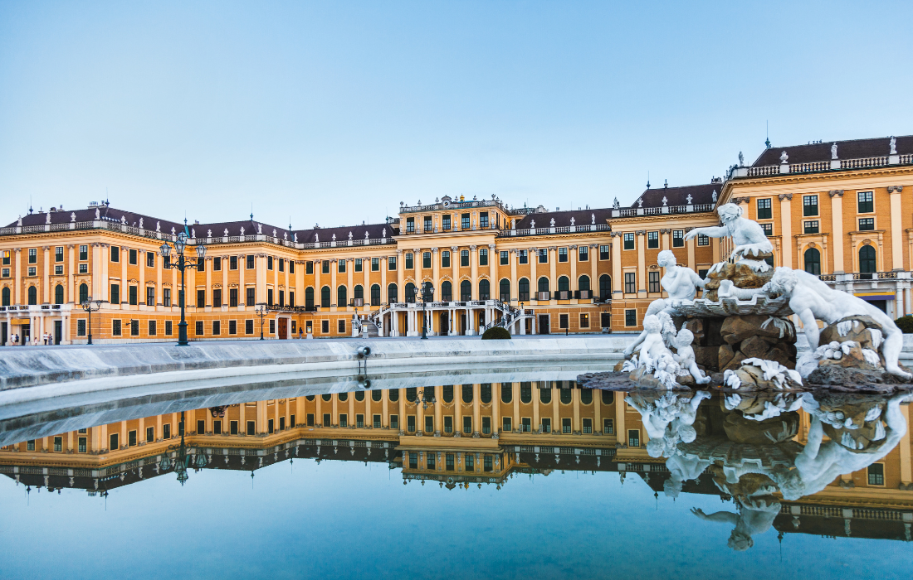
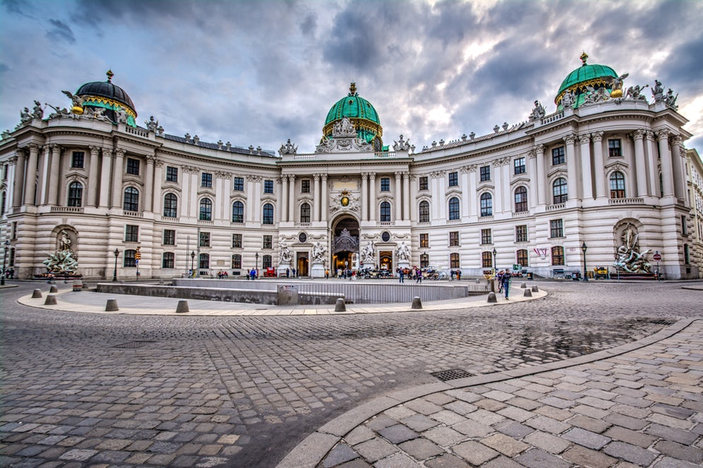
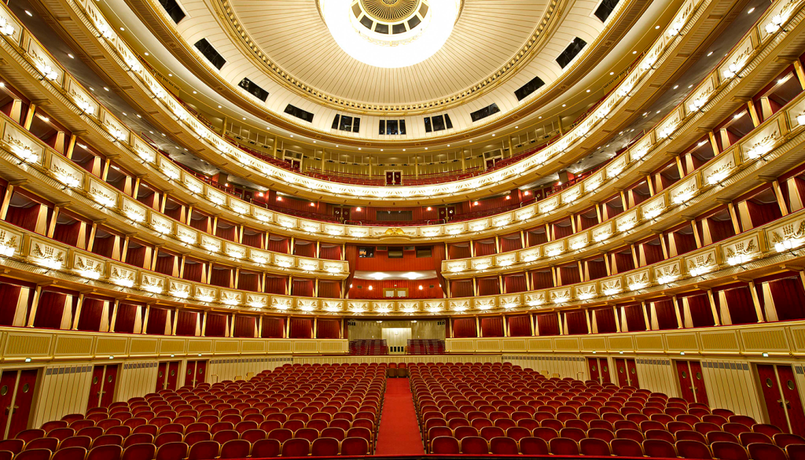
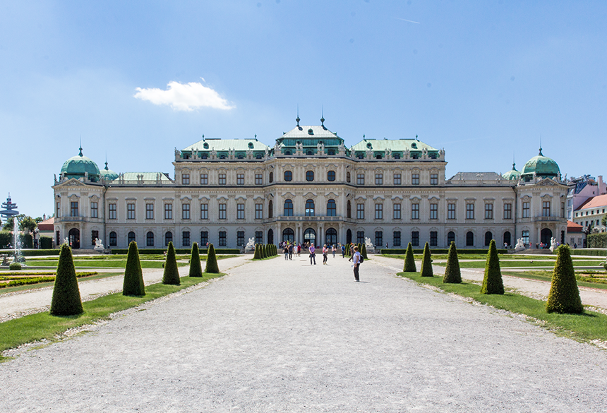
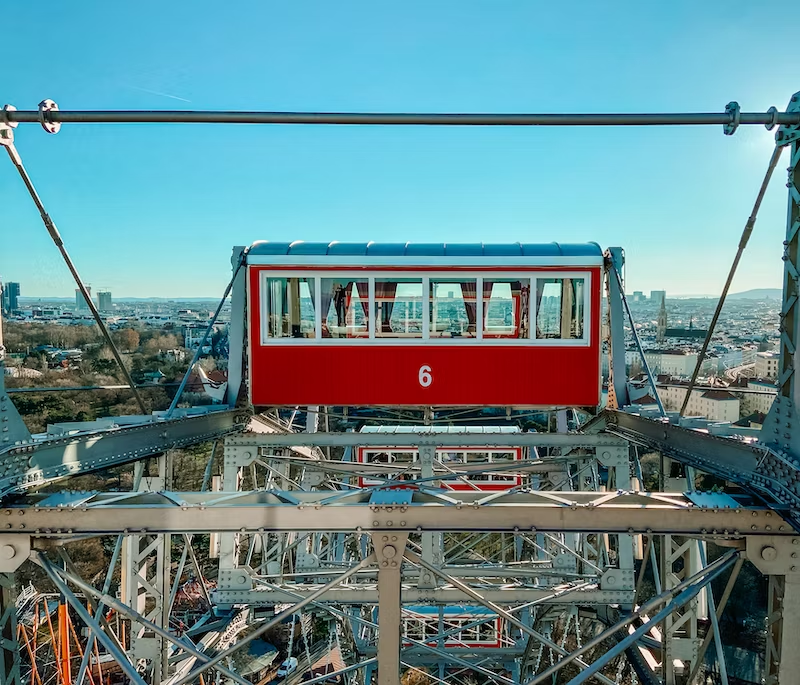
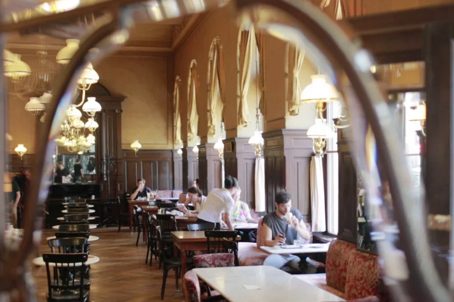
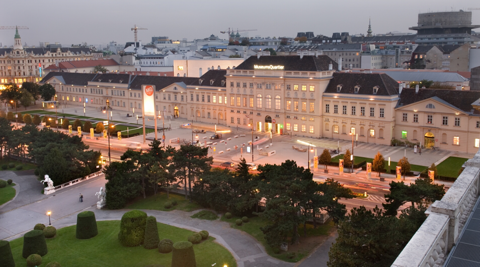
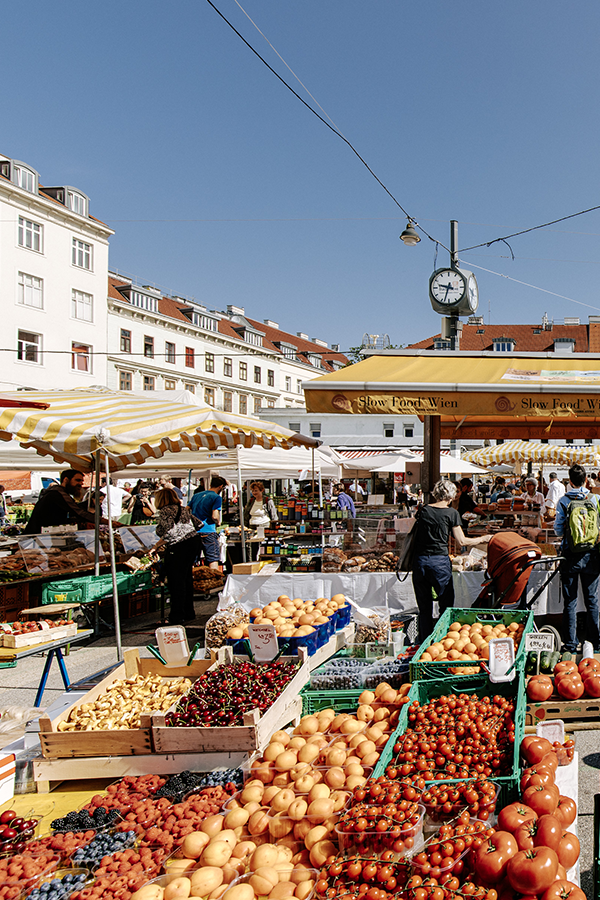
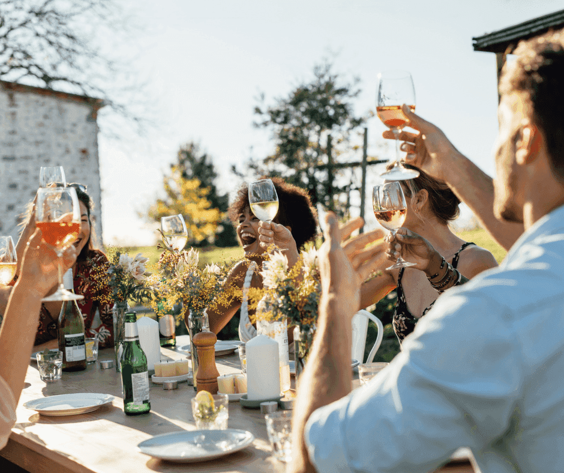

  # Уикенд във Виена: императорско великолепие и уютни кафенета

Виена, столицата на Австрия, е град с богата история, култура и изящни изкуства. Известна с императорските си дворци, зашеметяващата си архитектура и като родно място на класическата музика, Виена е град, който очарова посетителите със старинното си величие и оживената си културна сцена. В тази публикация в блога ще разгледаме как да прекарате незабравими два или три дни в този величествен град.

## Ден 1: Разглеждане на императорска Виена

### Сутринта: Дворецът Шьонбрун

Започнете деня си рано в двореца Шьонбрун, бившата лятна резиденция на императорите Хабсбурги. Този обект на световното наследство на ЮНЕСКО е една от най-посещаваните забележителности във Виена. Направете обиколка с екскурзовод, за да се възхитите на пищните държавни стаи и частните апартаменти на императорското семейство.

След като разгледате двореца, разходете се из красиво поддържаните градини. Не пропускайте Глориете - величествена постройка на върха на хълма, от която се открива панорамна гледка към двореца и града.

### Следобед: Обяд и дворецът Хофбург

Върнете се в центъра на града за традиционен виенски обяд в местно заведение *Beisl*. Опитайте *Виенски шницел* или *Тафелшпиц* и ги съчетайте със свежо австрийско бяло вино.

След обяда се разходете до двореца Хофбург - бившия императорски дворец в сърцето на града. Посетете музея Сиси, за да научите повече за живота на императрица Елизабет, и разгледайте императорските апартаменти и Сребърната колекция.

### Вечерта: Виенска държавна опера и вечеря

Вечерта се преоблечете за представление във Виенската държавна опера - един от най-престижните оперни театри в света. Резервирайте билети предварително, за да станете свидетели на оперно или балетно представление от световна класа.

След спектакъла се насладете на късна вечеря в някой от виенските гурме ресторанти, където можете да се насладите на модерна австрийска кухня.

## Ден 2: Изкуство, паркове и кафенета

### Сутринта: Дворецът Белведере и изкуството

Започнете втория си ден с посещение на двореца Белведере - още един бароков шедьовър. В дворцовия комплекс се помещава впечатляваща колекция от произведения на изкуството, включително известната картина на Густав Климт "Целувката".

### Следобед: Парк Пратер и гигантското виенско колело

След като се потопите в изкуството, се отправете към Пратера - голям обществен парк, където можете да се насладите на неангажиращ обяд в бирена градина. След това се качете на емблематичното Виенско колело (Wiener Riesenrad), за да се насладите на впечатляваща гледка към града.

### Вечерта: Култура на кафенето

Виена е известна с културата на кафенетата си, затова прекарайте вечерта си в традиционно *Кафехаус*. Поръчайте си *Melange* (виенско кафе) и парче *Sachertorte* (шоколадова торта) и се потопете в атмосферата на една отминала епоха.

## Ден 3 (по желание): МузеиКвартер и Нашмаркт

Ако разполагате с трети ден, навлезте по-дълбоко в културната сцена на Виена.

### Сутринта: МузеиКвартие

Посетете MuseumsQuartier, един от най-големите културни квартали в света. Изберете между Музея "Леополд" с богата колекция от съвременно австрийско изкуство и Музея за съвременно изкуство (MUMOK).

### Следобед: Нашмаркт и пазаруване

Разходете се из Нашмаркт, най-известния пазар във Виена, и опитайте различни местни и международни деликатеси. След това разгледайте околните бутици и магазини за уникални сувенири.

### Вечерта: Heuriger Experience

Завършете пътуването си с посещение на *Heuriger* - традиционна винена кръчма във Виена. Насладете се на местни вина, обилна храна и често музика на живо в селска обстановка.

Виена е град, който предлага перфектна комбинация от имперска история, изкуство, музика и кулинарни изкушения. Независимо дали сте тук за два или за три дни, ще си тръгнете със спомени за град, който гордо пази миналото си, като същевременно прегръща настоящето.